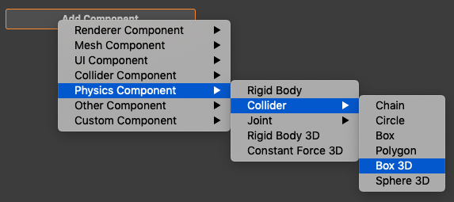
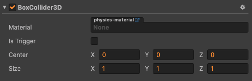
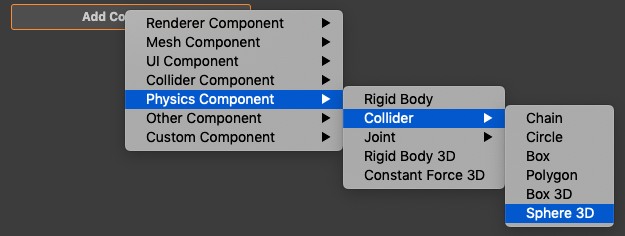
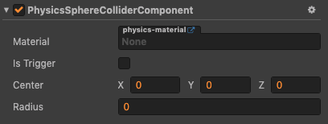

# 3D 物理碰撞组件

碰撞组件用于指明游戏对象的形状，不同形状具有不同属性及物理行为，可根据需求选择不同形状的碰撞组件。

### 盒碰撞组件（BoxCollider3D）

添加盒碰撞组件

盒碰撞组件属性预览

属性 | 功能说明
---|---
**Material** | 详见 [物理材质](./physics-material.md) ，设置组件的物理属性，如弹力，摩擦力
**Is Trigger** | 是否与其它碰撞器产生碰撞，并产生物理行为
**Center**  |  形状的中心点（与所在 Node 中心点的相对位置）
**Size**  |  盒的大小，即长、宽、高

### 球碰撞组件（SphereCollider3D）

添加球碰撞组件

球碰撞组件属性预览

属性 | 功能说明
---|---
**Material** | 详见 [物理材质](./physics-material.md) ，设置组件的物理属性，如弹力，摩擦力
**Is Trigger** | 是否与其它碰撞器产生碰撞，并产生物理行为
**Center**  |  形状的中心点（与所在 Node 中心点的相对位置）
**Radius** | 球的半径