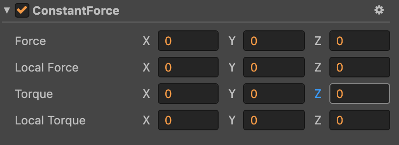

# 3D 物理恒力组件

恒力组件向刚体添加恒定力，例如火箭，刚开始速度不大，但会一直加速，需要有持续的力作用在火箭上。

## 添加恒力组件

## 恒力组件属性

属性 | 功能说明
---|---
**Force** |  设置世界朝向的力
**Local Force** |  设置本地朝向的力
**Torque** |  设置世界朝向的扭转力
**Local Torque** |  设置本地朝向的扭转力