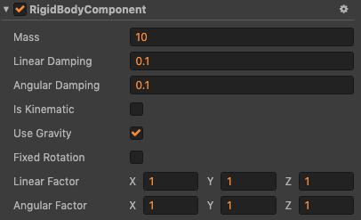

# 3D 物理刚体组件

刚体使节点在物理控制下运动，以真实世界的方式接受作用力。

## 添加刚体组件


## 刚体属性



属性 | 功能说明
---|---
**mass** |  物体的质量
**linearDamping** |  线性阻尼，用于减小物体的线性速率
**angularDamping** |  角阻尼，用于减小物体的旋转速率
**isKinematic** |   是否由用户来控制该刚体，而不受物理引擎的影响
**useGravity** |  是否受重力影响
**fixedRotation** |  碰撞时是否需要固定物体，而不产生旋转
**linerFactor** | 线性因数，可影响每个轴向的线性速度的变化
**angularFactor** | 旋转因数，可影响每个轴向的旋转速度的变化

## 休眠和唤醒刚体

代码示例：

```
if (rigidBody.isAwake) {
    rigidBody.sleep(); // 休眠
}
if (rigidBody.isSleeping) {
    rigidBody.wakeUp(); // 唤醒
}
```

## 使刚体运动

### 通过重力

设置 `useGravity` 属性为 `true` 将受到重力的作用。

### 通过力

根据牛顿第二定律 `F = m * a` ，对刚体某点上施加力，产生加速度，随着时间变化，速度也会变化。

代码示例：

```
rigidBody.applyForce(cc.v3(200, 0, 0));
```

### 通过冲量

根据动量守恒的方程式 `F * Δt = m * Δv`，对刚体某点施加冲量，随着时间增加，由于物体的质量是恒定的，速度就会产生变化。

代码示例：

```
rigidBody.applyImpulse(cc.v3(5, 0, 0));
```

### 通过改变速度

通过 `setLinearVelocity` 接口，改变线性速度。

通过 `setAngularVelocity` 接口，改变旋转速度。

代码示例：

```
rigidBody.setLinearVelocity(cc.v3(5, 0, 0)); // 改变线性速度
rigidBody.setAngularVelocity(cc.v3(5, 0, 0)); // 改变旋转速度
```

### 通过恒力组件

详见 [恒力组件](./physics-constant-force.md)

## 限制刚体的运动

### 通过休眠

休眠刚体时，会将刚体所有的力和速度清空，这将使刚体停下来。

**注：目前，施加力或冲量，以及改变速度会重新唤醒刚体，后续可能会进行调整，请留意版本更新公告**。

### 通过阻尼

`linearDamping` 和 `angularDamping` 属性，分别设置线性和旋转的阻尼。
阻尼参数的范围可以在 0 到无穷之间，0 意味着没有阻尼，无穷意味着满阻尼，通常来说，阻尼的值应在 0 到 0.1 之间。

### 通过固定旋转

`fixedRotation` 属性，默认为 `false` ，设置为 `true` 可以用于固定刚体，使其不会产生旋转。

### 通过因子

`linearFactor` 和 `angularFactor` 属性，分别设置线性和旋转的因子。
因子是 `Vec3` 的类型，相应分量的数值用于缩放相应轴向的速度变化，默认值都为 1，代表着缩放为 1 倍，即无影响。

**注：将因子某分量值设置为 0，可以固定某个轴向的移动或旋转，如果要完全固定旋转，请用 fixedRotation**。