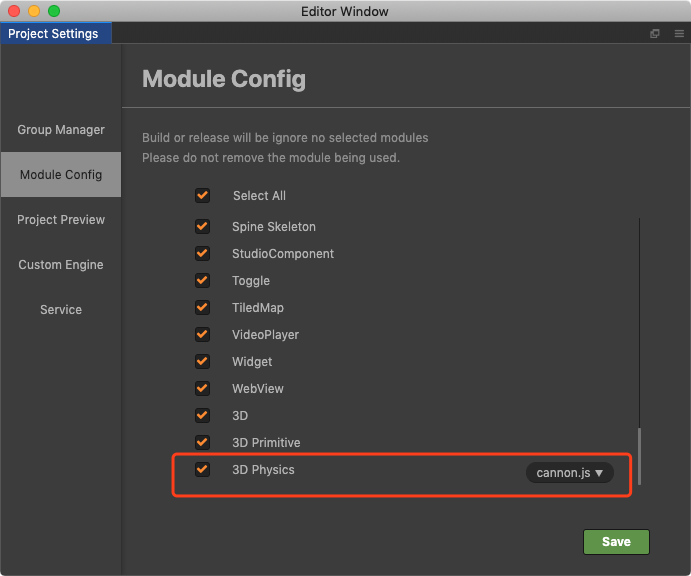

# 设置 3D 物理引擎

打开编辑器，点击菜单栏中的 **项目 -> 项目设置 -> 模块设置**，勾选 **3D Physics**。然后选择合适的 3D 物理引擎，可选项包括 `cannon.js` 和 `Builtin`，默认为 `cannon.js`。若不勾选 **3D Physics**，则不能使用物理相关的组件和接口，否则会导致运行时出现报错。

> **注意**：预览过程中物理引擎始终为 `cannon.js`，只有在构建工程时，该选项设置才会生效。

## 物理引擎（cannon.js）

**cannon.js**（[GitHub](https://github.com/cocos-creator/cocos-cannon.js) | [Gitee](https://gitee.com/mirrors_cocos-creator/cannon.js)）是一个开源的物理引擎，使用 JavaScript 开发并实现了比较全面的物理模拟功能。

当选择的物理引擎为 `cannon.js` 时，需要在节点上添加 [刚体组件](./physics-rigidbody.md) 才能进行物理模拟。然后再根据需求添加 [碰撞组件](./physics-collider.md)，该节点就会增加相应的碰撞体，用于检测是否与其它碰撞体产生碰撞。

目前 `cannon.js` 支持情况如下：

- [刚体](./physics-rigidbody.md)
- [Box \ Sphere 碰撞组件](./physics-collider.md)
- [触发和碰撞事件](./physics-event.md)
- [物理材质](./physics-material.md)
- [射线检测](./physics-manager.md)

## 碰撞检测（Builtin）

Builtin 是只有 **碰撞检测系统** 的物理引擎。相对于其它的物理引擎，Builtin 没有物理模拟功能，但它的优势在于更小的包体以及较小的计算量。

若使用 Builtin 进行开发，请注意以下几点：

- Builtin 只有 trigger 类型的事件。

- [3D 碰撞组件](./physics-collider.md) 中的 `Material` 属性无效。

- 3D 碰撞组件中的 `Is Trigger` 属性无效，所有的碰撞组件都只能用作 [触发器](./physics-event.md)。

- 3D 碰撞组件中的 `attachedRigidbody` 为 `null`。

- [3D 物理刚体组件](./physics-rigidbody.md) 无效。

- [3D 物理恒力组件](./physics-constant-force.md) 无效。
