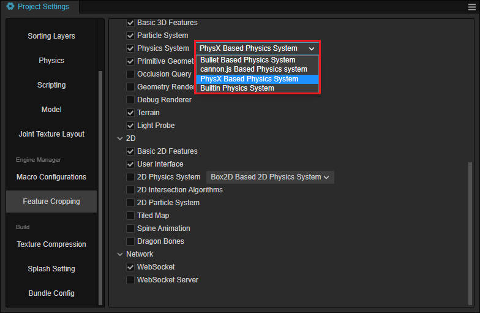
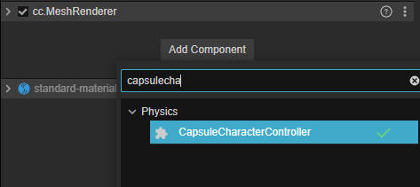
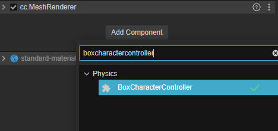
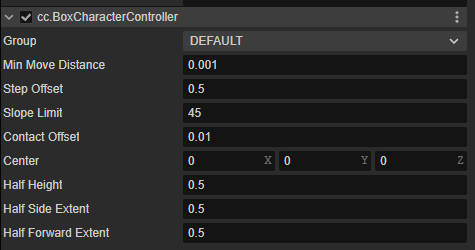

# 角色控制器

> 自 v3.8 开始，Cocos Creator 提供角色控制器。

角色控制可以为您的游戏添加简单易用的角色控制功能。

## 添加角色控制器

Cocos Creator 提供两种角色控制器类型：盒控制器和胶囊控制器。他们都继承自 `CharacterController`。

需要注意的是，角色控制器仅支持 **Bullet** 以及 **PhysX** 物理后端。请在编辑器顶部菜单 **项目** -> **项目设置** 中的 **功能剪裁** 分页中找到 **物理系统**，并将物理后端修改为 **Bullet Based Physics System** 或 **PhysX Based Physics System**（默认的物理后端是 Bullet）。



### 通用属性

以下属性为角色控制器的通用属性，您可以在 **盒角色控制器** 和 **胶囊体角色控制器** 的 **属性检查器** 面板找到它们。

| 属性 | 描述 |
| :-- | :-- |
| Group | 物理分组，更多请参考 **项目** -> **项目设置** 的物理分页中 [碰撞矩阵](../physics-group-mask.md) |
| Min Move Distance | 角色控制器的最小移动距离，每次 move 时如果低于这个距离则不会移动|
| Center  | 角色控制器的中心 |
| Step Offset | 最大自动爬台阶高度 |
| Slope Limit | 角色可以行走的最大坡度，单位：角度 |
| Skin Width | 控制器使用的皮肤宽度。请参考下方 **皮肤宽度** 获取更多信息。|

### 胶囊体角色控制器

若要添加胶囊体角色控制器，在 **属性检查器** 面板上点击 **添加组件** 按钮，并选择 **CapsuleCharacterController**：



#### 属性


| 属性 | 描述 |
| :--- | :---- |
| Radius  | 胶囊碰撞体的半径 |
| Height | 胶囊体末端两个球心的距离 |

### 盒角色控制器

若要添加盒角色控制器，在 **属性检查器** 面板上点击 **添加组件** 按钮，并选择 **BoxCharacterController**：



#### 属性



| 属性 | 描述 |
| :--- | :---- |
| Half Height  | 盒碰撞体在 Y 轴上的高度的一半 |
| Half Side Extent | 盒碰撞体在 X 轴上的高度的一半 |
| Half Forward Extent | 盒碰撞体在 Z 轴上的高度的一半 |

## 驱动角色控制器

如果要驱动角色控制器移动，可以使用 `move` 方法，代码示例如下：

```ts
const movement = v3(1.0, 0, 0);
let characterController = this.node.getComponent(CharacterController);
characterController.move(movement);
```

`move` 方法会考量行进路线中的碰撞体，内部使用了 `sweep` 的算法去检测，检测碰到物体后，一方面会判断控制器和物体的夹角，如果小于最大爬坡角度（Slope Limit），控制器会接着沿物体表面走；另一方面会考虑碰到控制器和物体的高度差，如果小于最大自动爬台阶高度（Step Offset）也会接着沿物体表面走。如果这两个都不满足，控制器就会停下来。

如果要重置角色的位置，请使用角色控制器的 `setPosition` 而不是节点的 `setPosition`，代码示例如下：

```
let characterController = this.node.getComponent(CharacterController);
characterController.setPosition(new Vec3(-3,5,6));
```

使用角色控制器的 `setPosition` 移动节点时，会和物理系统同步；而如果只使用节点的 `setPosition` 或者 `setWorldPosition`，可能造成节点位置和物理世界内的位置不同步现象。

> 这里是因为每帧当角色控制器从渲染场景到物理场景的同步时，还需要考量角色控制器的中心偏移。

需要注意的是，角色控制器是不受力影响的，因此开发者需要自行处理角色控制器的受力或者速度。

## 判断是否在地面上

通过 `isGrounded` 方法，可以判定角色控制器是否站在某些碰撞体上，代码示例如下：

```ts
let characterController = this.node.getComponent(CharacterController);
const isOnGround = characterController.isGrounded;
```

## 监听角色碰撞

当角色控制器和碰撞体发生碰撞时，会派发 `onControllerColliderHit` 事件，代码参考如下：

```ts
let characterController = this.node.getComponent(CharacterController)!;
characterController.on('onControllerColliderHit', this.onColliderHit, this);
```

碰撞回调如下：

```ts
onColliderHit (hit: CharacterControllerContact){}
```

回调参数说明：

- contact： 和其他碰撞体碰撞时的接触信息， API 参考：[CharacterControllerContact](__APIDOC__/api/zh/class/physics.CharacterControllerContact)

## 细节说明

模拟角色时，角色通常不是完全的物理对象，也就意味着角色其实并不展示出完整物理特性。在碰撞发生时，角色控制器无法和普通的动力学刚体（Dynamic Rigidbody）一样模拟器受力情况，如果要实现受力效果，可以在碰撞回调中改变位置、速度信息来模拟物理现象。

如果要模拟完全受力的物理现象，请使用 [动力学刚体](../physics-rigidbody.md)。同时需要注意的是持有角色控制器的节点上，如果再添加其他刚体，可能会导致无法预知的错误。通常来说并不建议这么做。

如果场景中有多个角色控制器，控制器之间并不会产生物理反应。该功能会在后续版本中添加。

### 皮肤宽度

皮肤宽度允许控制器和对象之前发生碰撞时，可以产生轻微的穿透从而避免抖动或者卡住。

通常为一个较小且为正的浮点数。

如果出现频繁卡住的问题，可以尝试调大 **皮肤宽度** 属性，来避免数字精度的问题。

## 示例

角色控制器的示例地址为 [GIT](https://github.com/cocos/cocos-example-projects)，下载完成后打开 **case-character-controller.scene** 场景运行即可。

## API

角色控制器的 API 请参考 [角色控制器](__APIDOC__/zh/class/physics.CharacterController)、[盒角色控制器](__APIDOC__/zh/class/physics.BoxCharacterController) 以及 [胶囊体角色控制器](__APIDOC__/zh/class/physics.CapsuleCharacterController)

## 支持情况

该功能在字节跳动的小程序 wasm 上不支持。如要启用，请使用 Cocos Creator 自带的 wasm。
