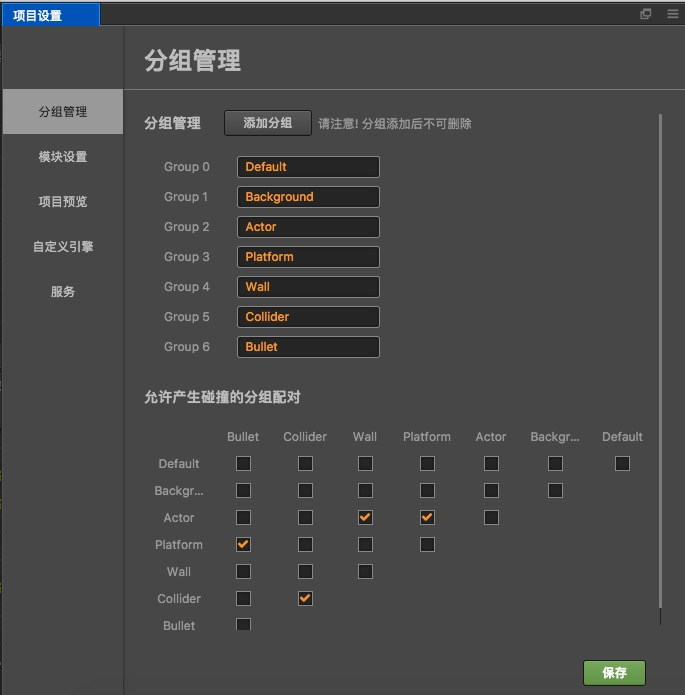
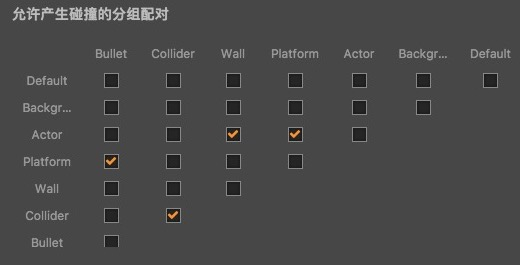

# 碰撞分组管理

## 分组管理

分组管理，需要打开 **项目设置** 面板进行设置，位置为 **菜单栏 -> 项目 -> 项目设置**。

打开 **项目设置** 面板后，在 **分组管理** 一栏可以看到 **分组列表** 的配置项，如下图：

点击 **添加分组** 按钮后即可添加一个新的分组，默认会有一个 **Default** 分组。

**需要注意的是：分组添加后是不可以删除的，不过你可以任意修改分组的名字**

## 碰撞分组配对

在 **分组列表** 下面可以进行 **碰撞分组配对** 表的管理，如下图

这张表里面的行与列分别列出了 **分组列表** 里面的项，**分组列表** 里的修改将会实时映射到这张表里。你可以在这张表里面配置哪一个分组可以对其他的分组进行碰撞检测，假设 **a 行 b 列** 被勾选上，那么表示 **a 行** 上的分组将会与 **b 列** 上的分组进行碰撞检测。

> **注意**：运行时修改节点的 group 之后，需要调用物理组件 Collider 的 apply，修改才会生效。

根据上面的规则，在这张表里产生的碰撞对有：

Platform - Bullet
Collider - Collider
Actor - Wall
Actor - Platform
