# 碰撞组件与基础属性

碰撞组件可用于定义需要进行物理碰撞的物体形状，不同的几何形状拥有不同的属性。碰撞体通常分为以下几种：
1. [基础碰撞体](#基础碰撞体)。常见的包含 [盒](#盒碰撞器组件-BoxCollider)、[球](#球碰撞器组件-SphereCollider)、[圆柱](#圆柱碰撞器组件-CylinderCollider)、[圆锥](#圆锥碰撞器组件-ConeCollider)、[胶囊](#胶囊碰撞器组件-CapsuleCollider) 碰撞体。
2. [复合碰撞体](#复合碰撞体)。可以通过在一个节点身上添加一个或多个基础碰撞体，简易模拟游戏对象形状，同时保持较低的性能开销。
3. [网格碰撞体](#网格碰撞器组件-MeshCollider)。根据物体网格信息生成碰撞体，完全的贴合网格。
4. [单纯形碰撞体](#单纯形碰撞器组件-SimplexCollider)。提供点、线、三角面、四面体碰撞。
5. [平面碰撞体](#平面碰撞器组件-PlaneCollider)。可以代表无限平面或半空间。这个形状只能用于静态的、非移动的物体。
6. [地形碰撞体](#地形碰撞器组件-TerrainCollider)。一种用于凹地形的特殊支持。

## 添加碰撞组件

这里以获取 **BoxCollider** 盒碰撞器组件为例。

### 通过编辑器添加

1. 新建一个 3D 对象 Cube，在 **资源管理器** 中点击左上角的 **+** 创建按钮，然后选择 **创建 -> 3D 对象 -> Cube 立方体**。

    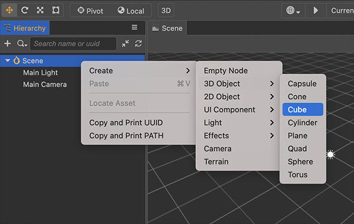

2. 选中新建的 Cube 立方体节点，在右侧的 **属性检查器** 面板下方点击 **添加组件** 按钮，选择 **Physics -> BoxCollider** 添加一个碰撞器组件.

    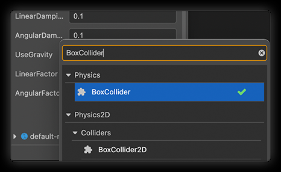

### 通过代码添加

```ts
import { BoxCollider } from 'cc'

const boxCollider = this.node.addComponent(BoxCollider);
```

## 碰撞组件共有属性说明

| 属性 | 说明 |
| :---|:--- |
| **Attached** | 碰撞器所绑定的 [刚体](physics-rigidbody.md) |
| **Material** | 碰撞器所使用的 [物理材质](physics-material.md)，未设置时为默认值 |
| **IsTrigger** | 是否为 [触发器](physics-event.md)，触发器不会产生物理反馈 |

刚体获取请注意以下几点：

- 在自身节点无 `RigidBody` 组件时，该属性返回为 `null`。
- Attached 对应的真实属性名为 attachedRigidBody，attachedRigidbody 是一个只读的属性，不可修改。

```ts
let collider = this.node.addComponent(BoxCollider)!;
let rigidbody = collider.attachedRigidBody;
```

有关碰撞器的编辑可以查看：[碰撞器 Gizmo](../editor/scene/collider-gizmo.md)。

> **注意**：在使用碰撞体前请先查阅 [不同物理后端碰撞形状支持情况](physics-engine.md#不同物理后端碰撞形状支持情况)，确保当前使用的物理引擎支持。

## 碰撞组件

### 基础碰撞体

#### 盒碰撞器组件 BoxCollider


盒形碰撞体是一个基于长方体形状的碰撞体，可用来实现木箱、墙壁等物体的碰撞。可以用来组合成复合形状。

| 属性 | 说明 |
| :---|:--- |
| **Center**  | 在本地坐标系中，形状的中心位置 |
| **Size**  |  在本地坐标系中，盒的大小，即长、宽、高 |

盒碰撞器组件接口请参考 [BoxCollider API](__APIDOC__/zh/classes/physics.boxcollider.html)。

#### 球碰撞器组件 SphereCollider

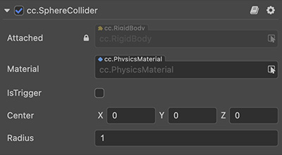

盒形碰撞体是一个基于长方体形状的碰撞体，可用来实现木箱、墙壁等物体的碰撞。

| 属性 | 说明 |
| :---|:--- |
| **Center**  | 在本地坐标系中，形状的中心位置 |
| **Radius** | 在本地坐标系中，球的半径 |

球碰撞器组件接口请参考 [SphereCollider API](__APIDOC__/zh/classes/physics.spherecollider.html)。

#### 胶囊碰撞器组件 CapsuleCollider

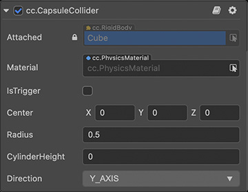

胶囊碰撞体是一个基于胶囊形状的碰撞体。

> **注意**：`cannon.js` 不支持胶囊组件，建议使用两个球体和圆柱拼凑。

| 属性 | 说明 |
| :---|:--- |
| **Center**  | 在本地坐标系中，形状的中心位置 |
| **Radius** | 在本地坐标系中，胶囊体上的球的半径 |
| **CylinderHeight** | 在本地坐标系中，胶囊体上圆柱体高度 |
| **Direction** | 在本地坐标系中，胶囊体的朝向 |

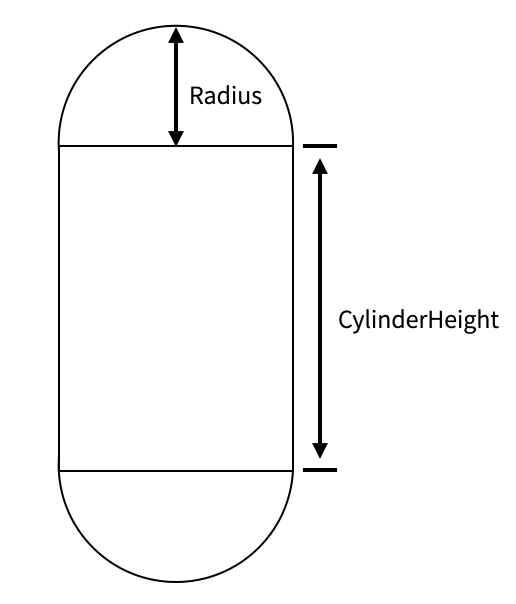

胶囊碰撞器组件接口请参考 [CapsuleCollider API](__APIDOC__/zh/classes/physics.capsulecollider.html)。

#### 圆柱碰撞器组件 CylinderCollider

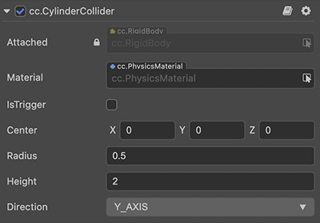

圆柱碰撞体是一个基于圆柱体的碰撞体。

| 属性 | 说明 |
| :---|:--- |
| **Center**  | 在本地坐标系中，形状的中心位置 |
| **Radius** | 在本地坐标系中，圆柱体上圆面的半径 |
| **Height** | 在本地坐标系中，圆柱体在相应轴向的高度 |
| **Direction** | 在本地坐标系中，圆柱体的朝向 |

圆柱碰撞器组件接口请参考 [CylinderCollider API](__APIDOC__/zh/classes/physics.cylindercollider.html)。

#### 圆锥碰撞器组件 ConeCollider


圆锥碰撞体是一个基于圆锥体的碰撞体。

| 属性 | 说明 |
| :---|:--- |
| **Center**  | 在本地坐标系中，形状的中心位置 |
| **Height** | 在本地坐标系中，圆锥体在相应轴向的高度 |
| **Direction** | 在本地坐标系中，圆锥体的朝向 |

圆锥碰撞器组件接口请参考 [ConeCollider API](__APIDOC__/zh/classes/physics.conecollider.html)。

### 复合碰撞体

复合碰撞体指的不是一个碰撞体类型，而是由多个基础碰撞体组成的可以简易模拟游戏对象形状的碰撞体组合。

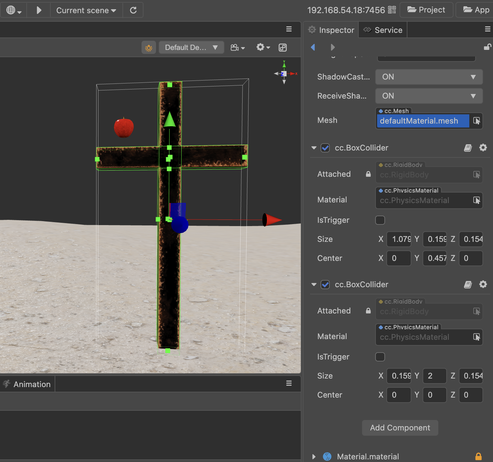

### 平面碰撞组件 PlaneCollider

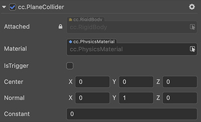

平面碰撞体是一个所属平面模型的碰撞体。平面模型可以通过在 **层级管理器** 面板右击 **创建->3D 对象->Plane 平面** 创建。

| 属性 | 说明 |
| :---|:--- |
| **Center**  | 在本地坐标系中，形状的中心位置 |
| **Normal** | 在本地坐标系中，平面的法线 |
| **Constant** | 在本地坐标系中，平面从原点开始沿着法线运动的距离 |

平面碰撞器组件接口请参考 [PlaneCollider API](__APIDOC__/zh/classes/physics.planecollider.html)。

### 网格碰撞组件 MeshCollider

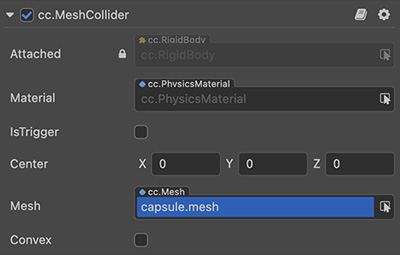

网格碰撞体是一个基于模型网格而形成的碰撞体。

> **注意**：
> 1. `cannon.js` 对网格碰撞器组件支持程度较差，只允许与少数碰撞器（球、平面）产生检测。
> 2. **Convex** 功能目前仅 `ammo.js` 后端支持。

| 属性 | 说明 |
| :---|:--- |
| **Center**  | 在本地坐标系中，形状的中心位置 |
| **Mesh** | 网格碰撞器所使用的网格资源，用于初始化网格碰撞体 |
| **Convex** | 是否使用网格的凸包近似代替，网格顶点数应小于 **255**，开启后可以支持动力学 |

网格碰撞器组件接口请参考 [MeshCollider API](__APIDOC__/zh/classes/physics.meshcollider.html)。

### 单纯形碰撞组件 SimplexCollider

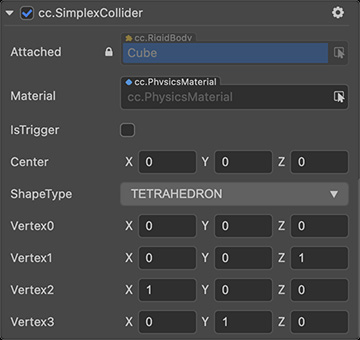

单纯形碰撞体是一个基于点、线、面和四面体的碰撞体。

| 属性 | 说明 |
| :---|:--- |
| **Center**  | 在本地坐标系中，形状的中心位置 |
| **ShapeType** | 单纯形类型，包括四种：点、线、三角面、四面体 |
| **Vertex0** | 单纯形的顶点 0，点（由 0 组成） |
| **Vertex1** | 单纯形的顶点 1，线（由 0、1 组成） |
| **Vertex2** | 单纯形的顶点 2，三角面（以此类推） |
| **Vertex3** | 单纯形的顶点 3，四面体 |

单纯形碰撞器组件接口请参考 [SimplexCollider API](__APIDOC__/zh/classes/physics.simplexcollider.html)。

> **注意**：`cannon.js` 对线和三角面的支持目前还不完善。

### 地形碰撞组件 TerrainCollider

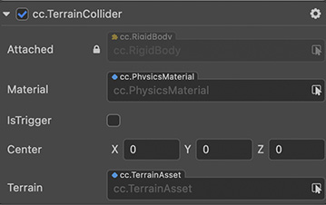

地形碰撞体是一个地形表面生成的碰撞体，具体形状与其附加到 Terrain 属性上的对象相同。

| 属性 | 说明 |
| :---|:--- |
| **Terrain** | 获取或设置此碰撞体引用的网格资源 |

地形碰撞器组件接口请参考 [TerrainCollider API](__APIDOC__/zh/classes/physics.terraincollider.html)。

## 自动缩放

每个组件都会绑定在一个节点上，有些组件会根据绑定的节点动态更新数据。其中碰撞体组件会根据节点信息自动更新相应的形状数据，让碰撞体可以更贴合渲染模型。以模型组件举例：

模型组件会根据绑定节点自动更新模型的世界矩阵，从而实现改变节点的位置、缩放、旋转等信息，可以使渲染的模型有相应仿射变换。

但碰撞体的有些性质导致缩放的处理不太一样：

- 碰撞体一般用几何结构来描述
- 碰撞体大部分都是凸包类型

这些性质限制了切变、非均一缩放等变换，以球举例：

假设绑定节点的缩放信息是 **(1,2,1)**（非均一缩放），由于模型和碰撞体描述的结构不一样，球模型使用多个基础图元（如三角面）来表示，缩放后会形变成类似于鹅卵石的形状；而球碰撞体是根据半径大小来描述，缩放时会取数值最大的维度来缩放半径（这样是为了碰撞体尽可能的包围住模型），**但缩放后还是一个球**，因此无法精确的包裹着类似于鹅软石大小的球模型。

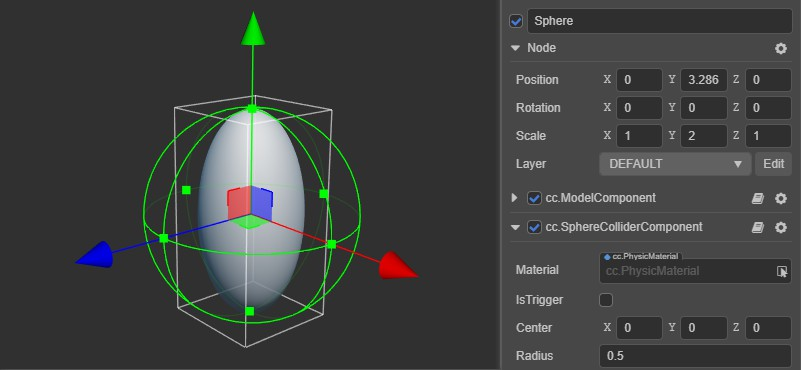

### 非标准形状

对于像鹅卵石这样非标准形状，可以使用 [MeshCollider 网格碰撞体](physics-component.md#%E7%BD%91%E6%A0%BC%E7%A2%B0%E6%92%9E%E5%99%A8%E7%BB%84%E4%BB%B6%20MeshCollider) 来代替基础的碰撞体。

**注意**：若需要支持动力学刚体，则必须开启 **convex** 功能。

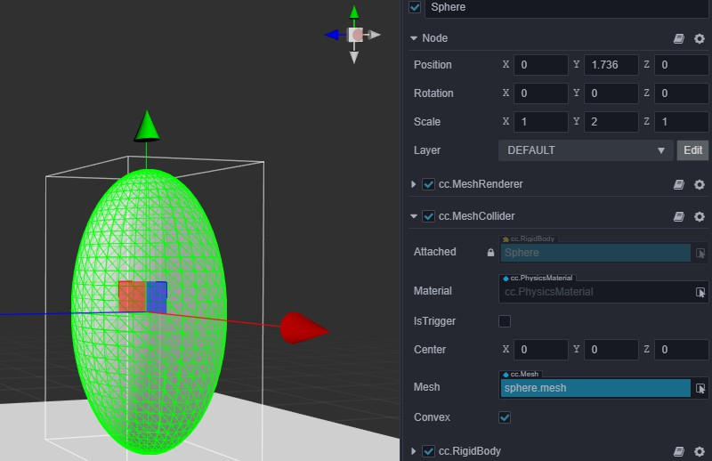

## 复合碰撞

对于单个节点是很容易看出是否有物理元素的，但如果以节点链（由节点树构成的物理元素）为单位，则很难看出物理元素是由哪些节点以及哪些组件组成的。

对于节点链的情况，目前有两个使用方案：

1. 节点链上的每个节点只要有物理组件，就是一个元素，这样父子节点之间的组件没有依赖关系。若节点需要多个碰撞体形状，往该节点上添加相应的 **Collider** 组件即可。
    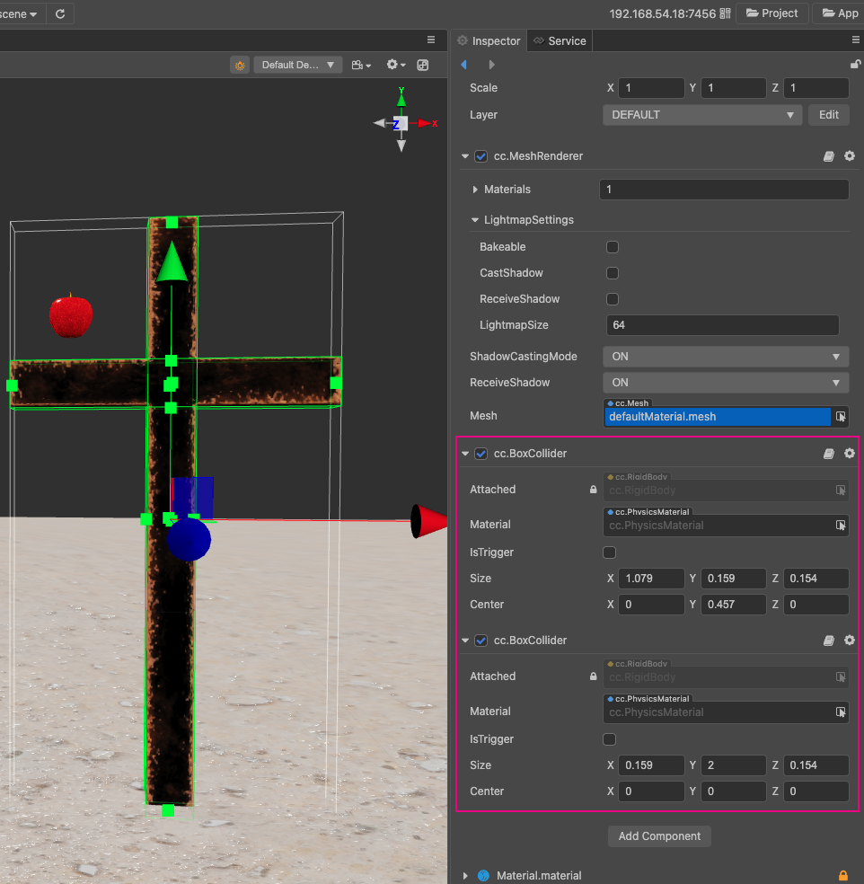

    **缺点**：

    - 层级结构不够直观，多个形状只能往一个节点上加，而显示形状需要增加子节点模型，并且难以支持碰撞体的局部旋转。
    - 对节点链调整参数时，需要同时调整两个地方，分别为子节点的位置信息和父节点上对应 **Collider** 组件的数据信息。

2. 从自身节点开始往父链节点上搜索，如果找到了 **RigidBody** 组件，则将自身的 **Collider** 组件绑定到该节点上，否则整条链上的 **Collider** 组件将共享一个 **RigidBody** 组件，元素对应的节点是最顶层的 **Collider** 组件所对应的节点。

    **缺点**：

    - 增加了节点耦合，节点更新时，需要更新相应的依赖节点。
    - 在节点链被破坏时，需要维护内容更多，节点链在反复被破坏时需要处理复杂的逻辑。

> **注意**：目前 Cocos Creator 使用的是方案 **1**，后续版本也有进行调整的可能，请留意版本更新公告。
