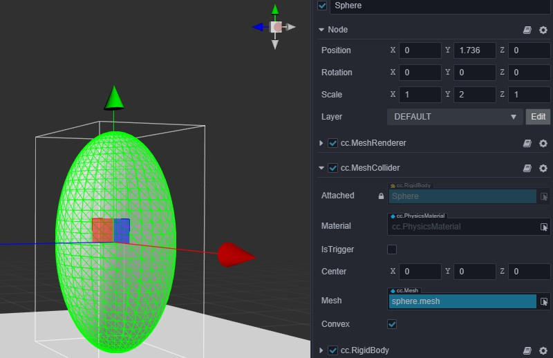

# 碰撞组件

各碰撞器组件说明，请参考 [碰撞器组件](physics-component.md#%E7%A2%B0%E6%92%9E%E5%99%A8%E7%BB%84%E4%BB%B6)

## 通过代码获取碰撞器组件

以获取 **BoxCollider** 盒碰撞器组件为例，将脚本挂载在带有碰撞器组件的节点上，通过以下代码获取组件：

```ts
import { BoxCollider } from 'cc'

this.getComponent(BoxCollider)
```

> **注**：若无智能导入提示，请检查工作目录是不是在工程的顶层，以及是否使用较新的 VSCode 编辑器。

## 碰撞器和触发器

各种 **Collider** 碰撞器组件具有 **isTrigger** 是否为触发器属性，将 **isTrigger** 设置为 `true` 时，该组件为触发器，而默认 `false` 情况为碰撞器。关于碰撞器和触发器的详细内容，可参考 [物理事件](physics-event.md)。

## Collider 和 RigidBody 的关系

**Collider** 和 **RigidBody** 组件都是服务于物理元素，分别操控着物理元素上的一部分属性。了解它们之间的关系，需要先了解 Cocos Creator 中的物理元素是如何构成的。

### 物理元素的组成

在 [**物理元素的组成**](physics.md#%E7%89%A9%E7%90%86%E5%85%83%E7%B4%A0%E7%9A%84%E7%BB%84%E6%88%90)中，介绍了一个物理元素是由 **Collider** 和 **RigidBody** 组件相互组合而成的，其中指出了物理元素只能有零个或一个 **RigidBody** 组件，但可以有零个或多个 **Collider** 组件。

单个节点是很容易看出是否有物理元素的，但如果以节点链为单位，则很难看出物理元素是由哪些节点以及哪些组件组成的。

对于节点树的情况，目前有两个使用方案：

1. 每个节点只要有 [物理组件](./physics-component.md)，就是一个元素，这样父子节点之间的组件没有依赖关系。若节点需要多个碰撞体形状，往该节点上添加相应的 **Collider** 组件即可。

    **缺点**：
    - 不够直观，多个形状只能往一个节点上加，显示形状需要增加子节点模型，并且不好支持碰撞体的局部旋转。
    - 调整参数时，需要调整两个地方，分别为子节点的位置信息和父节点上对应 **Collider** 组件的数据信息。

2. 从自身节点开始往父链节点上搜索，如果找到了 **RigidBody** 组件，则将自身的 **Collider** 组件绑定到该节点上，否则整条链上的 **Collider** 组件将共享一个 **RigidBody** 组件，元素对应的节点是最顶层的 **Collider** 组件所对应的节点。

    **缺点**：
    - 增加了节点耦合，节点更新时，需要更新相应的依赖节点。
    - 在节点链被破坏时，需要维护内容更多，节点链在反复被破坏时需要处理复杂的逻辑。

> **注**：目前 Cocos Creator 使用的是方案 **1**，后续版本也有进行调整的可能，请留意版本更新公告。

### **attached** 刚体组件属性

各种 **Collider** 碰撞器组件具有 **attached** 属性，此属性可获得当前 **Collider** 组件所绑定的 **RigidBody** 组件，但是请注意以下几点：

- 在自身节点无 **RigidBody** 组件时，该属性返回为 **null**。
- **attached** 是一个只读的属性。

代码示例：

```ts
const collider = this.node.getComponent(XXXCollider);
let rigidbody = collider.attached;
```

## 自动缩放

每个组件都会绑定在一个节点上，有些组件会根据绑定的节点动态更新数据。其中碰撞体组件会根据节点信息自动更新相应的形状数据，让碰撞体可以更贴合渲染模型。

更新数据，以模型组件举例：

模型组件会根据绑定节点自动更新模型的世界矩阵，从而实现改变节点的位置、缩放、旋转等信息，可以使渲染的模型有相应仿射变换。

但碰撞体的有些性质导致缩放的处理不太一样：

- 碰撞体一般用几何结构来描述
- 碰撞体大部分都是凸包类型

这些性质限制了切变、非均一缩放等变换，以球举例：

假设绑定节点的缩放信息是 **(1,2,1)**（非均一缩放），由于模型和碰撞体描述的结构不一样，球模型使用多个基础图元（如三角面）来表示，缩放后会形变成类似于鹅卵石的形状；但球碰撞体的使用半径大小来描述，缩放时会取数值最大的维度来缩放半径（这样是为了碰撞体尽可能的包围住模型），但缩放后还是一个球。


### 实现鹅卵石

对于此类情况，可以用网格碰撞体来代替基础的碰撞体。

**注**：若需要支持动力学刚体，则必须开启 **convex** 功能。



## 物理材质

碰撞体拥有物理材质属性，相关内容在[物理材质](physics-material.md)中有详细介绍，这里主要介绍共享和非共享的接口区别。

目前 **Collider** 组件提供了两个属性去访问和设置，分别为 **material** 和 **sharedMaterial**，它们的区别主要如下：

1. 设置 **sharedMaterial** 或者 **material** 是一样的效果，在没有调用这些接口之前是共享状态，当发现设置的与当前引用不是同一实例时，后面获取 **material** 将不会生成新的材质实例，此时是非共享状态。

2. 在共享状态前提下，获取 **material** 将会生成新的材质实例，以确保只有当前碰撞体引用了该材质，这样修改时不会影响到其他的碰撞体，之后就是非共享状态了。

3. 获取 **sharedMaterial** 不会生成新的，而是直接返回引用。
