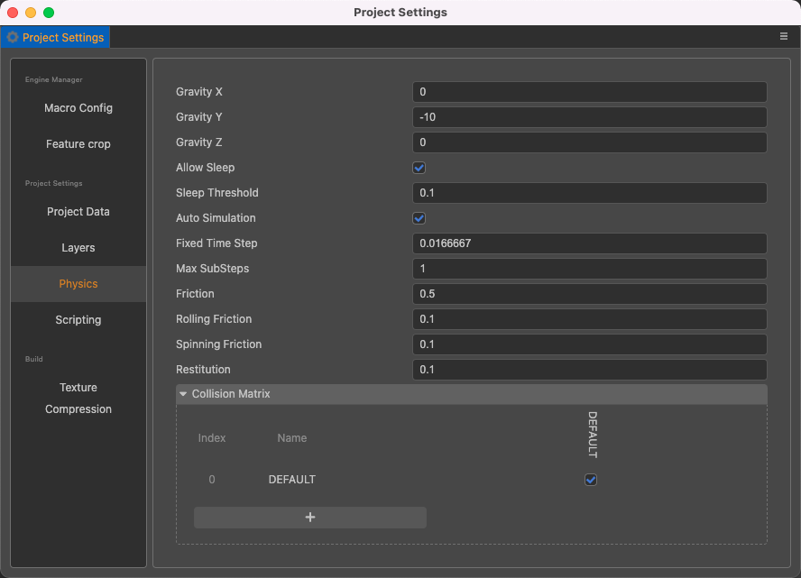
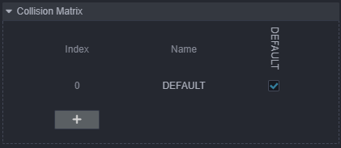
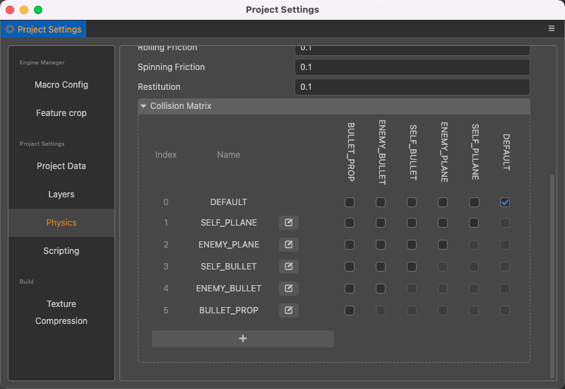
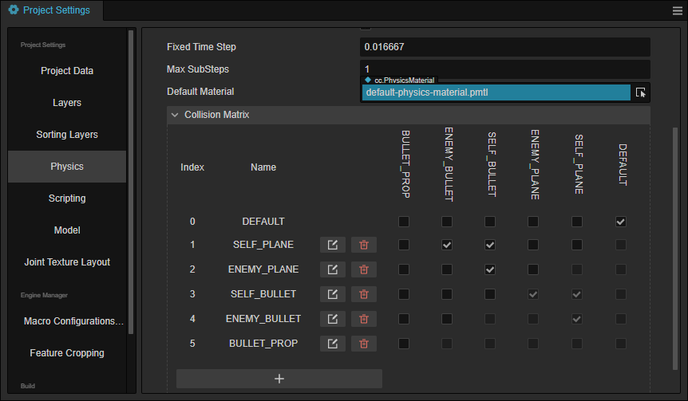
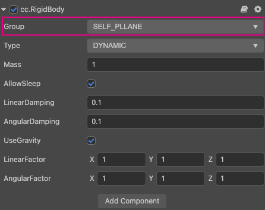

# 物理系统配置

物理系统模块（PhysicsSystem）用于管理整个物理系统，负责同步物理元素、触发物理事件和调度物理世界的迭代。

## 物理配置

### 通过物理配置面板

通过 **项目设置 -> 物理配置** 可以对物理系统进行相关配置。



| 属性 | 说明 |
| :--- | :--- |
| **Gravity X** | 重力矢量，设置 x 分量上的重力值 |
| **Gravity Y** | 重力矢量，设置 y 分量上的重力值 |
| **Gravity Z** | 重力矢量，设置 z 分量上的重力值 |
| **AllowSleep** | 是否允许系统进入休眠状态，默认值 `true` |
| **SleepThreshold** | 进入休眠的默认速度临界值，默认值 `0.1`，最小值 `0` |
| **AutoSimulation** | 是否开启自动模拟, 默认值 `true` |
| **FixedTimeStep** | 每步模拟消耗的固定时间，默认值 `1/60`，最小值 `0` |
| **MaxSubSteps** | 每步模拟的最大子步数，默认值 `1`，最小值 `0` |
| **Friction** | 摩擦系数，默认值 `0.5` |
| **RollingFriction** | 滚动摩擦系数，默认值 `0.1` |
| **SpinningFriction** | 自旋摩擦系数，默认值 `0.1` |
| **Restitution** | 弹性系数，默认值 `0.1` |
| **CollisionMatrix** | 碰撞矩阵，仅用于初始化 |

>**注意**：目前 **2D** / **3D** 物理共用一个配置。

### 程序化配置

| 属性 | 说明 |
| :--- | :--- |
| **enable** | 是否开启物理系统，默认为 `true` |
| **gravity** | 物理世界的重力值，默认为 `(0, -10, 0)` |
| **allowSleep** | 是否允许物理系统自动休眠，默认为 `true` |
| **maxSubSteps** | 每帧模拟的最大子步数，默认为 `2` |
| **fixedTimeStep** | 每次子步进消耗的时间，默认为 `1/60` |
| **sleepThreshold** | 进入休眠的默认速度临界值 |
| **autoSimulation** | 是否开启自动模拟，默认为 `true` |
| **defaultMaterial** | 获取默认物理材质（只读） |
| **raycastResults** | 获取 **raycast** 的检测结果（只读） |
| **raycastClosestResult** | 获取 **raycastClosest** 的检测结果（只读） |
| **collisionMatrix** | 获取碰撞矩阵，仅用于初始化 |

代码可以通过 `PhysicsSystem.instance` 设置。部分设置代码如下：

```ts
import { _decorator, Component, Node, Vec3, PhysicsSystem } from 'cc';
const { ccclass, property } = _decorator;
@ccclass('Example')
export class Example extends Component {
    start () {
        PhysicsSystem.instance.enable = true;
        PhysicsSystem.instance.gravity = new Vec3(0, -10, 0);
        PhysicsSystem.instance.allowSleep = false;
    }
}
```

也可通过 `PhysicsSystem.resetConfiguration` 接口来重置物理配置，代码示例如下：

```ts
let conf = game.config.physics
conf.gravity = new Vec3(10, 10, 0);
PhysicsSystem.instance.resetConfiguration(conf);
```

更多 API 内容请查看物理系统接口请参考：[PhysicsSystem API](__APIDOC__/zh/classes/physics.physicssystem.html)。

## 碰撞矩阵

碰撞矩阵是 [分组和掩码](physics-group-mask.md) 功能的进一步封装，它用于初始化物理元素的分组和掩码。



碰撞矩阵默认情况下只有一个 **DEFAULT** 分组，新建分组默认不与其它组碰撞。

点击 **+** 按钮可以新增分组。新增分组的 **Index** 和 **Name** 均不能不填。

- **Index** 代表的是碰撞分组值， 最高支持 32 位，即数值范围为 `[0, 31)`。分组值不可重复。
- **Name** 代表的是碰撞分组名。此处在这里设置的名字只是为了用户进行碰撞分组配置方便，无法通过代码获取，代码能获取到的只有分组值。



图上所示的就是一个飞行射击类游戏碰撞分组的配置。从图中可以看出，当添加一个分组的时候，面板上会出现横向和纵向都有分组的名字。我们把横向的部分称之为 **分组**，纵向的部分称之为 **掩码**。假设我现在进行了如下勾选：



此配置代表的意思是分组 **ENEMY_PLANE** 可以与分组 **ENEMY_BULLET** 和 **SELF_BULLET** 产生碰撞。这里的分组 **ENEMY_BULLET** 和 **SELF_BULLET** 就是分组 **ENEMY_PLANE** 的掩码。同样，对于分组 **ENEMY_BULLET** 来说 **ENEMY_PLANE** 也是它的掩码。

配置完成碰撞矩阵之后，就可以对需要产生碰撞的对象添加 **刚体（RigidBody）** 组件，设置碰撞分组 `Group`。



> **注意**：分组不可以删除，但可以修改分组的名称。
