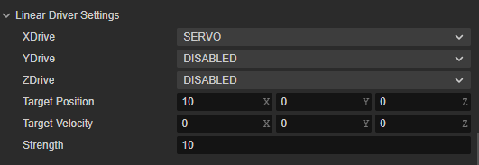
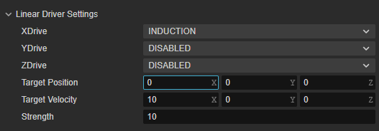

# 约束

在物理引擎中，**约束** 用于模拟物体间的连接情况，如连杆、绳子、弹簧或者布娃娃等。

约束依赖 [刚体组件](physics-rigidbody.md)，若节点无刚体组件，则添加约束时，引擎会自动添加刚体组件。

> **注意**：目前的约束仅在物理引擎选择为 Bullet、PhysX 或 Cannon.js 的情况下生效。

## 铰链约束 HingeConstraint

通过铰链约束，将连接物体的运动约束在某一个轴上，这种约束在模拟门的合页或电机转动等情形下非常有用。

| 属性                | 说明                                                       |
| :------------------ | :--------------------------------------------------------- |
| **AttachedBody**    | 关节所附着的刚体，即当前关节所在节点下的刚体组件           |
| **ConnectedBody**   | 获取或设置关节连接的另一个刚体，为空值时表示链接到静态刚体 |
| **EnableCollision** | 获取或设置关节连接的两刚体之间是否开启碰撞                 |
| **PivotA**          | 在自身刚体的本地空间中，约束关节的相对位置                 |
| **PivotB**          | 在连接刚体的本地空间中，约束关节的相对位置                 |
| **Axis**            | 在本地空间中约束关节的旋转轴                               |

铰链约束接口请参考 [HingeConstraint API](__APIDOC__/zh/class/physics.HingeConstraint)。

## 点对点约束 PointToPointConstraint

点对点约束是一种简单的复合约束，可以将两个对象，或者一个对象与坐标系中一点连接。连接的对象可以在共用一个连接点的情况下，相对对方自由旋转。

| 属性                | 说明                                                       |
| :------------------ | :--------------------------------------------------------- |
| **AttachedBody**    | 关节所附着的刚体，即当前关节所在节点下的刚体组件           |
| **ConnectedBody**   | 获取或设置关节连接的另一个刚体，为空值时表示链接到静态刚体 |
| **EnableCollision** | 获取或设置关节连接的两刚体之间是否开启碰撞                 |
| **PivotA**          | 在自身刚体的本地空间中，约束关节的相对位置                 |
| **PivotB**          | 在连接刚体的本地空间中，约束关节的相对位置                 |

点对点约束接口请参考 [PointToPointConstraint API](__APIDOC__/zh/class/physics.PointToPointConstraint)。

## 固定约束 FixedConstraint

固定约束是一种最简单的约束，它锁定了两个刚体之间的相对位置和旋转。连接的对象不允许相对于彼此移动。

| 属性                | 说明                                                       |
| :------------------ | :--------------------------------------------------------- |
| **AttachedBody**    | 关节所附着的刚体，即当前关节所在节点下的刚体组件           |
| **ConnectedBody**   | 获取或设置关节连接的另一个刚体，为空值时表示链接到静态刚体 |
| **EnableCollision** | 获取或设置关节连接的两刚体之间是否开启碰撞                 |
| **BreakForce**      | 获取或设置约束在断开之前可以施加的最大力                   |
| **BreakTorque**     | 获取或设置约束在断开之前可以施加的最大扭矩                 |

固定约束接口请参考 [FixedConstraint API](__APIDOC__/zh/class/physics.FixedConstraint)。

## 可配置约束 Configurable constraint

可配置约束是物理引擎中最全面的约束之一，包括各种游戏引擎中常用的约束类型。通过配置，可以对6个自由度分别进行控制，并通过设置不同方向上的约束参数实现几乎所有物理引擎中常用的特殊约束。不同自由度可以有不同的约束模式，如free、limited 和 locked。其中，free 表示不做任何约束，limit 表示限制刚体的运动范围和过程，而 locked 表示限制连接的刚体必须相对静止。例如，将所有6个自由度的约束模式设置为 locked 时，相当于使用 fixed 约束限制刚体。在 limit 模式下，可以对刚体的运动进行一定程度的限制，如限制该自由度在某个区间内运动。对于 limit 模式下的刚体，在运动到被限制范围的边界时，会发生回弹。此时，可以通过设置不同的回弹系数来调节回弹的力度，并通过调节软约束的参数实现约束的弹性，给运动施加一定量的阻力等。

由可配置约束连接的刚体可以通过马达驱动产生期望的相对运动。启用马达后，刚体将向指定的相对位置运动或逐渐加速到指定的相对速度并保持运动。马达有两种不同的模式，伺服模式和普通模式。在伺服模式下，驱动器将使刚体向指定的位置或角度运动，并在到达目标位置或角度后停止。在普通模式下，驱动器将使刚体逐渐加速，达到指定的线速度或角速度，然后保持该速度运动。另一个可以调节的参数是驱动器的最大驱动力，该参数决定刚体能够以怎样的速度加速趋向指定的目标位置和速度。当最大驱动力很大时，外界的干扰将很难改变刚体之间的相对运动状态。

| 属性                      | 描述                                                       |
| :------------------------ | :--------------------------------------------------------- |
| **Attached Body**          | 关节所附着的刚体，即当前关节所在节点下的刚体组件           |
| **Connected Body**         | 获取或设置关节连接的另一个刚体，为空值时表示链接到静态刚体 |
| **Enable Collision**       | 获取或设置关节连接的两刚体之间是否开启碰撞                 |
| **Axis**                  | 获取或设置约束的主轴向                                     |
| **Secondary Axis**         | 获取或设置约束的次要轴向（与主轴正交）                     |
| **Pivot A**                | 在自身刚体的本地空间中，约束关节的相对位置                 |
| **Pivot B**                | 在连接刚体的本地空间中，约束关节的相对位置                 |
| **Auto Pivot B**            | 从 PivotA 和两个刚体的相对位置自动推导 PivotB              |
| **Break Force**            | 获取或设置约束断裂前可以施加的最大力                       |
| **Break Torque**           | 获取或设置约束断裂前可以施加的最大扭矩                     |
| **Linear Limit Settings**   | 获取或设置线性限制设置                                     |
| **Angular Limit Settings**  | 获取或设置角度限制设置                                     |
| **Linear Driver Settings**  | 获取或设置线性马达设置                                     |
| **Angular Driver Settings** | 获取或设置角度马达设置                                     |

示例：当设置约束体主轴朝向为依附刚体的 y 轴，次轴为依附刚体的 x 轴时，约束体各个轴的朝向如下图所示。

| 附着刚体轴向 | 约束体线性轴向 | 约束体旋转轴轴向 |
| :-- | :-- | :-- |
|  |  |  |

## 线性限制 LinearLimitSettings

| 属性                     | 描述                      |
| :----------------------- | :------------------------ |
| **XMotion**              | 获取或设置 x 轴的约束模式 |
| **YMotion**              | 获取或设置 y 轴的约束模式 |
| **ZMotion**              | 获取或设置 z 轴的约束模式 |
| **Upper**                | 获取或设置线性限制的上限  |
| **Lower**                | 获取或设置线性限制的下限  |
| **Restitution**          | 获取或设置约束的恢复系数  |
| **Enable Soft Constraint** | 获取或设置是否启用软约束  |
| **Damping**              | 获取或设置约束的阻尼系数  |
| **Stiffness**            | 获取或设置约束的硬度系数  |

## 角度限制 AngularLimitSettings

| 属性 | 描述 |
| :-- | :-- |
| **Twist Motion**               | 获取或设置扭转轴的约束模式         |
| **Swing Motion1**              | 获取或设置摆动 y 轴的约束模式      |
| **Swing Motion2**              | 获取或设置摆动 z 轴的约束模式      |
| **Twist Extent**               | 获取或设置扭转轴的角度限制         |
| **Swing Extent1**              | 获取或设置摆动 y 轴的角度限制      |
| **Swing Extent2**              | 获取或设置摆动 z 轴的角度限制      |
| **Twist Restitution**          | 获取或设置扭转约束的恢复系数       |
| **Swing Restitution**          | 获取或设置摆动约束的恢复系数       |
| **Enable Soft Constraint Twist** | 获取或设置是否启用扭转约束的软约束 |
| **Twist Damping**              | 获取或设置扭转约束的阻尼系数       |
| **Twist Stiffness**            | 获取或设置扭转约束的刚度系数       |
| **Enable Soft Constraint Swing** | 获取或设置是否启用摆动约束的软约束 |
| **Swing Damping**              | 获取或设置摆动约束的阻尼系数       |
| **Swing Stiffness**            | 获取或设置摆动约束的硬度系数       |

## 线性马达 LinearDriverSettings

| 属性 | 描述 |
| :----------- | :-------------------------- |
| **XDrive**   | 获取或设置沿 x 轴的驱动模式 |
| **YDrive**   | 获取或设置沿 y 轴的驱动模式 |
| **ZDrive**   | 获取或设置沿 z 轴的驱动模式 |
| **Target Orientation**   | 获取或设置目标位置          |
| **Target Velocity** | 获取或设置目标速度          |
| **Strength** | 获取或设置最大驱动力        |

驱动模式请参考下文。

## 角度马达 AngularDriverSettings

| 属性 | 描述 |
| :-- | :-- |
| **Twist Drive**  | 获取或设置沿扭转轴的驱动模式    |
| **Swing Drive1** | 获取或设置沿摆动 y 轴的驱动模式 |
| **Swing Drive2** | 获取或设置沿摆动 z 轴的驱动模式 |
| **Target Orientation**      | 获取或设置目标角度              |
| **Target Velocity**    | 获取或设置目标角速度            |
| **Strength**       | 获取或设置最大驱动力            |

驱动模式请参考下文。

## 驱动模式

线性马达和角度马达都可以分轴调整他的驱动模式，驱动模式有 3 种：

- **DISABLED**：禁用模式，该模式下，对应的分轴不会受到马达驱动力或者扭矩的影响
- **SERVO**：尝试移动/旋转到指定的位置/角度。
    - 线性马达： X，Y，Z 的 Drive 属性分别和 Target Position 的三个参数对应

        

        以上图举例， **XDrive** 为 **SERVO** 且 **Target Position** 的 X 分量为 10，则表示约束将尝试移动到 10。

    - 角度马达：Twist Drive，Swig Drive1，Swig Drive2 分别和 Target Orientation 的三个参数对应
- **INDUCTION**：驱动约束到指定的速度/角速度
    - 线性马达： X，Y，Z 的 Drive 属性分别和 Target Velocity 的三个参数对应

        

        以上图为例，**XDrive** 为 **INDUCTION** 且 **Target Velocity** 的 X 分量为 10，则表示约束将尝试将其速度移动到 10.

    - 角度马达：Twist Drive，Swig Drive1，Swig Drive2 分别和 Target Velocity 的三个参数对应

有关可配置约束接口，请参阅 [ConfigurableConstraint API](__APIDOC__/zh/class/physics.ConfigurableConstraint)。
