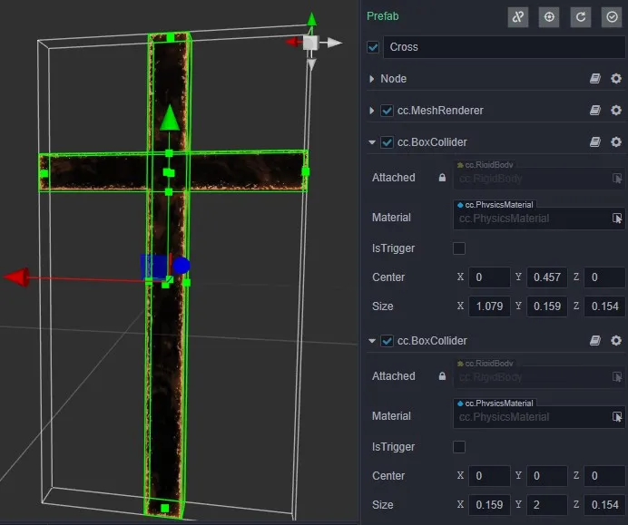
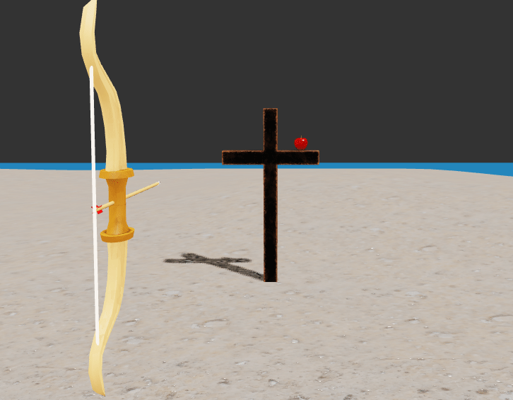
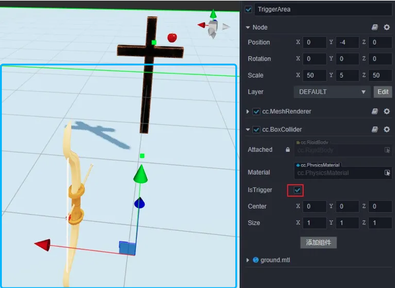
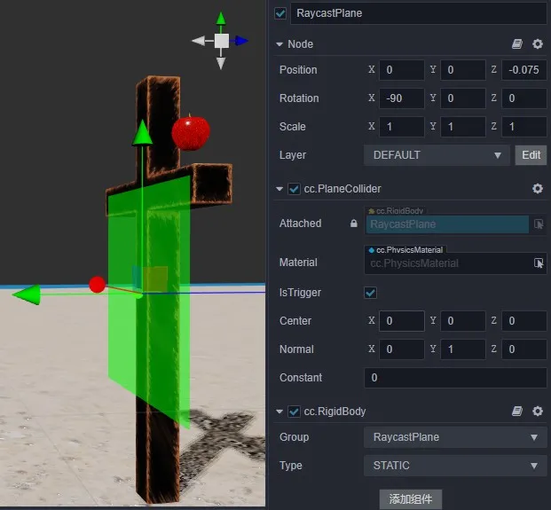
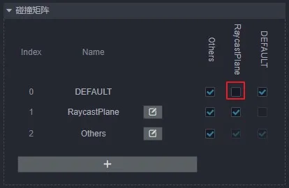
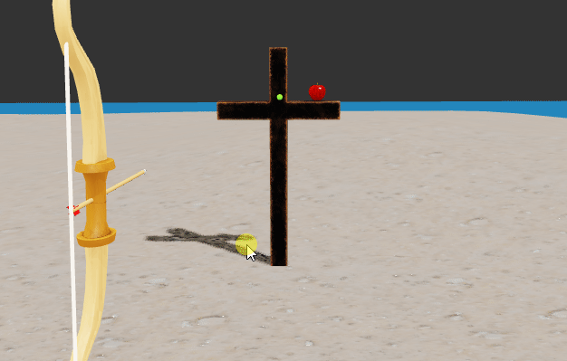
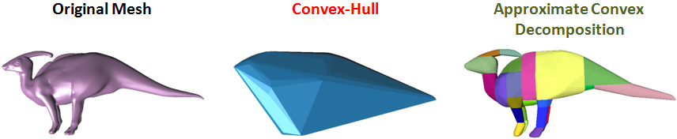

# 物理应用案例

## 射箭案例

1. 用基础形状组合十字架——复合形状

    下图中用两个盒形状组合一个十字架，节点上所有的碰撞体组合成了一个十字形状，这是实现带有凹面形状最基础的方法：

    

    容易误用的地方是在多个节点中添加碰撞体拼凑出十字架后，希望它碰撞后可以保持整体结构进行运动，这在目前的结构中是无法做到的，只能往单个节点上添加碰撞体来实现。

2. 射箭与回收箭——运动学、动力学、事件

    射箭的第一步是拉弓，箭需要完全跟随弹性绳骨骼一起运动，不希望箭受到物理规则的影响，此时应将箭的刚体设置为 `Kinematic` 类型；第二步是松开弹性绳发射箭，这时希望给箭设置初速度后，可以按照物理规则进行运动，因此将箭的刚体设置为 `Dynamic` 类型。

    

    回收箭的大致过程是在箭射出去后，一旦触碰到触发区域就将其还原到弓上。这可以通过制作监听区域来实现，首先利用碰撞体组件拼凑出区域，同时将碰撞体组件的 `IsTrigger` 勾选上（下图中的地面，也就是蓝框圈出的部分为监听区域）。

    

    上述容易产出错误的地方有：

    1. 希望修改变换信息来操作动力学（Dynamic）类型的刚体运动，应当通过速度、力或冲量等物理层的数值来控制。

    2. 利用静态（Static）类型的刚体来监听事件，静态刚体只会和带有类型为运动学或动力学的刚体产生事件。如果两者都为静态，则不产生事件。

    3. 监听事件时仅监听了触发开始（OnTriggerEnter），但是误以为包括了触发保持（OnTriggerStay）和结束（OnTriggerExit）。

3. 瞄准——碰撞矩阵(过滤检测)、射线检测、静态平面

    瞄准是射箭前的步骤，准心处于箭头指向所在的射线上，在十字架前面加一个静态平面碰撞体，然后利用射线检测就可以得到准心的位置。

    

    静态平面只是用来做射线检测，给它专门建立一个分组，并且不与箭、苹果等等物体进行检测，这是最通用的性能优化方法。

    

    调用射线检测方法时，设置传入掩码为仅和静态平面检测，即 `0b10`（二进制表示法）。

    上述容易产出错误的地方有：

    1. 分不清刚体组件上的分组和节点上的层。这两者的概念类似，但是使用者不同，分组的使用者是物理模块，层的使用者是渲染模块。

    2. 对掩码的理解不到位，不知传何值。这里提供一个小技巧，以一个能够筛选出 `Others` 的掩码举例，首先Others的index值为2，哪么只要让二进制掩码从右往左的顺序第 `2` 位为 `1`，就能让 `Others` 通过筛选，也就是 `ob100`（这里强烈建议不要随便更改分组的索引）。

    3. 误认为射线检测接口的返回值是击中的数据。获取结果有专门的接口，此处设计是为了强调这是个复用对象。为了减少垃圾内存，每次调用接口只会更新它们的数据，而不是重新生成新的（若需要持久记录，哪么可以克隆一份）。

4. 射击苹果——静态网格、凸包、多步模拟（步长调整）

    一般的苹果都带有凹面，处理好凹类或带连续平滑不规则曲面的模型都非常棘手，这是因为目前成熟的理论和技术都建立在离散、凸包的世界之上（微积分中用差分近似表示微分就是最典型的范例）。

    在实时物理引擎中，对于这类物体只能支持到静态或运动学类型的刚体层级，对于动力学就束手无策了。然而不幸的是，真实的苹果运动表现强烈依赖动力学，这种情况只能给苹果填加凸包形式的网格碰撞体（需将 convex 勾选上），再加上一个动力学刚体，用近似物体去参与模拟。

    

    运动表现与模拟参数有非常大的关系，穿透是最具有代表性的现象，这可以通过缩减步长和增加步数来实现，调整步长有个小技巧：输入分式，即 `1/Frame`，其中 `Frame` 表示帧率。

    

    上述容易产出错误的地方有：

    1. 在带有未勾选 `convex` 的网格碰撞器上添加了的动力学刚体，与其它物体产生了穿透现象，或者说完全没有反应，这是典型的错误使用，只有勾上 `convex` 的才能支持动力学刚体。

    2. 对一个顶点数极多的模型开启了 `convex`，过多的顶点数会使凸包的面数增多，这对性能有很大的影响，而且实际上并不需要面数特别多的凸包，一般建议模型的顶点数应小于 `255`。

    3. 开启凸包后，模型的凹面处的接触不贴近，这是正常现象，现在的实时技术是将模型用多个凸包组合来解决，如下图所示：

        

    4. 只调整了步长，但未调整步数，这两者需要相互配合才有效果。小技巧是，步数可以随意设置较大的值，步长根据最大的速度值进行调整，值越大，步长应当越小。

