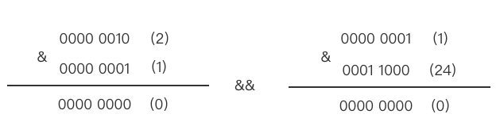
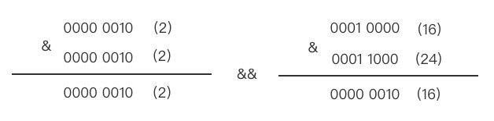

# 分组和掩码

分组和掩码是物体之间能否进行物理碰撞检测的必要条件。分组可以简单的理解为一个碰撞对象所处的分组，掩码可以简单的理解为该碰撞对象需要与哪些分组对象进行碰撞。

## 碰撞检测原理

在 Cocos Creator 中是否进行碰撞检测采用的是二进制 [按位操作](https://www.w3school.com.cn/js/js_bitwise.asp)，通过将分组值与掩码值进行“与”运算，从而判断是否满足条件。对象间允许进行碰撞检测的计算方式如下：

```ts
(GroupA & MaskB) && (GroupB & MaskA)
```

从这个公式中可以看出，分组 A 需要满足在分组 B 的掩码列表里并且分组 B 也需要满足在分组 A 的掩码列表里，这样的两个对象之间就能进行碰撞检测。如何将二进制操作与允许进行碰撞检测计算公式结合起来，这是下面需要了解的部分。但在这之前，需要用户在 **项目设置  -> 物理 -> 碰撞矩阵** 处先配置 [碰撞分组](physics-configs.md#碰撞矩阵)。


根据上图的配置，Cocos Creator 会将数据解析为以下值（此处仅针对讲解的部分做展示）：

- **DEFAULT**：**Index** 值为 `0`，分组实际值为 `1<<0=1`，二进制值为 `0000 0001`；掩码值实际值为 `1<<0=1`，二进制值为 `0000 0001`。
- **SELF_PLANE**：**Index** 值为 `1`，分组实际值为 `1<<1=2`，二进制为 `0000 0010`；掩码值实际值为 `(1<<3)+(1<<4)=24`，二进制值为 `0001 1000`。
- **ENEMY_BULLET**：**Index** 值为 `4`，分组实际值为 `1<<4=16`，二进制为 `0001 0000`；掩码值实际值为 `1<<1=2`，二进制值为 `0000 0010`。

根据数据就可以对分组之间是否碰撞做计算：

- 分组 **SELF_PLANE** 是否与分组 **DEFAULT** 碰撞：

  

  根据以上计算最终得出的值是 `0`，因此两个分组间不会产生碰撞。

- 分组 **SELF_PLANE** 是否与分组 **ENEMY_BULLET** 碰撞：

  

  根据以上计算最终得出的值大于 `0`，因此两个分组间会产生碰撞。

> **注意**：`<<` 左移运算符，是位运算符的一种，通过从右推入 0 向左位移，并使最左边的位脱落。

## 动态设置分组和掩码

### 定义分组

通常，在游戏开发中，需要在碰撞发生前设置好可碰撞分组，在碰撞发生时处理相关的逻辑。在 Cocos Creator 中，所有的碰撞数据获取到的是数值，这样不利于开发过程中的判断。因此，可以通过定义分组对象或者枚举的形式，清晰的知道每一串数字的意义。

在可以采用左移操作符（<<）对分组或者掩码进行设置，并且无论是分组对象还是分组枚举，对应的值都应该和碰撞矩阵定义的值一致，否则可能出现数据不一致，从而导致判断失败。

方式一：定义在一个 **object** 中

```ts
export const PHY_GROUP = {
    DEFAULT: 1 << 0,
    SELF_PLANE: 1 << 1,
    ENEMY_PLANE = 1 << 2,
    SELF_BULLET = 1 << 3,
    ENEMY_BULLET = 1 << 4,
    BULLET_PROP = 1 << 5,
};
```

方式二：定义在一个 **enum** 中

```ts
enum PHY_GROUP {
    DEFAULT = 1 << 0,
    SELF_PLANE = 1 << 1,
    ENEMY_PLANE = 1 << 2,
    SELF_BULLET = 1 << 3,
    ENEMY_BULLET = 1 << 4,
    BULLET_PROP = 1 << 5,
};

// 如果该枚举需要在属性面板上显示，需要引入来自 cc 模块的 Enum 函数，将定义好的枚举注册到编辑器中
Enum(PHY_GROUP);
```

> **注意**：由于历史原因， **Enum** 函数对 **-1** 有特殊处理，如果不熟悉，请勿定义值为 **-1** 的属性。

### 设置/获取分组

```ts
  // 此处案例使用的是上方 “定义分组” 处定义的枚举
  const rigid = this.getComponent(RigidBody);
  rigid.setGroup(PHY_GROUP.SELF_PLANE);
  // 等价于 rigid.setGroup(1 << 1) 或 rigid.setGroup(1)

  rigid.getGroup();
```

### 添加/删除分组

```ts
  // 如果当前分组并未在碰撞矩阵中定义，也可以动态添加
  const group = 1 << 7;
  const rigid = this.getComponent(RigidBody);
  rigid.addGroup(group);
  rigid.removeGroup(group);
```

### 设置/获取掩码

```ts
  const rigid = this.getComponent(RigidBody);
  const mask = (1 << 0) + (1 << 1); // 等价于 1 << 0 | 1 << 1
  rigid.setMask(mask);
  rigid.getMask();
```

> **注意**：
> - 此处需要注意操作符的优先级。例如：3 + 1 << 2 和 3 + (1 << 2) 所计算的值是不相等的，操作符 + 的优先级大于 <<。

#### 使用掩码

掩码可以根据分组进行定义，例如：

- 定义一个只检测 **DEFAULT** 的掩码 `const maskForGroup1 = PHY_GROUP.DEFAULT;`
- 定义一个可检测 **DEFAULT** 和 **SELF_PLANE** 的掩码 `const maskForGroup01 = PHY_GROUP.DEFAULT | PHY_GROUP.SELF_PLANE;`
- 定义一个所有组都不检测的掩码 `const maskForNone = 0;`
- 定义一个所有组都检测的掩码 `const maskForAll = 0xffffffff;`

### 查看分组或掩码二进制

通过 `(value >>> 0).toString(2)`，可以看到二进制的字符串表示。


