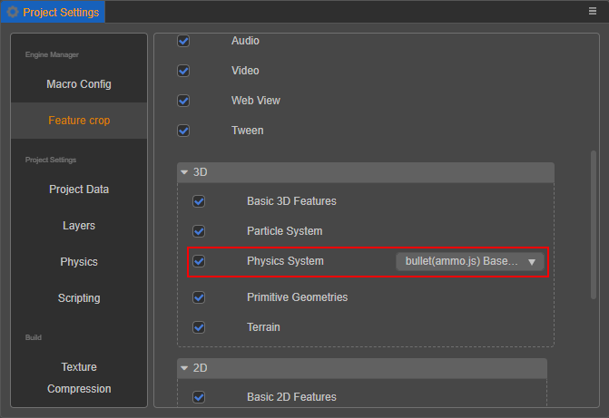

# 选择适合你项目的物理系统

在编辑器上方的菜单栏中点击 **项目 -> 项目设置 -> 功能裁剪 -> 物理系统**，即可根据项目需求选择合适的物理引擎进行开发。默认物理引擎为 **bullet（ammo.js）**，开发过程中可随意切换物理引擎。



若不需要用到任何物理相关的组件和接口，可以取消 **物理系统** 的勾选，这样在发布时包体将会更小。但需要注意的是若取消勾选，则项目不可以使用物理相关的组件和接口，否则运行时将会报错。

## 物理引擎类型

### 碰撞检测：builtin

__builtin__ 仅有碰撞检测的功能，相对于其它的物理引擎，它没有复杂的物理模拟计算。如果您的项目不需要这一部分的物理模拟，那么可以考虑使用 __builtin__，这将使得游戏的包体更小。

若使用 __builtin__ 进行开发，请注意以下几点：

- __builtin__ 只有 __trigger__ 类型的事件。
- __Collider__ 中的 __isTrigger__ 无论值真假，都为运动学类型的触发器。

### 物理引擎：cannon.js

**cannon.js**（[GitHub](https://github.com/cocos-creator/cocos-cannon.js) | [Gitee](https://gitee.com/mirrors_cocos-creator/cannon.js)）是一个开源的物理引擎，它使用 __js__ 语言开发并实现了比较全面的物理功能，如果您的项目需要更多复杂的物理功能，那么您可以考虑使用它。 __cannon.js__ 模块大小约为 __141KB__。

### 物理引擎：bullet（ammo.js）

**ammo.js**（[GitHub](https://github.com/cocos-creator/cocos-ammo.js) | [Gitee](https://gitee.com/mirrors_cocos-creator/ammo.js)）是 [bullet](https://github.com/bulletphysics/bullet3) 物理引擎的 __asm.js__/__wasm__ 版本，由 [emscripten](https://github.com/emscripten-core/emscripten) 工具编译而来。 __Bullet__ 具有完善的物理功能，以及更佳的性能，未来我们也将在此投入更多工作。

需要注意的是，目前 __ammo.js__ 模块具有 __1.5MB__ 左右的大小。

### 物理引擎：PhysX

**PhysX**（[GitHub](https://github.com/NVIDIAGameWorks/PhysX)）是由英伟达公司开发的开源实时商业物理引擎，它具有完善的功能特性和极高的稳定性，同时也兼具极佳的性能表现。

目前 Cocos Creator 支持的 **PhysX** 是 4.1 版本，允许在绝大部分原生和 Web 平台中使用。当发布到原生平台时，推荐使用 PhysX 物理，可以得到更好的物理性能，特别是发布到 iOS 时。

但由于 **PhysX** 目前的包体过于庞大（约 5MB）以及自身的一些限制，导致部分平台无法得到良好支持，包括：

- 各类有包体限制的小游戏平台
- 安卓 x86 设备

部分较新的平台和设备，例如 HarmonyOS、Apple M1（Silicon）架构的设备，将在后续支持，请留意更新公告。

除此之外，字节跳动平台提供了底层的原生物理功能，因此字节跳动小游戏中同样可以使用该功能，详情请参考 [发布到字节跳动小游戏 - 原生物理](../editor/publish/publish-bytedance-mini-game.md)。

<!-- ## 扩展物理后端 -->

## 物理引擎的性能表现

主要针对各类小游戏平台和原生平台，并对使用 **Bullet** 和 **PhysX** 物理时的性能进行了对比：

- 在原生和字节跳动小游戏平台上，使用 **PhysX** 物理可以得到最加良好的性能。
- 在各类小游戏平台上，使用 **Bullet** 物理可以得到最加良好的性能。

## 物理引擎的效果差异

不同的物理引擎，其内部的设计和算法都不相同，因此会出现一些参数相同但是效果不同的情况，这些差异主要包括以下三类：

1. 刚体组件上的 `damping` 属性

    由于 PhysX 物理使用了不同的阻尼算法模型导致的差异。但此差异已被内部消除，如果需要同步之前在 PhysX 中设置的阻尼值，可以参考以下代码进行转换：

    ```ts
    const dt = PhysicsSystem.instance.fixedTimeStep;
    const newDamping = 1 - (1 - oldDamping * dt) ** (1 / dt);
    ```

2. 刚体组件上的 `factor` 属性

    由于 PhysX 物理只固定刚体自由度，没有提供刚体速度的缩放因子导致的，即刚体组件中的 `Linear Factor` 和 `Angular Factor` 属性对 PhysX 物理只有固定效果。之后将会在内部消除此差异。

3. 物理材质

    PhysX 中的物理材质支持静态摩擦系数、动态摩擦系数和弹性系数，与 Creator 中的物理材质资源相比，缺少了动态摩擦系数。该系数目前与静态摩擦系数保持一致，这部分的差异目前暂时无法提供转换方式。

除了以上提到的几点之外，也存在其它算法的差异，例如数值积分方法、LCP 求解算法、求解精度等，因此始终会有不同的效果，不过这些在实际项目开发中不太容易感知。
