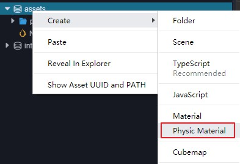

# 物理材质

物理材质是一种资源，它记录了物体的表面信息，这些信息用来计算碰撞物体受到的摩擦力和弹力等。

## 属性

物理材质属性如下图所示：


| 属性 | 属性说明 |
| :-- | :-- |
| Friction | 摩擦系数 |
| RollingFriction | 滚动摩擦系数 |
| SpinningFriction | 自旋摩擦系数 |
| Restitution | 回弹系数 |

当与其它表面接触时，这些系数用于计算相应的摩擦力和弹力。

## 创建物理材质

### 在编辑器内创建

可使用编辑器创建物理材质，如下图所示：



### 通过代码创建

也可通过代码实例化物理材质：

```ts
import { PhysicsMaterial } from 'cc';

let newPmtl = new PhysicsMaterial();
newPmtl.friction = 0.1;
newPmtl.rollingFriction = 0.1;
newPmtl.spinningFriction = 0.1;
newPmtl.restitution = 0.5;
```

## 应用

目前物理材质以碰撞体为单位进行设置，每个 **Collider** 都具有一个 **Material** 的属性（不设置时， **Collider** 将会引用物理系统中的默认物理材质）。

应用到 **Collider** 同样也分编辑器操作和代码操作两种方式。

编辑器内操作，只需要将资源拖入到 `cc.PhysicMaterial` 属性框中即可，如下图所示：


```ts
import { Collider } from 'cc';

let collider = this.node.getComponent(Collider);
if (collider) {
    collider.material = newPmtl;
    collider.material.rollingFriction = 0.1;
}
```
