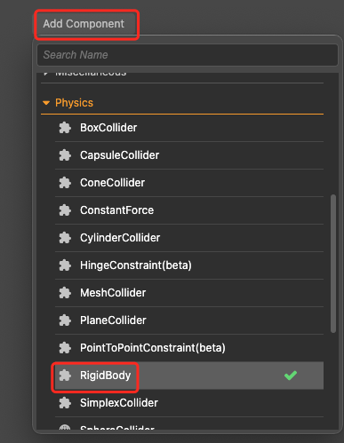
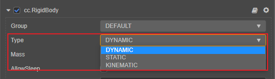
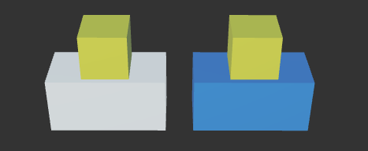
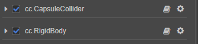
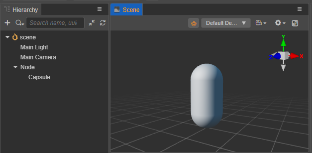
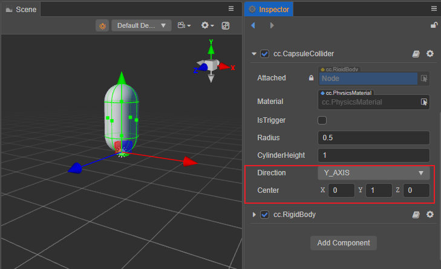
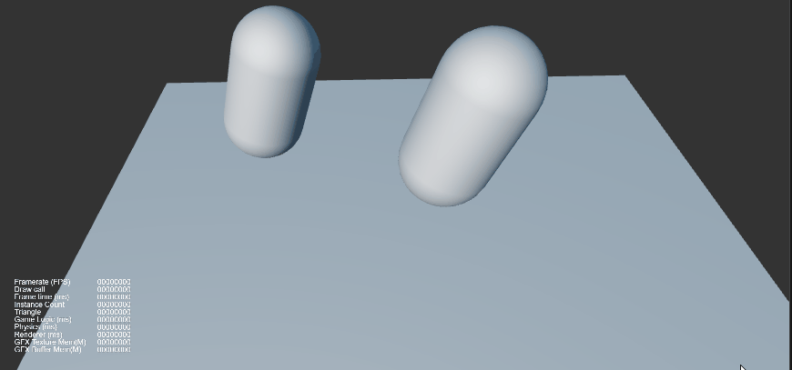

# 刚体组件

刚体是组成物理世界的基本对象，它可以使游戏对象的运动方式受物理控制。例如：刚体可以使游戏对象受重力影响做自由下落，也可以在力和扭矩的作用下，让游戏对象模拟真实世界的物理现象。

## 添加刚体

### 通过编辑器添加

点击 **属性检查器** 下方的 **添加组件 -> Physics -> RigidBody**，即可添加刚体组件到节点上。



### 通过代码获取刚体组件

```ts
import { RigidBody } from 'cc'

let rigidBody = this.node.getComponent(RigidBody);
```

### 什么情况下需要添加刚体

1. 配置碰撞分组并让其生效。
2. 物体需要具备运动学或动力学行为。

>**注意**：物体需要具备完全物理特性的前提条件物体同时具备 **刚体** 和 **碰撞体**，并调整好其质心位置和碰撞体的形状。

## 刚体属性


| 属性      | 说明                                                                             |
| :-------- | :------------------------------------------------------------------------------- |
| **Group** | 刚体分组                                                                         |
| **Type**  | 刚体类型。<br>**DYNAMIC**：动力学 <br>**STATIC**：静态 <br>**KINEMATIC**：运动学 |

以下属性仅在 **Type** 设为 **DYNAMIC** 时生效：

| 属性               | 说明                                                 |
| :----------------- | :--------------------------------------------------- |
| **Mass**           | 刚体质量，该值需大于 **0**                           |
| **AllowSleep**     | 是否允许自动休眠                                     |
| **LinearDamping**  | 线性阻尼，用于衰减线性速度，值越大，衰减越快         |
| **AngularDamping** | 角阻尼，用于衰减角速度，值越大，衰减越快             |
| **UseGravity**     | 是否使用重力                                         |
| **LinerFactor**    | 线性因子，用于缩放每个轴方向上的物理数值（速度和力） |
| **AngularFactor**  | 角因子，用于缩放每个轴方向上的物理数值（速度和力）   |

刚体组件接口请参考 [RigidBody API](__APIDOC__/zh/#/docs/3.4/zh/physics/classes/rigidbody.html)。

## 刚体类型

目前刚体类型包括 **DYNAMIC**、**KINEMATIC** 和 **STATIC**。



- **STATIC**：静态刚体。可以是手动设置刚体类型的游戏对象，也可以是具有碰撞体而没有刚体的游戏对象。如果一个节点默认只添加了碰撞器而没有添加刚体，那么这个节点可以认为默认使用的是 **静态刚体**。静态刚体在大多数情况下用于一些始终停留在一个地方，不会轻易移动的游戏物体，例如：建筑物。若物体需要持续运动，应设置为 **KINEMATIC** 类型。静态刚体与其他物体发生碰撞时，不会产生物理行为，因此，也不会移动。
- **DYNAMIC**：动力学刚体。具有碰撞体和非运动刚体。刚体碰撞完全有物理引擎模拟，可以通过 **力的作用** 运动物体（需要保证质量大于 0）。例如：斯诺克游戏击球后，母球滚动与其他球撞击；
- **KINEMATIC**：运动学刚体。具有碰撞体和运动刚体，可以直接通过移动刚体对象的变换属性，但不会像运动学刚体一样响应力和碰撞，通常用于表达电梯这类平台运动的物体。它与静态刚体类似，不同的地方在于移动的运动刚体会对其他对象施加摩擦力，并在接触时唤醒其他刚体。

**示例**：通过一个简单的物理模拟说明各种类型刚体所具有的表现。下图方块中白色用了静态刚体，蓝色用了运动学刚体，黄色用了动力学刚体。其中白色和蓝色都是操控的变换信息，很明显的看出几个表现：
1. 白色和蓝色之间会出现穿透现象。
2. 白色的静态物体也可以运动。
3. 两个黄色方块表现不同，白色上方的静止不动，蓝色上方的会跟随着运动。



以上现象的原因是：
1. 静态刚体和运动学刚体都不会受到力的作用，所以产生了穿透，这是正常现象。
2. 静态物体的确是可以运动的，静态是指在时空中，每一个时刻都是静态，不会考虑其它时刻的状态。
3. 与静态物体不同，运动学物体会根据附近时刻估算出运动状态（比如速度），又由于摩擦力的作用，因此带动了黄色方块。

## 刚体质心

在默认情况下，刚体的质心和模型的原点是一致的。

下图演示了当模型原点不一致时，质心位置的变化：


这里用一个示例来说明如何调整碰撞的质心：

- 新建一个空的节点 **Node** 并添加下图所示的组件：

  

- 在 **Node** 的子节点下添加一个胶囊体，如下图所示：

  

- 调整 **cc.CapsuleCollider** 的 Center 为下图所示，则此时胶囊体的质心则在胶囊体的底部：

  

通过下图可观察到当质心不一致时的运动表现，右边的胶囊体质心位于胶囊体的底部，左边的胶囊体质心位于物体的中心。

  

## 控制刚体

### 让刚体运动起来

针对不同的类型，让刚体运动的方式不同：

- 对于静态刚体（**STATIC**），应当尽可能保持物体静止，但仍然可以通过变换（位置、旋转等）来改变物体的位置。
- 对于运动学刚体（**KINEMATIC**），应当通过改变变换（位置、旋转等）使其运动。

对于动力学（**DYNAMIC**）刚体，需要改变其速度，有以下几种方式：

#### 通过重力

刚体组件提供了 **UseGravity** 属性，需要使用重力时候，需将 **UseGravity** 属性设置为 `true`。

#### 通过施加力

刚体组件提供了 `applyForce` 接口，根据牛顿第二定律，可对刚体某点上施加力来改变物体的原有状态。

```ts
import { math } from 'cc'

rigidBody.applyForce(new math.Vec3(200, 0, 0));
```

#### 通过扭矩

力与冲量也可以只对旋转轴产生影响，使刚体发生转动，这样的力叫做扭矩。

刚体组件提供了 `applyTorque` 接口，通过此接口可以施加扭矩到刚体上，因为只影响旋转轴，所以不需要指定作用点。

```ts
rigidBody.applyTorque(new math.Vec3(200, 0, 0));
```

#### 通过施加冲量

刚体组件提供了 `applyImpulse` 接口，施加冲量到刚体上的一个点，根据动量守恒，将立即改变刚体的线性速度。 如果冲量施加到的点不是刚体的质心，那么将产生一个扭矩并影响刚体的角速度。

```ts
rigidBody.applyImpulse(new math.Vec3(5, 0, 0));
```

#### 通过改变速度

刚体组件提供了 `setLinearVelocity` 接口，可用于改变线性速度。

```ts
rigidBody.setLinearVelocity(new math.Vec3(5, 0, 0));
```

刚体组件提供了 `setAngularVelocity` 接口，可用于改变旋转速度。

```ts
rigidBody.setAngularVelocity(new math.Vec3(5, 0, 0));
```

### 限制刚体的运动

#### 通过休眠

休眠刚体时，会将刚体所有的力和速度清空，使刚体停下来。

```ts
if (rigidBody.isAwake) {
    rigidBody.sleep();
}
```

唤醒刚体时，刚体的力和速度将会恢复。

```ts
if (rigidBody.isSleeping) {
    rigidBody.wakeUp();
}
```

> **注意**：执行部分接口，例如施加力或冲量、改变速度、分组和掩码会尝试唤醒刚体。

#### 通过阻尼

刚体组件提供了 **linearDamping** 线性阻尼和 **angularDamping** 旋转阻尼属性，可以通过 `linearDamping` 和 `angularDamping` 方法对其获取或设置。

阻尼参数的范围建议在 **0** 到 **1** 之间，**0** 意味着没有阻尼，**1** 意味着满阻尼。

```ts
if (rigidBody) {
    rigidBody.linearDamping = 0.5;
    let linearDamping = rigidBody.linearDamping;

    rigidBody.angularDamping = 0.5;
    let angularDamping = rigidBody.angularDamping;
}
```

#### 通过因子

刚体组件提供了 **linearFactor** 线性速度因子和 **angularFactor** 旋转速度因子属性，可以通过 `linearFactor` 和 `angularFactor` 方法对其获取或设置。

因子是 `Vec3` 的类型，相应分量的数值用于缩放相应轴向的速度变化，默认值都为 **1**，表示缩放为 **1** 倍，即无缩放。

```ts
if (rigidBody) {
    rigidBody.linearFactor = new math.Vec3(0, 0.5, 0);
    let linearFactor = rigidBody.linearFactor;

    rigidBody.angularFactor = new math.Vec3(0, 0.5, 0);
    let angularFactor = rigidBody.angularFactor;
}
```

> **注意**：
> 1. 将因子某分量值设置为 **0**，可以固定某个轴向的移动或旋转。
> 2. 在使用 [**cannon.js**](physics-engine.md#cannon.js) 或 [**ammo.js**](physics-engine.md#ammo.js) 物理引擎情况下，因子作用的物理量不同，使用 **cannon.js** 时作用于速度，使用 **ammo.js** 时作用于力。
