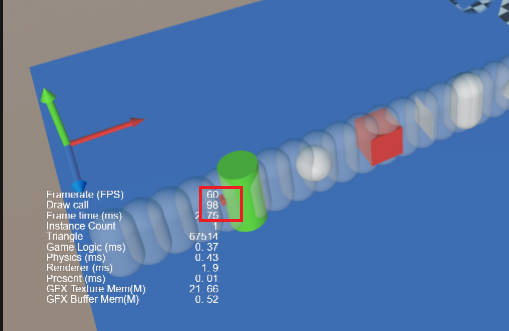

# 几何投射检测

Cocos Creator 从 v3.7 开始，支持扫略功能。

几何投射检测，会沿着指定的射线，发射不同的几何体，就像使用某个几何体沿着射线扫过一个区域，因此又称扫略。扫略会对几何体扫过的物理世界区域内的碰撞体进行检查，并返回特定的结果。

和 `rayCast` 射线检测发射的射线不同，`sweep` 允许物理引擎投射不同的几何体，并返回特定的碰撞信息。

目前引擎提供以下 **盒形**、**球形** 以及 **胶囊体** 扫略。

## 方法

- 盒形：
    - `sweepBox`：沿着给定的射线投射一个盒，并返回所有命中的碰撞体
    - `sweepBoxClosest`：沿着给定的射线投射一个盒，并返回最近命中的碰撞体

    - 参数说明：

        - `worldRay`：geometry.Ray：世界空间下的一条射线
        - `halfExtent`：IVec3Like 盒体的一半尺寸，三维矢量的 xyz 各代表盒在每个轴上的大小的一半
        - `orientation`：IQuatLike： 盒体的方向
        - `mask`: number：掩码，默认为 0xffffffff，请参考 [分组和掩码](./physics-group-mask.md) 以及 [射线检测](./physics-raycast.md)
        - `maxDistance`: number 最大检测距离，默认为 10000000，目前请勿传入 Infinity 或 Number.MAX_VALUE
        - `queryTrigger`：boolean 默认为 true，是否检测触发器

- 球形
    - `sweepSphere`：沿着给定的射线投射一个球形，并返回所有命中的碰撞体
    - `sweepSphereClosest`：沿着给定的射线投射一个球形，并返回所有命中的碰撞体

    - 参数说明：
        - `worldRay`：geometry.Ray：世界空间下的一条射线
        - `radius`：number 球体的半径
        - `mask`：number, 掩码，默认为 0xffffffff，请参考 [分组和掩码](./physics-group-mask.md) 以及 [射线检测](./physics-raycast.md)
        - `maxDistance`：number 最大检测距离，默认为 10000000，目前请勿传入 Infinity 或 Number.MAX_VALUE
        - `queryTrigger`：boolean 默认为 true，是否检测触发器

- 胶囊体
    - sweepCapsule：沿着给定的射线投射一个胶囊体，并返回所有命中的碰撞体
    - sweepCapsuleClosest：沿着给定的射线投射一个胶囊体，并返回最近命中的碰撞体
    - 参数说明：
        - `worldRay`：geometry.Ray：世界空间下的一条射线
        - `radius`：number：胶囊体的半径
        - `height`：number：胶囊体末端两个半球圆心的距离
        - `orientation`：IQuatLike： 胶囊体的朝向
        - `mask`：number, 掩码，默认为 0xffffffff，请参考 [分组和掩码](./physics-group-mask.md) 以及 [射线检测](./physics-raycast.md)
        - `maxDistance：number` 最大检测距离，默认为 10000000，目前请勿传入 Infinity 或 Number.MAX_VALUE
        - `queryTrigger：boolean` 默认为 true，是否检测触发器

详细说明请参考 [API](__APIDOC__/zh/class/PhysicsSystem)。

## 返回值

函数的返回值为 boolean，用于确定表示是否有检测到碰撞。为保证扫略的性能，扫略方法的结果都被存储在 `PhysicsSystem` 内。使用时请先通过 `sweepCastClosestResult/sweepCastResults` 获取到检测结果，下次扫略后，之前的结果可能会被覆盖或失效，因此建议在获取到结果之后，将结果内的内容提取出来使用。

- `sweepBoxClosest`、`sweepSphereClosest` 以及 `sweepCapsuleClosest` 方法的结果被保存在 `PhysicsSystem.instance.sweepCastResults` 内，其类型为 `PhysicsRayResult`，代码示例如下

  ```ts
  const result = PhysicsSystem.instance.sweepCastClosestResult;
  ```

- `sweepBox`、`sweepSphere` 和 `sweepCapsule` 方法的结果存储在 `PhysicsSystem.instance.sweepCastResults` 内，其为 `PhysicsRayResult` 类型的数组。代码示例如下

    ```ts
    const results = PhysicsSystem.instance.sweepCastResults;

    for (let i = 0; i < results.length; i++) {
        const result = results[i];
        ...
    }
    ```

`PhysicsRayResult` 的描述如下：

- `hitPoint`: vec3 在世界坐标系下的击中点
- `distance`: number 击中点到射线原点的距离
- `collider`: Collider 击中的碰撞盒
- `hitNormal`: vec3 在世界坐标系下击中面的法线

API 参考 [PhysicsRayResult](__APIDOC__/zh/class/PhysicsRayResult)。

## 示例

以盒型扫略为例，使用方法如下：

```ts
if (PhysicsSystem.instance.sweepSphereClosest(this._ray, this._sphereRadius * this._scale, this._mask, this._maxDistance, this._queryTrigger)) {
    const result = PhysicsSystem.instance.sweepCastClosestResult;
}
```

更多示例请参考 [GIT](https://github.com/cocos/cocos-example-projects/tree/master/physics-3d)。

下载示例后，打开 **case-physics-sweep** 场景，运行即可查看扫略的结果。



示例中扫略的结果标记为 **红色**。
