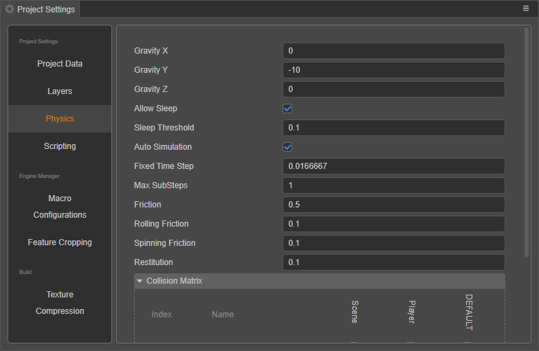

# 物理系统

物理系统（PhysicsSystem）用于管理所有物理相关的功能，目前它负责同步物理元素、触发物理事件和调度物理世界的迭代。

物理系统的配置可通过 **项目设置 -> 物理** 进行设置。该配置会同时应用在 2D 和 3D 物理部分。

## 属性

| 属性 | 说明 |
| :--- | :--- |
| **enable** | 是否开启物理系统，默认为 `true` |
| **gravity** | 物理世界的重力值，默认为 `(0, -10, 0)` |
| **allowSleep** | 是否允许物理系统自动休眠，默认为 `true` |
| **maxSubSteps** | 每帧模拟的最大子步数，默认为 `2` |
| **fixedTimeStep** | 每次子步进消耗的时间，默认为 `1/60` |
| **sleepThreshold** | 进入休眠的默认速度临界值 |
| **autoSimulation** | 是否开启自动模拟，默认为 `true` |
| **defaultMaterial** | 获取默认物理材质（只读） |
| **raycastResults** | 获取 **raycast** 的检测结果（只读） |
| **raycastClosestResult** | 获取 **raycastClosest** 的检测结果（只读） |
| **collisionMatrix** | 获取碰撞矩阵，仅用于初始化 |

> **注意**：物理系统是单例类，通过 `PhysicsSystem.instance` 获取物理系统的实例。

## 部分接口

| 接口 |说明 |
| :--- | :--- |
| resetConfiguration | 通过 `IPhysicsConfig` 重置物理的配置   
|  step | 执行物理世界的步进模拟   该方法每次调用，物理引擎则会进行一次模拟   通过降低 `fixedTimeStep` 属性可减少物理引擎的采样频率从而提升性能，同时其计算精度也会降低。

物理系统的更多 API 可以参考：[PhysicsSystem](__APIDOC__/zh/classes/physics.physicssystem.html)
