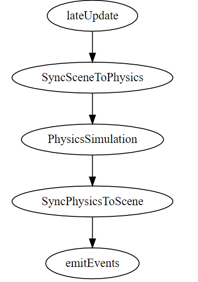

# 3D 物理系统

## 3D 物理简介

物理系统是游戏引擎的关键组成部分，因为它将真实世界的物理性质（如质量、重力和摩擦力）注入游戏世界，使游戏世界的运作更加真实。物理引擎负责根据物体的物理性质模拟游戏世界中的运动和碰撞反馈。值得注意的是，物理系统是一个复杂的系统，不仅与游戏逻辑相关，还与渲染系统、动画系统和音频系统相关。通常，游戏物理系统仅涵盖了牛顿力学的基础，如碰撞检测和刚体运动。其他物理现象，如流体力学或软体物理学，需要使用其他方法实现。用户可以使用物理引擎提供的API控制物理系统，在游戏中实现各种物理效果。

Cocos Creator 支持以下几种物理引擎：

- **Bullet**：默认物理引擎，[Bullet 物理引擎](https://pybullet.org/wordpress/) 的 asm.js/wasm 版本。具备碰撞检测和物理模拟的物理引擎。
- **builtin**：内置物理引擎，仅用于碰撞检测的轻量引擎。
- **cannon.js**：具有碰撞检测和物理模拟的物理引擎。
- **PhysX**: 由 [NVIDIA](https://developer.nvidia.com/physx-sdk) 公司开发的游戏物理引擎。具备碰撞检测和物理模拟的物理引擎。

开发者根据开发对物理特性需求或应用场景选择不同的物理引擎，详情请参考：[设置物理引擎](physics-engine.md)。

> **注意**：在低版本中 PhysX 不被支持。如要使用 PhysX 请确保引擎升级到最新版本。

## 物理世界和元素

物理世界中的每个元素都可以理解为一个独立的 **刚体**，在 Cocos Creator 3.x 中可以通过为游戏对象添加 [Collider 碰撞组件](physics-collider.md) 或者 [RigidBody 刚体组件](physics-rigidbody.md) 让物理元素具备物理特性。物理系统将为这些元素进行物理计算，比如计算各物体是否产生碰撞，以及物体的受力情况。当计算完成后，物理系统会将物理世界更新到场景世界中，仿真还原真实世界中的物理行为。

场景世界与物理世界：

> **注意**：此处的 “刚体” 指的是物理世界中，在运动中或受力作用后，形状和大小不变，而且内部各点的相对位置不变的物体。

### 物理世界的流程

当所有组件都完成 `lateUpdate` 之后，引擎会将持有物理属性的节点（刚体组件、碰撞体组件）同步到物理世界，并驱动物理引擎进行模拟，模拟完成以后再将物理引擎计算出的结果同步到场景的各个节点上。整体流程如下图所示：

## 添加物理元素

在游戏世界中添加一个物理元素可以分为以下步骤：

1. 新建一个节点。此处新建一个立方体模型 **Cube**；
2. 添加碰撞组件，此处添加一个 [盒碰撞体组件](physics-collider.md#%E7%9B%92%E7%A2%B0%E6%92%9E%E5%99%A8%E7%BB%84%E4%BB%B6-boxcollider)。在 **属性检查器** 面板下方点击 **添加组件** 按钮，在 **Physics** 目录下选择 **BoxCollider** 并调整参数；
3. 为了使它具有物理行为，接着添加一个[刚体 RigidBody](physics-rigidbody.md) 组件。

这样，便有了一个 **既有碰撞器又有物理行为** 的一个物理元素。

## 射线以及几何体检测

游戏中可能会需要对某些物理特性进行检测，如子弹是否击中目标，可否将某些家具摆放在特定位置是，检测方法一般是发射一条，多条射线或者某种几何体（通常为模型的包围盒、胶囊体等），可以参考下列的文档来进行投射检测。

- [射线检测](./physics-raycast.md)
- [几何投射检测](./physics-sweep.md)
