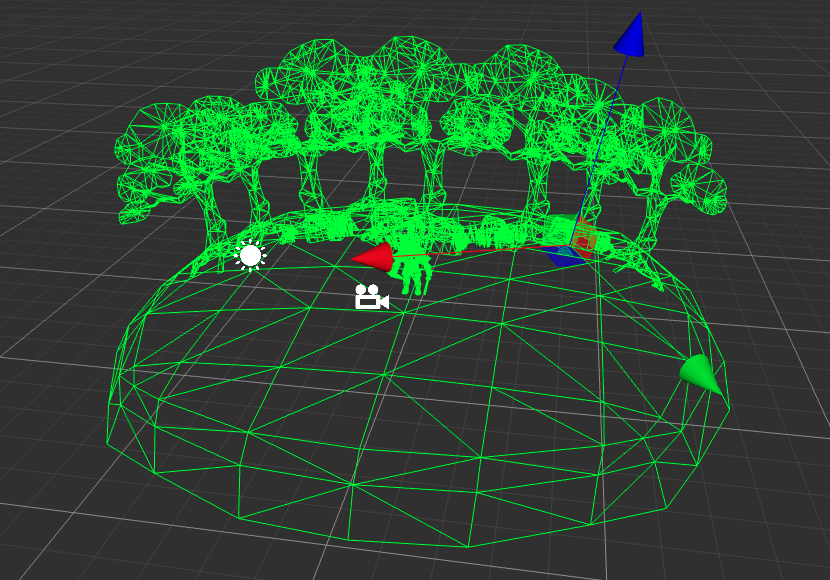
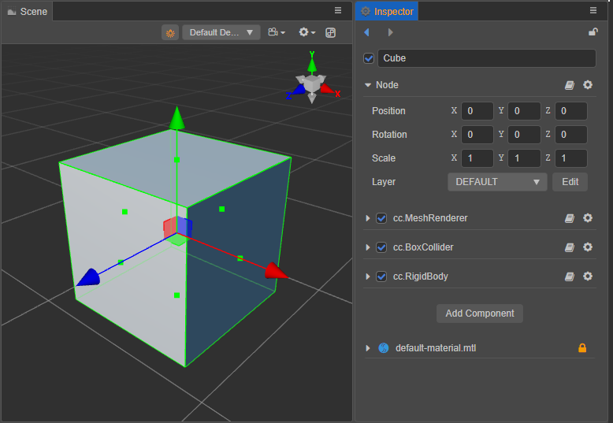

# 3D 物理系统

## 3D 物理简介



物理系统是将游戏世界赋予现实世界的物理属性（重力、推力等），并抽象为刚体模型，使得游戏物体在力的作用下，仿真现实世界的运动及其之间的碰撞过程。即在牛顿经典力学模型基础之上，通过 API 计算游戏物体的运动、旋转和碰撞。

Cocos Creator 3.X 3D 物理支持以下几种物理引擎：

- **ammo.js**：默认物理引擎，[Bullet 物理引擎](https://pybullet.org/wordpress/) 的 asm.js/wasm 版本。具备碰撞检测和物理模拟的物理引擎。
- **builtin**：仅用于碰撞检测的轻量引擎。
- **cannon.js**：具有碰撞检测和物理模拟的物理引擎。
- **PhysX**: 由 [NVIDIA](https://developer.nvidia.com/physx-sdk) 公司开发的游戏物理引擎。具备碰撞检测和物理模拟的物理引擎。

开发者根据开发需求或不同的应用场景选择不同的物理引擎，详情请参考：[设置物理引擎](physics-engine.md)。

> **注意**：在低版本中 PhysX 不被支持。如要使用 PhysX 请确保引擎升级到最新版本。

## 物理世界和元素

物理世界中的每个元素都可以分为一个独立的 **刚体**，在 Cocos Creator 3.x 中可以通过为游戏对象添加 [Collider 碰撞组件](physics-collider.md) 或者 [RigidBody 刚体组件](physics-rigidbody.md) 让物理元素具备物理特性。物理系统将为这些元素进行物理计算，比如计算各物体是否产生碰撞，以及物体的受力情况。当计算完成后，物理系统会将物理世界更新到场景世界中，仿真还原真实世界中的物理行为。

场景世界与物理世界：


> **注意**：此处的 “刚体” 并非刚体组件，而是物理世界内的刚体（指在运动中和受力作用后，形状和大小不变，而且内部各点的相对位置不变的物体），刚体组件用于控制刚体物理行为。

### 物理世界的更新

物理世界会在 `postUpdate` 时对物理世界进行模拟并将结果同步到节点的变换上。而 `postUpdate` 的更新时机是在 **组件（Component）** 的 `lateUpdate` 之后，因此在组件的 `update` 和 `lateUpdate` 中都可以给物体添加力或者速度。

```flow
st=>start: Start
op=>operation: Physics
cond=>condition: Yes or No?
e=>end
st->op->cond
cond(yes)->e
cond(no)->op
```

## 添加物理元素



在游戏世界中添加一个物理元素可以分为以下步骤：

1. 新建一个节点。此处新建一个立方体模型 **Cube**；
2. 添加碰撞组件，此处添加一个 [盒碰撞体组件](physics-collider.md)。在 **属性检查器** 面板下方点击 **添加组件** 按钮，在 **Physics** 目录下选择 **BoxCollider** 并调整参数；
3. 为了使它具有物理行为，接着添加一个[刚体 RigidBody](physics-rigidbody.md) 组件。

这样，便有了一个 **既有碰撞器又有物理行为** 的一个物理元素。
