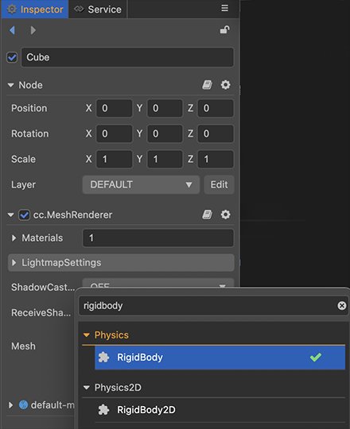
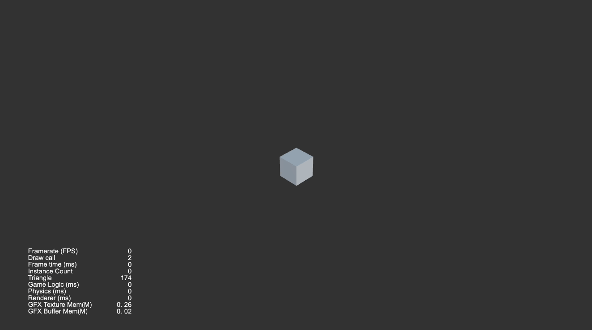
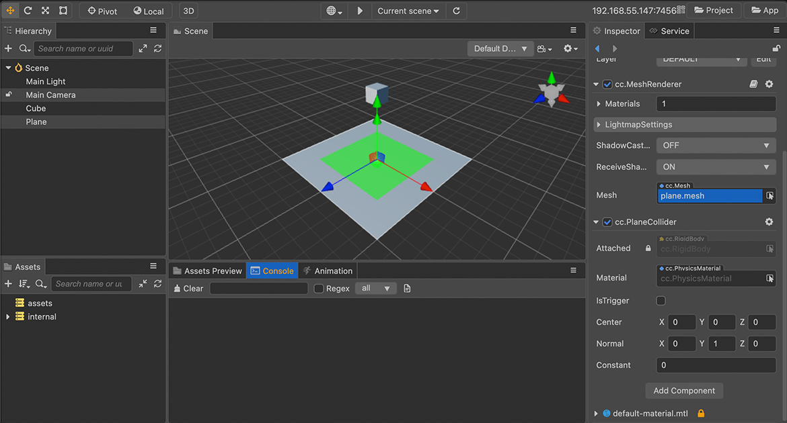
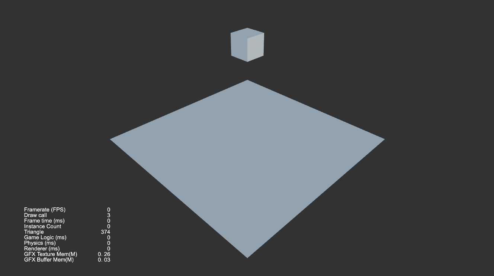

# 物理

Cocos Creator 3.0 目前支持以下物理引擎，为开发者提供了高效统一的组件化工作流程和便捷的使用方法，您可以 [选择项目适合的物理引擎](physics-item.md) 进行开发，开发过程中也可随时切换。

- [**ammo.js**](https://github.com/cocos-creator/ammo.js)：默认物理引擎，功能完善强大的 [Bullet 物理引擎](https://pybullet.org/wordpress/) 的 JavaScript 移植版本。
- [**cannon.js**](https://github.com/cocos-creator/cannon.js)：具有物理模拟的物理引擎。
- **builtin**：轻量的碰撞检测系统。

## 物理世界和元素

物理世界中的元素可以分为一个个的 **刚体**，在 Cocos Creator 中加入物理元素可以通过为游戏对象添加 **Collider 碰撞器** 或者 **RigidBody 刚体** 组件，物理系统将为这些元素进行物理计算，使其表现出真实世界中的行为。

> **注意**：此处的“刚体”不是指刚体组件，刚体组件用于控制刚体物理行为相关的属性。

### 添加物理元素

1. 新建一个 3D 对象，以 **Cube 立方体** 为例，在 **资源管理器** 的文件夹中点击右键或者点击左上方的加号按钮，然后选择 **创建 -> 3D 对象 -> Cube 立方体**。

    

2. 选中新建的 3D 对象，在右侧的 **属性检查器** 面板下方点击 **添加组件** 按钮，添加一个 **Psycial -> RigidBody** 刚体组件，该对象既具有物理行为.

    

    

3. 接着再添加一个碰撞器组件，以 **Cube 立方体** 为例，添加 **Psycial -> BoxCollider** 组件。

    

这样，便生成了一个 **既有碰撞器又有物理行为** 的物理元素。

### 完善物理世界

让我们继续完善物理世界，添加一个 **Plane 平面**，只为其添加 **PlaneCollider** 平面碰撞器组件，然后调整原有立方体的 Y 轴高度。

    

点击运行按钮，便可以看到物理元素在场景世界上的变化，效果如下图所示：

### 物理元素的组成

在 Cocos Creator 中，一个物理元素可以由以下方式组成：

- 一个刚体组件
- 一个或多个碰撞器组件
- 一个刚体加一个或多个碰撞器组件

## 文档目录

Cocos Creator 的物理部分的更多内容，请参考以下文档：

- [物理引擎选择](physics-item.md)：介绍了 Cocos Creator 中可选的各种物理引擎
- [物理系统](physics-system.md)：介绍了物理系统，以及物理系统的一系列属性和接口
- [物理组件](physics-component.md)：介绍了一些物理组件以及面板上的一系列属性
- [物理使用](physics-use.md)：进一步介绍了物理相关的使用、事件、分组掩码等
    - [碰撞组件](physics-collider.md)：介绍了 **Collider** 碰撞器组件的设计，以及与 **RigidBody** 刚体组件的关系
    - [刚体组件](physics-rigidbody.md)：介绍了 **RigidBody** 刚体组件的一些代码使用示例
    - [物理事件](physics-event.md)：介绍了 Cocos Creator 中的物理事件
    - [物理配置](physics-configs.md)：物理配置用于配置各种常用属性，以及设置碰撞矩阵等
    - [物理材质](physics-material.md)：介绍了 Cocos Creator 中的物理材质资源
    - [分组和掩码](physics-group-mask.md)：介绍了物理过滤检测中分组掩码的使用
    - [射线检测](physics-raycast.md)：介绍了对物理碰撞器的射线检测功能
