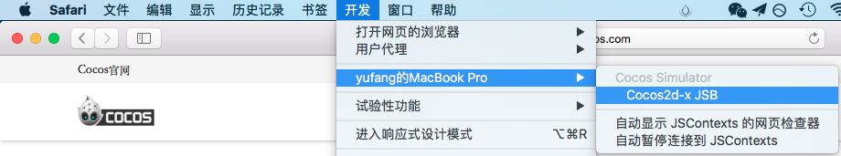
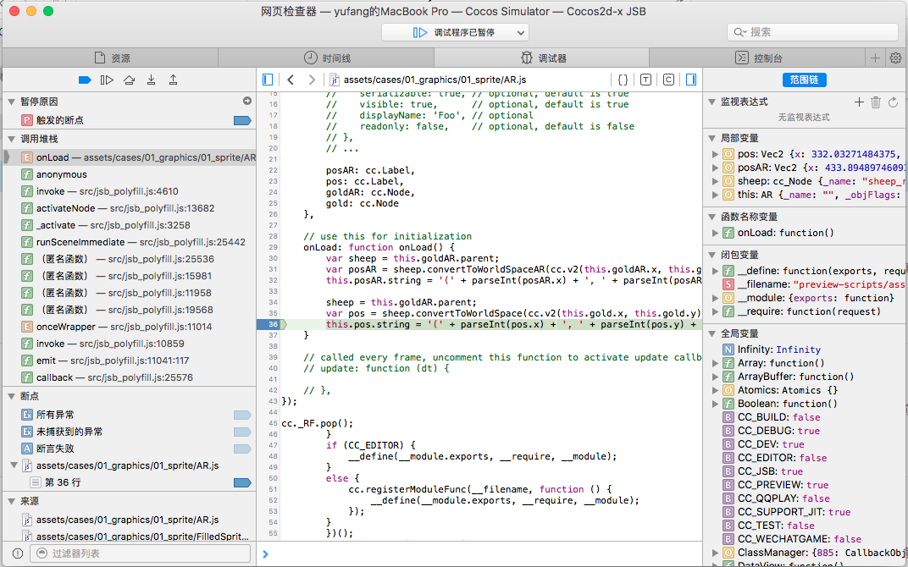
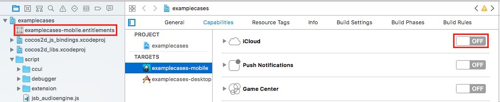
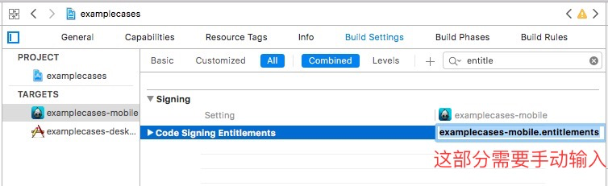
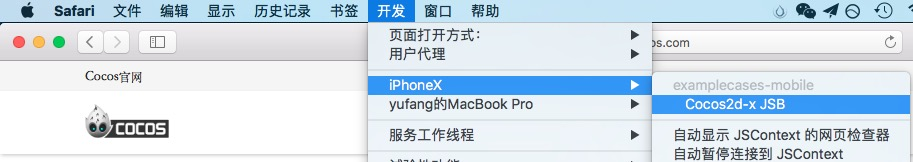
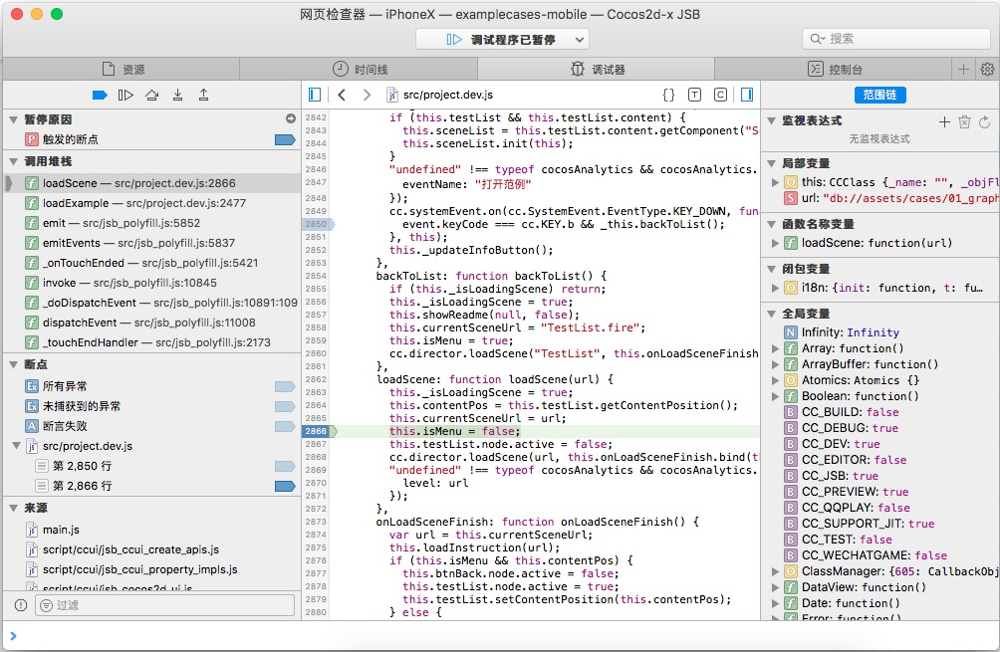

# 原生平台 JavaScript 调试

游戏发布到原生平台后，由于运行环境不同，可能会出现在浏览器预览时无法重现的 Bug，这时我们就必须直接在原生平台下进行调试。Cocos Creator 支持 JSB 2.0，可以很方便地对原生平台中的 JavaScript 进行远程调试。

## 模拟器调试

一般来说，原生平台的大多数问题都可以在模拟器中进行重现，我们可以先在模拟器中测试，有问题的话直接在模拟器中调试即可。模拟器调试有以下两种方法。

### 方法一

首先在编辑器工具栏正上方选择使用 **模拟器（调试）** 作为预览平台，然后点击编辑器中的 **运行预览** 按钮在模拟器中运行游戏。

#### Windows

运行模拟器后，直接用 Chrome 浏览器打开地址：`chrome-devtools://devtools/bundled/inspector.html?v8only=true&ws=127.0.0.1:5086/00010002-0003-4004-8005-000600070008` 即可进行调试：

#### Mac

- 运行模拟器后，在 Safari 浏览器的 **偏好设置 -> 高级** 选项卡中，勾选 `在菜单栏中显示"开发"菜单`。
- Safari 菜单中选择 `开发 -> 你的 Mac 设备 -> Cocos2d-x JSB`。

- 在弹出的 **Web Inspector** 中进行调试：

### 方法二

从 **v2.0.7** 开始，**设置** 面板的 **预览运行** 中新增了 [开启模拟器调试界面](../getting-started/basics/editor-panels/preferences.md#%E9%A2%84%E8%A7%88%E8%BF%90%E8%A1%8C) 功能。调试步骤如下：

  - 在 **设置 -> 预览运行** 面板中勾选 **开启模拟器调试界面**，然后点击**保存**。
  - 在编辑器上方选择模拟器并点击 **运行预览** 按钮，即可在模拟器预览项目时自动打开调试窗口进行调试。

## 真机调试

如果游戏只有在真机上才能运行，或者模拟器重现不了问题，那就必须用真机对打包后的游戏进行调试。

### Android 调试

- 确保 Android 设备与 Windows 或者 Mac 在同一个局域网中。注意在调试过程中请勿使用 VPN ，否则可能导致无法正常调试。
- 在 Creator 的构建发布面板选择 Android 平台、Debug 模式，构建编译运行工程。
- 用 Chrome 浏览器打开地址：`chrome-devtools://devtools/bundled/inspector.html?v8only=true&ws={IP}:5086/00010002-0003-4004-8005-000600070008`, 其中 `{IP}` 为 Android 设备的本地 IP，即可进行调试。（**注意**：从 **v2.0.7** 开始，地址中的 5086 需要改为 6086）

### iOS 调试

- 通过 USB 数据线将设备和电脑连接起来。
- 打开 iPhone 的设置 -> Safari -> 高级 -> 打开  Web 检查器。
- 在 Creator 的构建发布面板选择 iOS 平台、Debug 模式，构建工程。在 Xcode 中打开工程。

- 在工程中添加签名：选择你的 iOS 工程 -> General -> Signing -> 选择你的开发者证书。
- 为 Xcode 工程添加 entitlements 文件，如果 entitlements 文件存在则跳过此步骤。如果不存在，则到工程的 Capabilities 设置中打开 iCloud，然后再关闭。这时 .entitlements 文件会被自动添加到工程中。

- 确保 Build Setting 里面 Code Signing Entitlements 选项中包含 entitlements 文件。

- 打开 entitlements 文件，手动添加 **get-task-allow**，值类型为 **Boolean**，值为 **YES**。

- 在 Xcode 中编译工程，将工程发布到设备上。
- Safari 菜单中选择 `开发 -> 你的设备 -> Cocos2d-x JSB`（该步骤如果找不到你的设备，有可能是因为 Safari 版本过低，需要升级 Safari）

- 在弹出的 **Web Inspector** 中进行调试：

## 其它平台调试

如果需要在 Release 模式下调试，或者需要发布到 Windows 或者 Mac 平台上调试，或者需要调试定制后的原生引擎，可参考更详细的 [JSB 2.0 使用指南：远程调试与 Profile](../advanced-topics/jsb/JSB2.0-learning.md#%E8%BF%9C%E7%A8%8B%E8%B0%83%E8%AF%95%E4%B8%8E-profile)。
