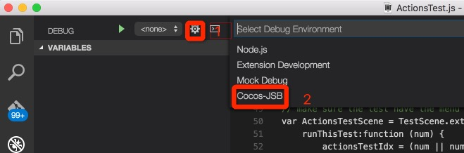

# 原生平台调试

目前使用 Cocos Creator 进行游戏开发时，游戏脚本以 JavaScript 形式编写，运行在原生平台时需要经过 JSB 绑定，然后通过原生 C++ 引擎代码运行，由于运行平台不同，可能会出现和 Web 浏览器运行效果不同的地方和错误。我们可以借助 VS Code 的调试功能来调试我们的 JSB 游戏程序。

## 安装 Cocos-Debug VS Code 插件

在 Cocos Creator 的开发者菜单中，选择 VS Code 工作流，再选择安装 VS Code 扩展插件，插件就会被自动安装到用户文件夹的 `.vscode/extensions` 路径下，然后启动 VS Code。

安装插件成功后，在 VS Code 左侧 tab 中选择第四个 **Debug**，然后可以点击上面的齿轮选择 `Cocos-JSB` 调试方案。

如果安装插件不成功，可以查看 VS Code 官网的[插件安装指南文档](https://code.visualstudio.com/docs/extensions/install-extension)。

## 模拟器调试

首先在编辑器工具栏正上方选择使用 **模拟器（调试）** 作为预览平台，然后点击编辑器中的 **运行预览** 按钮在模拟器中运行游戏。

然后找到模拟器中的项目资源路径，这个路径会在 Cocos Creator 安装路径中，根据操作系统的不同，路径有一些区别：

- Windows：`CocosCreator/resources/cocos2d-x/simulator/win32`
- Mac：`CocosCreator.app/Contents/Resources/cocos2d-x/simulator/mac/Simulator.app/Contents/Resources`

在 Mac 平台由于 VS Code 无法通过浏览选择应用程序包（.app）之内的路径，可能需要先打开 VS Code，关闭所有已开启的文件夹，然后将 Finder 里的上述路径拖拽到 VS Code 中。

然后就可以在打开的工程中的 `src/project.dev.js` 文件中设置断点并进行调试了。先设置好断点，然后确保模拟器已经在运行的情况下，VS Code 中切换到 Debug 页面，在下拉菜单选中 `Cocos-Debug`，然后点击绿色三角按钮开启调试进程。

现在可以进行正常的 JSB 程序调试了。

关于 VS Code 调试功能的使用，请参考[VS Code 调试指南文档](https://code.visualstudio.com/docs/editor/debugging)。

### Windows socket 链接错误解决方法

在 Windows 上启动调试器时可能会链接失败并提示：

`ar: attachRequest: retry socket.connect`

可以尝试点击 Debug 页面的齿轮按钮，并在 `launch.json` 配置文件中修改 `address` 字段为：

`"address": "::1"`

原因是在 Windows 上部分链接会默认使用 IPv6，因此我们需要填写 IPv6 格式的本地默认 ip 地址。

## 原生工程调试

构建发布出原生工程以后，对包括 iOS、Android、Windows、Mac 等原生平台都可以进行调试。首先要用 VS Code 打开构建发布出的原生工程，一般在

`myProject/build/myProject/jsb-default` 或 `myProject/build/myProject/jsb-binary`，根据构建工程时选择的引擎模板而定。

在真机或桌面模拟器上运行后，流程就和模拟器调试类似了，请在 `jsb-default/src/project.dev.js` 中设置断点和调试。下面是移动设备调试时的注意事项。

### iOS 调试

要调试 iOS 设备：

- 通过 USB 连接线将设备和电脑链接起来
- 通过 Xcode 在设备上运行游戏
- 配置 VS Code 中 cocos-debug 调试方案的 `launch.json` 文件，将 `address` 字段改为您 iOS 设备的 IP 地址

### Android 调试

要调试 Android 设备：

- 通过 USB 连接线将设备和电脑链接起来
- Adb 在设备上运行游戏（可以通过 **构建发布** 面板，在构建和编译完成后点击运行）
- 使用 adb 命令转发调试端口：`adb forward tcp:5086 tcp:5086`

## 使用限制

VS Code 只能挂载到运行中的 cocos2d-x JSB 程序，才能开始调试，因此目前不能在启动时就停在断点处。以后我们会改善这一点，目前可以在游戏中手动设置启动按钮来回避这个问题。

