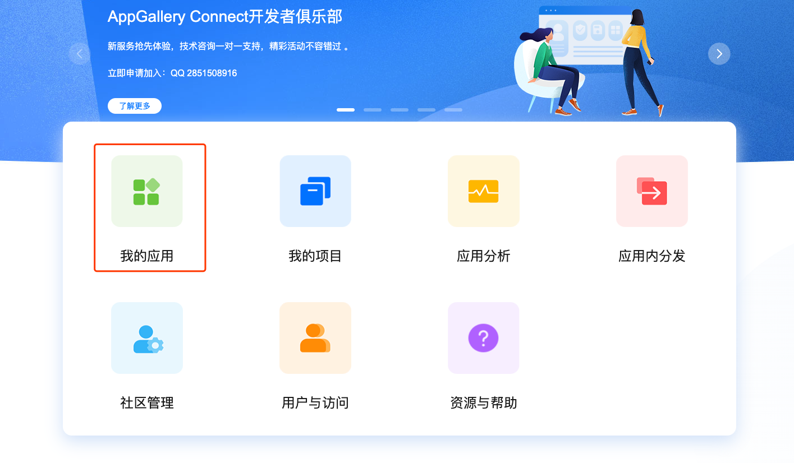
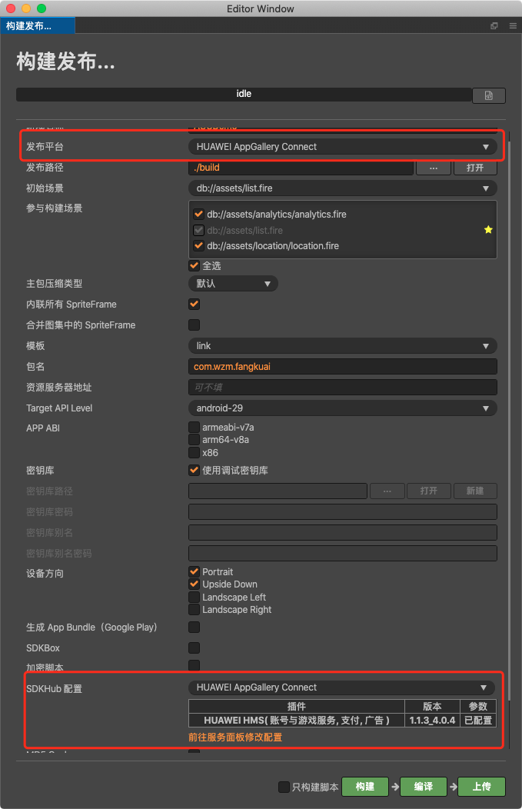
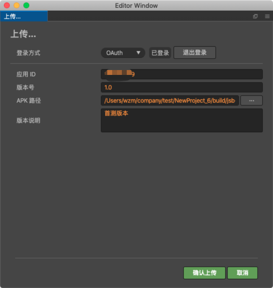
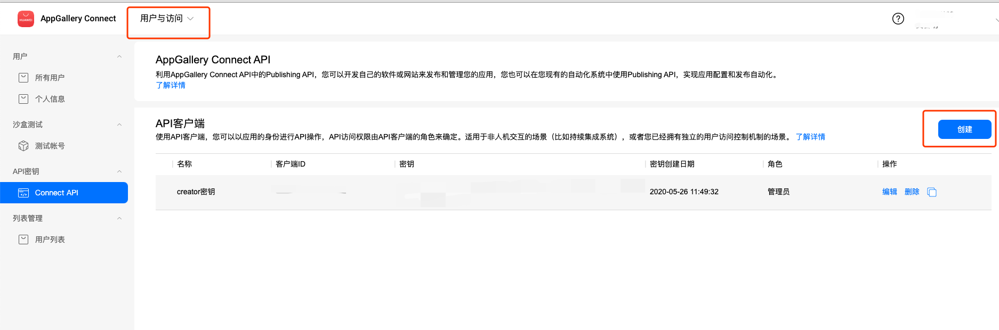
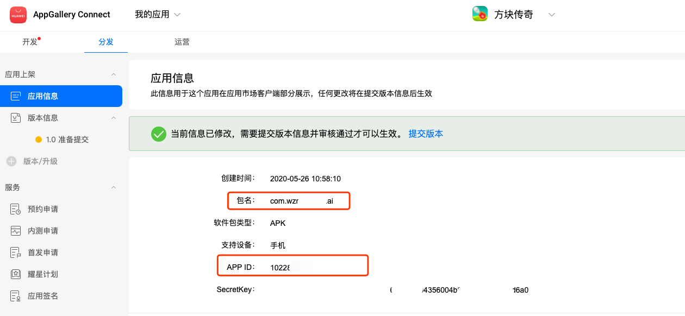
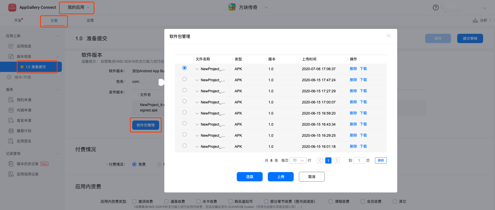

# 发布到 HUAWEI AppGallery Connect
Cocos Creator 从 **v2.4.1** 版本开始正式支持将游戏发布到 HUAWEI AppGallery Connect。
## 开发前的准备
- 申请 [华为账号](https://id1.cloud.huawei.com/CAS/portal/loginAuth.html)，并注册为开发者。
- 开发者申请通过后，到 [AppGallery Connect](https://developer.huawei.com/consumer/cn/service/josp/agc/index.html) 后台，**我的应用 创建**，进行应用的创建。

- 申请完成后备用，后续需要使用到对应的应用参数。

## HUAWEI SDK 集成
Creator 集成了 HUAWEI 一系列的服务，可以通过 Cocos Service 服务，一键集成到项目中，十分方便。
### 使用 Cocos Service 进行 SDK 集成
- 打开 Cocos Service 面板，选择需要接入的 SDK ，然后根据提示进行开启（配置详情请见 [Cocos Service HUAWEI SDK 集成文档]()）。
### 构建发布
- 当在 Cocos Service 完成 SDK 相关配置后，就可以进行游戏开发和集成，由于目前 SDK 仅支持 **Android** 平台，所以需要进行构建发布后才能进行 SDK 的测试。
- 打开构建面板，选择 **HUAWEI AppGallery Connect** 平台，并在界面中的 **SDKHub** 选项，选择已经在 Cocos Service 服务面板配置好的配置集进行集成。

- 选择完成点击构建即可， Creator 会自动把所有的依赖和代码都配置完成，直接参照对应平台的接入文档，即可轻松实现 SDK 集成。
- 点击 **编译** 按钮或者使用 **Android Studio** 打开项目进行编译，就可以进行 HUAWEI 各项服务的测试。
### 上传到 AppGallery Connect
- Creator 支持直接上传待发布的 apk 到 AppGallery Connect 后台，十分快捷。
- 打开 **构建发布** 面板，选择 **HUAWEI AppGallery Connect** 平台，点击上传按钮，即可打开 **上传** 界面。

- Creator 支持两种登录上传方式（OAuth 和 API 客户端），两者的详细区别可以参考 [说明](https://developer.huawei.com/consumer/cn/doc/development/AppGallery-connect-Guides/agcapi-getstarted)，根据自己的喜好使用。
    - API 客户端方式：
        - 首次使用，需要登录 [AppGallery Connect](https://developer.huawei.com/consumer/cn/service/josp/agc/index.html) 后台进行配置的获取
        - 选择 **用户与访问** ，**Connect API** ，**创建** ， 创建一个客户端密钥，并赋予足够的[权限](https://developer.huawei.com/consumer/cn/doc/distribution/app/agc-team_account_mgt#appendix)。
        - 将界面上生成的 **客户端ID** 和 **密钥**，填写入 Creator **上传界面**  对应栏目中。
        
        
    - OAuth：
        - OAuth 登录方式不需要做额外操作，但是后续需要在确认上传的时候，通过 OAuth 的方式登录 HUAWEI 账号（同时该账号需要有足够的[权限](https://developer.huawei.com/consumer/cn/doc/distribution/app/agc-team_account_mgt#appendix)）
        - 登录后勾选对应权限的允许选项，窗口会自动关闭并进行后续操作。
- 选择完登录方式，我们需要把 **上传界面** 剩余的 **应用的id、版本号、APK路径** 补全，可以在 [AppGallery Connect](https://developer.huawei.com/consumer/cn/service/josp/agc/index.html) 后台，**我的应用**，**应用信息** 栏目找到这些信息。

- 点击上传，等待上传完成即可。

- 登录 [AppGallery Connect](https://developer.huawei.com/consumer/cn/service/josp/agc/index.html) 后台，选择 **我的应用**，选择好我们配置好的应用，并选择 **分发**，**版本信息 准备提交**， **软件版本 软件包管理**，就可以看到我们刚刚上传的应用

- 如果确认各个信息没有问题，可以直接点提交审核，进行APK的审核上架。
