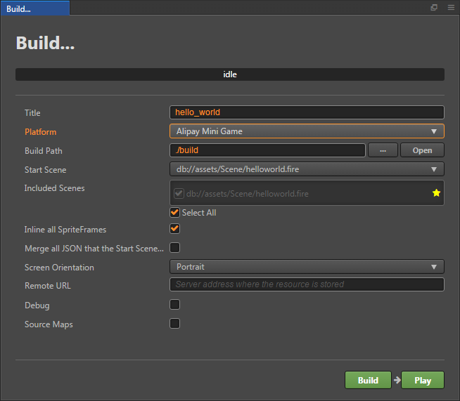
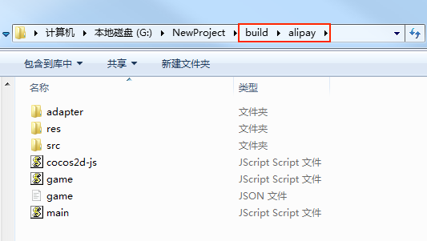

# 发布到支付宝小游戏

Cocos Creator 从 v2.1.3 版本开始正式支持将游戏发布到支付宝小游戏。

## 环境配置

- 桌面端下载 [支付宝小程序开发者工具]()（链接后续补充）并安装。

- 下载 [支付宝]()（后续补充），并安装到 Android 设备上。

- 建议 Android Phone 4.3 或以上版本。

- Android 支付宝客户端最低支持版本 10.1.72。

## 发布流程

一、使用 Cocos Creator 打开需要发布的项目工程，在 **构建发布** 面板的 **发布平台** 中选择 **Alipay Mini Game**。然后点击 **构建**。

二、构建完成后，会在发布包的目录下生成一个 **alipay** 的支付宝小游戏工程文件夹，其中已经包含了支付宝小游戏环境的配置文件：`game.json`。

三、点击 **运行**，即可调起 **支付宝开发者工具**，打开支付宝小游戏项目以及预览调试游戏内容。**支付宝开发者工具** 的使用方式请参考 [支付宝开发者工具文档]()（后续验证及补充）。

## 支付宝小游戏环境的资源管理

支付宝小游戏与微信小游戏类似，都存在着包体限制，超过 4MB 的额外资源，必须通过网络请求下载。

我们建议用户只保存脚本文件在小游戏包内，其他资源都从远程服务器下载。Cocos Creator 已经帮用户做好了远程资源的下载、缓存和版本管理。具体的实现逻辑和微信小游戏类似，详情可参考 [微信小游戏资源管理](./publish-wechatgame.md#小游戏环境的资源管理)。

具体来说，开发者需要做的是：

- 构建时，设置 **远程服务器地址**，然后点击 **构建**。
- 构建完成后将支付宝小游戏发布包目录下的 res 文件夹完整的上传到服务器。
- 删除本地发布包目录下的 res 文件夹。

## 参考链接

- [支付宝小游戏注册指导文档]()（后续补充）
- [支付宝开发者工具文档]()（后续补充）
- [支付宝小游戏 API 文档]()（后续补充）
