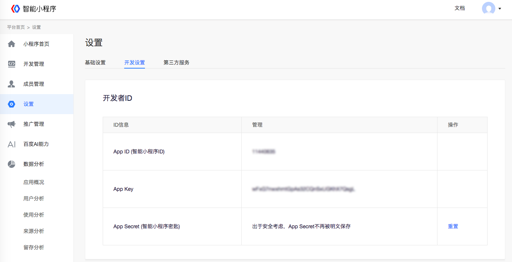
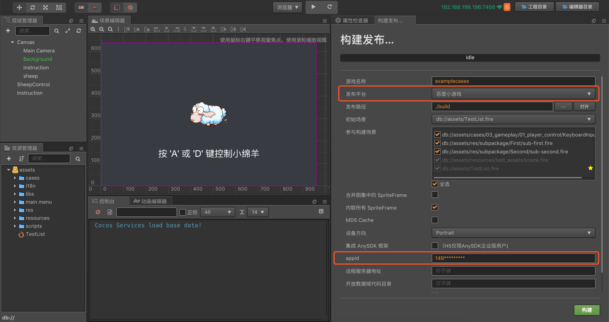
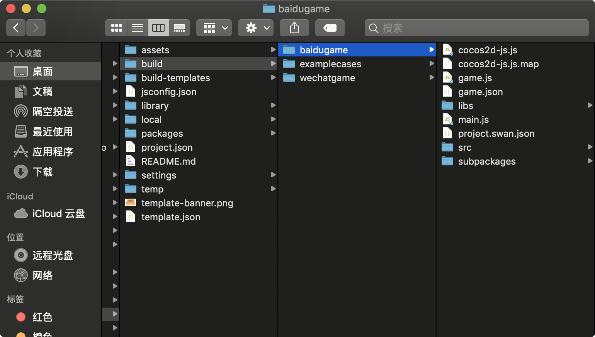
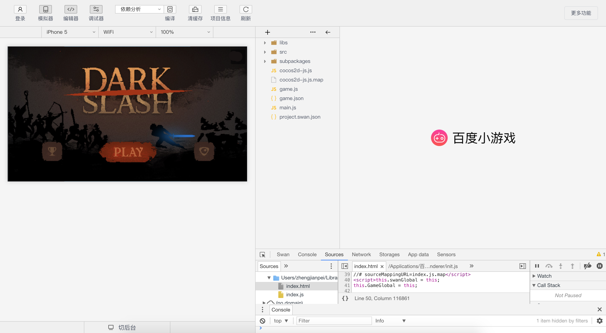

# 发布到百度小游戏

> **注意**：由于相关合约已到期，自 2022 年 11 月 30 日起，将不再支持百度小游戏的发布和构建。

Cocos Creator 从 v2.0.9 版本开始正式支持将游戏发布到百度小游戏。

百度小游戏是基于手机百度 app 上的智能小程序进行扩展的小游戏，它不仅提供了强大的游戏能力，还和智能小程序一样，提供了大量的原生接口，比如支付，文件系统，位置，分享等。相当于同时结合了 WEB 易于传播以及 Native 功能丰富的优势。

百度小游戏的运行环境和微信小游戏类似，基本思路也是封装必要的 WEB 接口提供给用户，尽可能追求和 WEB 同样的开发体验。百度小游戏在智能小程序环境的基础上提供了 WebGL 接口的封装，使得渲染能力和性能有了大幅度提升。不过由于这些接口都是百度团队通过自研的原生实现封装的，所以并不可以等同为浏览器环境。

作为引擎方，为了尽可能简化开发者的工作量，我们为用户完成的主要工作包括：

- 引擎框架适配百度小游戏 API，纯游戏逻辑层面，用户不需要任何额外的修改
- Cocos Creator 编辑器提供了快捷的打包流程，直接发布为百度小游戏
- 自动加载远程资源，缓存资源以及缓存资源版本控制

具体百度小游戏的申请入驻，开发准备，游戏提交，审核和发布流程可以参考 [百度小游戏注册指导文档](https://smartprogram.baidu.com/docs/game/)。

## 使用 Cocos Creator 发布百度小游戏

### 准备工作

- 在 [百度开发者工具文档](https://smartprogram.baidu.com/docs/game/tutorials/howto/dev/) 里下载并安装百度开发者工具
- 在手机的应用商店中下载并安装百度应用
- 登录 [智能小程序平台](https://smartprogram.baidu.com/developer/index.html)，找到 appid

    

### 发布流程

1. 在 **构建发布** 面板中选择 **发布平台** 为 **百度小游戏**，填入 **appid**，然后点击 **构建**。

    

2. 构建完成后，会在发布包的目录下生成一个 **baidugame** 的百度小游戏工程文件夹，其中已经包含了百度小游戏环境的配置文件：`game.json` 和 `project.swan.json`

    

3. 使用 **百度开发者工具** 打开构建生成的 **baidugame** 文件夹，即可打开百度小游戏项目及预览调试游戏内容。**百度开发者工具** 的使用方式请参考 [百度开发者工具文档](https://smartprogram.baidu.com/docs/game/tutorials/howto/dev/)。

    

**注意**：

- 请不要升级 **百度开发者工具** 到 **2.0.10** 版本。
- 预览调试时若出现了 **当前版本的开发者工具无法发布小程序，请更新最新的开发者工具** 的提示，说明填写的 appid 是小程序的 appid，不是小游戏的 appid，请重新申请一个小游戏 appid。

## 百度小游戏环境的资源管理

百度小游戏与微信小游戏类似，都存在着包体限制，超过 4MB 的额外资源，必须通过网络请求下载。

我们建议用户只保存脚本文件在小游戏包内，其他资源都从远程服务器下载。Cocos Creator 已经帮用户做好了远程资源的下载、缓存和版本管理。具体的实现逻辑和微信小游戏类似，具体可参考 [微信小游戏资源管理](./publish-wechatgame.md#小游戏环境的资源管理)。

同时，当开启引擎的 md5Cache 功能后，文件的 url 会随着文件内容的改变而改变，这样当游戏发布新版本后，旧版本的资源在缓存中就自然失效了，只能从服务器请求新的资源，也就达到了版本控制的效果。

具体来说，开发者需要做的是：

1. 构建时，在 **构建发布** 面板中勾选 md5Cache 功能。
2. 设置 **远程服务器地址**，然后点击 **构建**。
3. 构建完成后将百度小游戏发布包目录下的 res 文件夹完整的上传到服务器。
4. 删除本地发布包目录下的 res 文件夹。

> **注意**：
>
> 1. 百度在真机上加载远程服务器上的资源时，目前只支持通过 https 访问，所以必须将资源文件放在 https 服务器上，否则会出现加载资源失败的情况。
> 2. 如果缓存资源超过百度环境限制，用户需要手动清除资源，可以在百度小游戏中使用 `remoteDownloader.cleanAllCaches()` 和 `remoteDownloader.cleanOldCaches()` 接口来清除缓存。前者会清除缓存目录下的所有缓存资源，请慎重使用；而后者会清除缓存目录下目前应用中未使用到的缓存资源。

## 百度小游戏分包加载

百度小游戏的分包加载方式和微信小游戏类似，其包体限制如下：

- 所有包的总大小不超过 **8MB**
- 单个分包/主包大小不超过 **4MB**

具体的分包加载机制可参考 [分包加载](../scripting/subpackage.md)。

## 平台 SDK 接入

除了纯游戏内容以外，百度小游戏环境还提供了非常强大的原生 SDK 接口，这些接口都是仅存在于百度小游戏环境中的，等同于其他平台的第三方 SDK 接口。这类 SDK 接口的移植工作在现阶段还是需要开发者自己处理。下面列举一些百度小游戏所提供的强大 SDK 能力：

1. 用户接口：登陆，授权，用户信息等
2. 百度收银台支付
3. 转发信息
4. 文件上传下载
5. 其他：图片、位置、广告、设备信息等等

## 接入百度小游戏的开放数据域

类似微信小游戏，百度小游戏为了保护其社交关系链数据，也实现了一个 **开放数据域**，可以获取到同玩且双向关注的好友信息。这是一个单独的游戏执行环境。开放数据域中的资源、引擎、程序，都和主游戏完全隔离，开发者只有在开放数据域中才能访问百度小游戏提供的 `swan.getUserInfo()`、`swan.getUserCloudStorage()` 和 `swan.getFriendCloudStorage()`  三个 API，用于获取相应的用户数据。

详细的百度小游戏开放域发布流程，请参考 [接入百度小游戏的开放数据域](../publish/publish-baidugame-sub-domain.md)。

## 百度小游戏已知问题

目前 Cocos Creator 对百度小游戏的适配工作还未完全结束，暂时还不支持以下组件：

- VideoPlayer
- WebView

用户如果有需要，目前可以先自己直接调用百度的 API 来使用。

## 参考链接

- [百度小游戏注册指导文档](https://smartprogram.baidu.com/docs/game/)
- [百度开发者工具文档](https://smartprogram.baidu.com/docs/game/tutorials/howto/dev/)
- [百度小游戏 API 文档](https://smartprogram.baidu.com/docs/game/api/openApi/authorize/)
