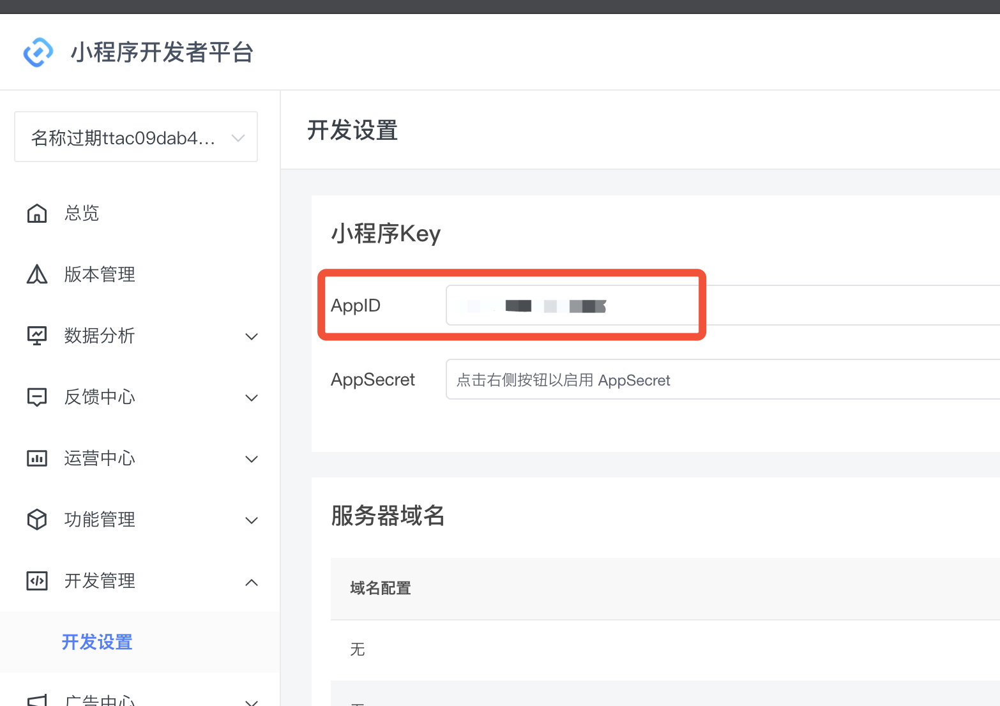
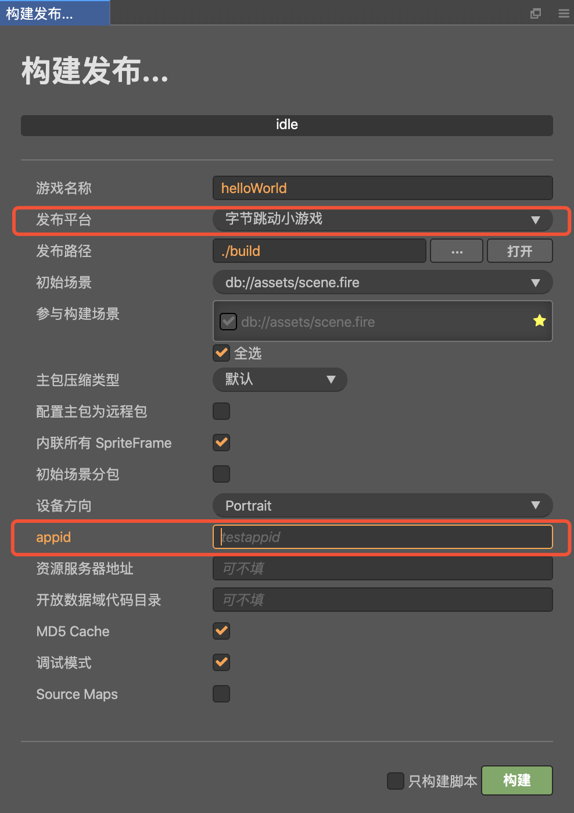
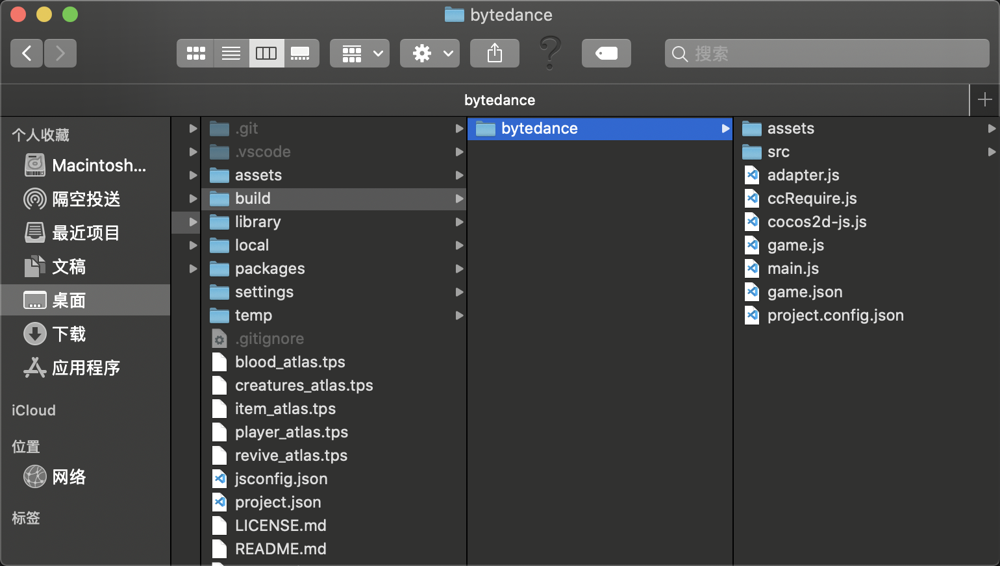
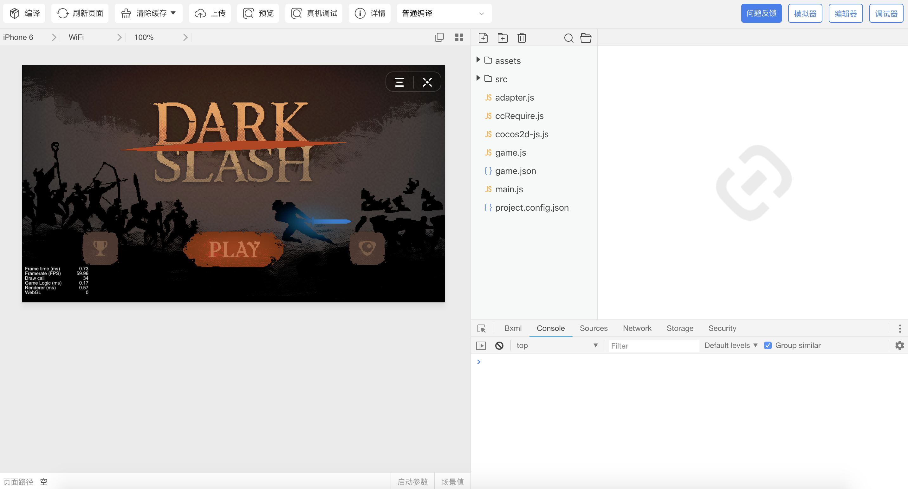

# 发布到字节跳动小游戏

Cocos Creator 从 v2.4.2 开始支持将游戏发布到 **字节跳动小游戏**。

字节跳动小游戏的运行环境是字节小程序的扩展，在小程序环境的基础上提供了 WebGL 接口的封装，使得渲染能力和性能有了大幅度提升。不过由于这些接口都是字节团队通过自研的原生实现封装的，所以并不可以等同为浏览器环境。

作为引擎方，为了尽可能简化开发者的工作量，我们为开发者完成的主要工作包括：

- 引擎框架适配字节跳动小游戏 API，纯游戏逻辑层面，开发者不需要任何额外的修改
- Cocos Creator 编辑器提供了快捷的打包流程，直接发布为字节跳动小游戏
- 自动加载远程资源，缓存资源以及缓存资源版本控制

关于字节跳动小游戏接入的细节，可参考 [字节跳动小游戏接入指南](https://microapp.bytedance.com/docs/zh-CN/mini-game/introduction/plugin-reference/sign)。

## 准备工作

- 下载 [字节跳动开发者工具](https://microapp.bytedance.com/docs/zh-CN/mini-game/develop/developer-instrument/developer-instrument-update-and-download) 并安装。

- 参考 [字节跳动小游戏接入指南](https://microapp.bytedance.com/docs/zh-CN/mini-game/introduction/plugin-reference/sign) 文档，在字节跳动开发者平台完成账号注册、登录以及申请小游戏。

- 小游戏申请通过后，在开发者平台的 **开发管理 -> 开发设置** 中找到 appid。

  

## 发布流程

使用 Cocos Creator 打开需要发布的项目工程，从 **菜单栏 -> 项目** 中打开 **构建发布** 面板，**发布平台** 选择 **字节跳动小游戏**，填入小游戏 appid，然后点击 **构建**。

### 参数项配置

相关参数配置具体的填写规则如下：

- **主包压缩类型**

  设置主包的压缩类型，具体内容可参考文档 [Asset Bundle — 压缩类型](../asset-manager/bundle.md#%E5%8E%8B%E7%BC%A9%E7%B1%BB%E5%9E%8B)。

- **配置主包为远程包**

  该项为可选项，需要与 **资源服务器地址** 选项配合使用。 
  勾选后，主包会配置为远程包，并且与其相关依赖资源一起被构建到发布包目录 remote 下的内置 Asset Bundle — [main](../asset-manager/bundle.md#%E5%86%85%E7%BD%AE-asset-bundle) 中。开发者需要将整个 remote 文件夹上传到远程服务器。

- **初始场景分包**

  该项为可选项。 
  勾选后，首场景及其相关的依赖资源会被构建到发布包目录 assets 下的内置 Asset Bundle — [start-scene](../asset-manager/bundle.md#%E5%86%85%E7%BD%AE-asset-bundle) 中，提高初始场景的资源加载速度。具体内容可参考文档 [初始场景的资源加载](publish-wechatgame.md#%E5%88%9D%E5%A7%8B%E5%9C%BA%E6%99%AF%E7%9A%84%E5%8A%A0%E8%BD%BD%E9%80%9F%E5%BA%A6)。

- **资源服务器地址**

  该项为选填项，用于填写资源存放在远程服务器上的地址。开发者需要在构建后手动将发布包目录下的 remote 文件夹上传到所填写的资源服务器地址上。

- **开放数据域代码目录**

  该项为选填项，用于接入字节跳动小游戏的开放数据域，具体的发布流程请参考 [接入字节跳动小游戏的开放数据域](publish-bytedance-sub-domain.md)。

### 运行预览

- 构建完成后点击 **发布路径** 后面的 **打开** 按钮，可以看到在发布包 build 目录下生成了字节跳动小游戏工程文件夹 **bytedance**，其中已经包含了字节跳动小游戏环境的配置文件：`game.json` 和 `project.config.json`。

  

- 使用 **字节跳动开发者工具** 打开构建生成的 **bytedance** 文件夹，即可打开字节跳动小游戏项目及预览调试游戏内容。开发者工具的具体使用方式请参考 [字节跳动开发者工具介绍](https://microapp.bytedance.com/docs/zh-CN/mini-game/develop/developer-instrument/development-assistance/mini-app-developer-instrument)。

  

## 字节跳动小游戏环境的资源管理

字节跳动小游戏与微信小游戏类似，都存在着包体限制，超过 4MB 的额外资源，必须通过网络请求下载。

Cocos Creator 已经帮开发者做好了远程资源的下载、缓存和版本管理。具体的实现逻辑和操作步骤都与微信小游戏类似，请参考 [微信小游戏资源管理](./publish-wechatgame.md#%E5%BE%AE%E4%BF%A1%E5%B0%8F%E6%B8%B8%E6%88%8F%E7%9A%84%E8%B5%84%E6%BA%90%E7%AE%A1%E7%90%86)。

## 分包加载

Cocos Creator 从 **v2.4.4** 开始支持字节跳动小游戏的分包功能，用法与微信小游戏类似，详情请参考 [小游戏分包](./subpackage.md)。

字节跳动小游戏需要特定的版本才能支持分包功能，字节产品的版本要求如下：

| 产品     | Android    | iOS        |
| :--     | :---       | :---       |
| 抖音     | v13.6.0    | v13.7.0    |
| 头条     | v7.9.9     | v7.9.8     |

字节开发者工具使用的版本请大于等于 **2.0.6**，小于 **3.0.0**。调试基础库则要求在 1.88.0 及以上。

> **注意**：若产品的版本不支持分包加载，则引擎会将分包作为一个普通的 asset bundle 加载。

目前小游戏分包大小有以下限制：
- 整个小游戏的所有分包大小不超过 16 M
- 单个分包/主包的大小不能超过 4 M

具体可参考 [字节小游戏分包加载官方文档](https://microapp.bytedance.com/docs/zh-CN/mini-game/develop/framework/subpackages/introduction)

## 平台 SDK 接入

除了纯游戏内容以外，其实字节跳动小游戏环境还提供了非常强大的原生 SDK 接口，其中最重要的就是用户、社交、录屏等，这些接口都是只存在于字节跳动小游戏环境中的，等同于其他平台的第三方 SDK 接口。这类 SDK 接口的移植工作在现阶段还需要开发者自己处理。下面列举一些字节跳动小游戏提供的强大 SDK：

1. 用户接口：登录，授权，用户信息等
2. 游戏内 [录屏与分享](https://microapp.bytedance.com/docs/zh-CN/mini-game/operation/function/record-share/)
3. 转发以及获得转发信息
4. 媒体：图片、录音、相机等
5. 其他：位置、设备信息、扫码、NFC 等等

## 字节跳动小游戏的限制

字节跳动小游戏暂时不支持以下功能模块：

- VideoPlayer
- WebView

另外，通过网络加载的音频资源，字节跳动小游戏是采用流式播放的，无法获取到音频的 duration，除非将音频资源放到 Asset Bundle 中导出。

## 参考链接

- [字节跳动小游戏接入指南](https://microapp.bytedance.com/docs/zh-CN/mini-game/introduction/plugin-reference/sign)
- [字节跳动小游戏 API 文档](https://microapp.bytedance.com/docs/zh-CN/mini-game/develop/api/mini-game/bytedance-mini-game)
- [字节跳动开发者工具下载](https://microapp.bytedance.com/docs/zh-CN/mini-game/develop/developer-instrument/developer-instrument-update-and-download)
- [字节跳动开发者工具介绍](https://microapp.bytedance.com/docs/zh-CN/mini-game/develop/developer-instrument/development-assistance/mini-app-developer-instrument)
- [字节跳动小游戏真机调试](https://microapp.bytedance.com/docs/zh-CN/mini-game/develop/developer-instrument/development-assistance/real-machine-adjust)
- [字节跳动小游戏多端支持情况](https://microapp.bytedance.com/docs/zh-CN/mini-game/develop/multi-server-support/using-restriction)
- [字节跳动小游戏 FAQ 汇总](https://forum.cocos.org/t/faq/97461)
- [头条和抖音小游戏流量、分成及接入指南](https://mp.weixin.qq.com/s/hgZPEJyy2gWgYacDAc82Jw)
