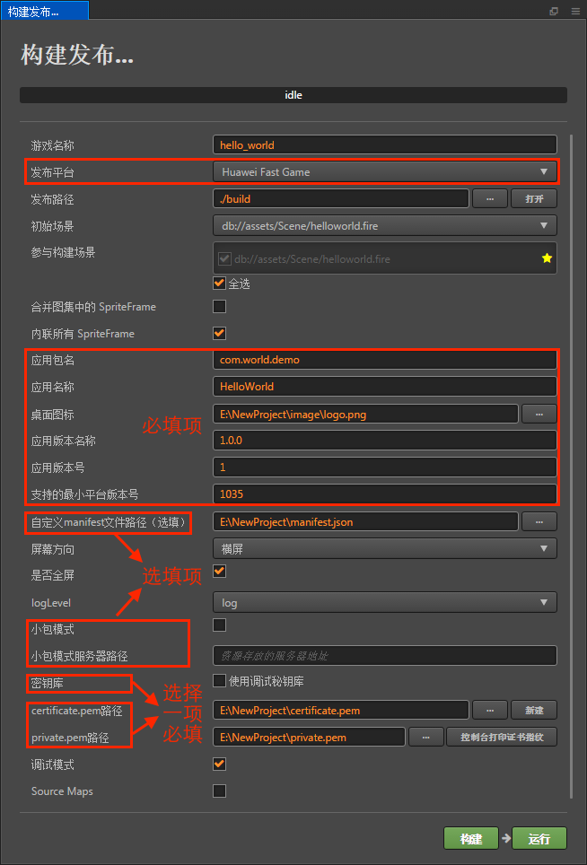

# 发布到华为快游戏平台

Cocos Creator 从 v2.0.7 版本开始正式支持将游戏发布到华为快游戏平台。我们来看一下如何使用 Cocos Creator 发布到华为快游戏平台。

## 环境配置

- 下载 [华为快应用加载器](https://obs.cn-north-2.myhwclouds.com/hms-ds-wf/sdk/HwFastAPPEngine_Loader.1213_tool.zip)，并安装到 Android 设备上（建议 Android Phone 6.0 或以上版本）

- PC 端全局安装 [nodejs-8.1.4](https://nodejs.org/zh-cn/download/) 或以上版本

## 发布流程

一、使用 Cocos Creator 打开需要发布的项目工程，在 **构建发布** 面板的 **发布平台** 中选择 **Huawei Fast Game**。



其中 **应用包名**、**应用名称**、**桌面图标**、**应用版本名称**、**应用版本号**、**支持的最小平台版本号** 这些参数为必填项。**自定义 manifest 文件路径**、**小包模式**、**小包模式服务器路径** 为选填项。而 **密钥库** 以及两个签名文件（**certificate.pem 路径** 和 **private.pem 路径**），需要根据用户需求选择勾选 **密钥库** 或者填写两个路径。相关参数配置具体的填写规则如下：

- **应用名称**

  该项为必填项。是华为快游戏的名称。**构建发布** 面板最上方的 **游戏名称** 则不参与华为快游戏打包流程。

- **桌面图标**

  该项为必填项。构建时 **桌面图标** 将会构建到华为快游戏的工程中。点击输入框右边的 **...** 按钮即可选择图片。

- **支持的最小平台版本号**

  该项为必填项。根据华为的要求目前这个值必须大于或等于 1035。

- **自定义 manifest 文件路径**

  该项为选填项。为华为快游戏扩展功能。使用时需要选择 json 文件，文件中的数据类型要求为 json 格式。**注意**：当 json 数据的 key 值为 `package`、`appType`、`name`、`versionName`、`versionCode`、`icon`、`minPlatformVersion`、`config`、`display` 时不可用。否则在构建时会被 **应用包名**，**应用名称**，**应用图标**，**应用版本号**，**应用版本名称** 等数据覆盖。

- **小包模式和小包模式服务器路径**

  该项为选填项。小游戏的包内体积包含代码和资源不能超过 10M，资源可以通过网络请求加载。**小包模式** 就是帮助用户将脚本文件保留在小游戏包内，其他资源则上传到远程服务器，根据需要从远程服务器下载。而远程资源的下载、缓存和版本管理，Creator 已经帮用户做好了。用户需要做的是以下两个步骤：

  1、构建时，勾选 **小包模式**，填写 **小包模式服务器路径**。然后点击 **构建**。

  2、构建完成后，点击 **发布路径** 后面的 **打开** 按钮，将发布路径下的 **huawei/res** 目录上传到小包模式服务器。例如：默认发布路径是 build，则需要上传 build/huawei/res 目录。

  此时，构建出来的 rpk 将不再包含 res 目录，res 目录里的资源将通过网络请求从填写的 **小包模式服务器地址** 上下载。

- **密钥库**

  勾选 **使用调试密钥库** 时，表示默认使用的是 Creator 自带的证书构建 rpk 包，仅用于 **调试** 时使用。**注意**：若 rpk 包要用于提交审核，则构建时不要勾选该项。<br>
  如果不勾选 **密钥库**，则需要配置签名文件 **certificate.pem 路径** 和 **private.pem 路径**，此时构建出的是可以 **直接发布** 的 rpk 包。用户可通过输入框右边的 **...** 按钮来配置两个签名文件。**注意**：这两个签名文件建议不要放在发布包 build 目录下，否则每次构建时都会清空该目录，导致文件丢失。<br>

  有以下两种方式可以生成签名文件：

    - 通过 **构建发布** 面板 **certificate.pem 路径** 后的 **新建** 按钮生成

    - 通过命令行生成 release 签名

      用户需要通过 openssl 命令等工具生成签名文件 private.pem、certificate.pem。

      ```bash
      # 通过 openssl 命令工具生成签名文件
      openssl req -newkey rsa:2048 -nodes -keyout private.pem -x509 -days 3650 -out certificate.pem
      ```

      **注意**：openssl 工具在 linux 或 Mac 环境下可在终端直接打开。而在 Windows 环境下则需要安装 openssl 工具并且配置系统环境变量，配置完成后需重启 Creator。

- **自定义 npm 文件夹路径**

   **自定义 node 路径**是选填项。

   不填写时，在 windows 系统上默认读取环境变量，在mac上默认读取 /usr/bin/local 目录。当您的电脑环境未满足上述条件时，可填写 **自定义 node 路径** 来满足 creator 构建导出可运行的快游戏 rpk 包，rpk 包位于快游戏工程 huawei 下的 dist 目录里。

    - 获取本地的 node 的安装路径的命令：

      在 mac 系统
      ```
      which node
      ```
      如果输出结果：

      ```
      /Users/yourname/.nvm/versions/node/v8.1.4/bin/node
      ```
      则**自定义 node 路径**需要填写为：

      ```
      /Users/yourname/.nvm/versions/node/v8.1.4/bin
      ```
      在 windows 系统下
      ```
      where node
      ```

      如果输出结果：

      ```
      c:\Program Files\nodejs\node.exe
      ```
      则**自定义 node 路径**需要填写为

      ```
      c:\Program Files\nodejs
      ```

二、**构建发布**

  **构建发布** 面板的相关参数设置完成后，点击 **构建**。构建完成后点击 **发布路径** 后面的 **打开** 按钮来打开构建发布包，可以看到在默认发布路径 build 目录下生成了 **huawei** 目录，该目录就是导出的华为快游戏工程目录和 rpk，rpk 包在 **/build/huawei/dist** 目录下。

  

三、**将打包出来的 rpk 运行到手机上**。有以下两种方式：

  - 在 **构建发布** 面板点击右下角的 **运行** 按钮，会弹出一个 **快游戏工具** 面板。在 **手机列表** 栏目选择手机（如果连接了多台手机），然后在 **快游戏调试平台** 栏目点击 **运行** 按钮。

    这时 rpk 会被推送到之前在手机上安装完成的 **华为快应用加载器** 上（如有读写等权限弹出请允许），即可在手机上打开 rpk。

    

  - 将构建生成的 rpk 包（位于快游戏工程 huawei 目录下的 dist 目录中）拷贝到手机 sdcard 目录下。然后在手机上打开 **华为快应用加载器** 后，点击手机的返回键会弹出一个列表，选择第一个选项 **本地安装**，选择路径为放置 rpk 的路径，即可将 rpk 运行到手机上。

四、分包 rpk

分包 rpk 是根据用户的需求选择是否使用。分包加载，即把游戏内容按一定规则拆分在几个包里，在首次启动的时候只下载必要的包，这个必要的包称为 **主包**，开发者可以在主包内触发下载其他子包，这样可以有效降低首次启动的消耗时间。若要使用该功能需要在 Creator 中设置 [分包加载](../scripting/subpackage.md)，设置完成后在构建时就会自动分包。

构建完成后，生成的子包和主包会合并成一个 rpk，生成目录在 **/build/huawei/dist** 目录下

## 相关参考链接

[华为快游戏开发文档](https://developer.huawei.com/consumer/cn/service/hms/catalog/fastgame.html?page=fastapp_fastgame_introduction)
