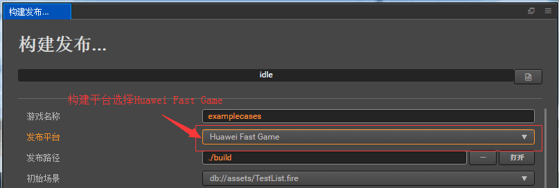
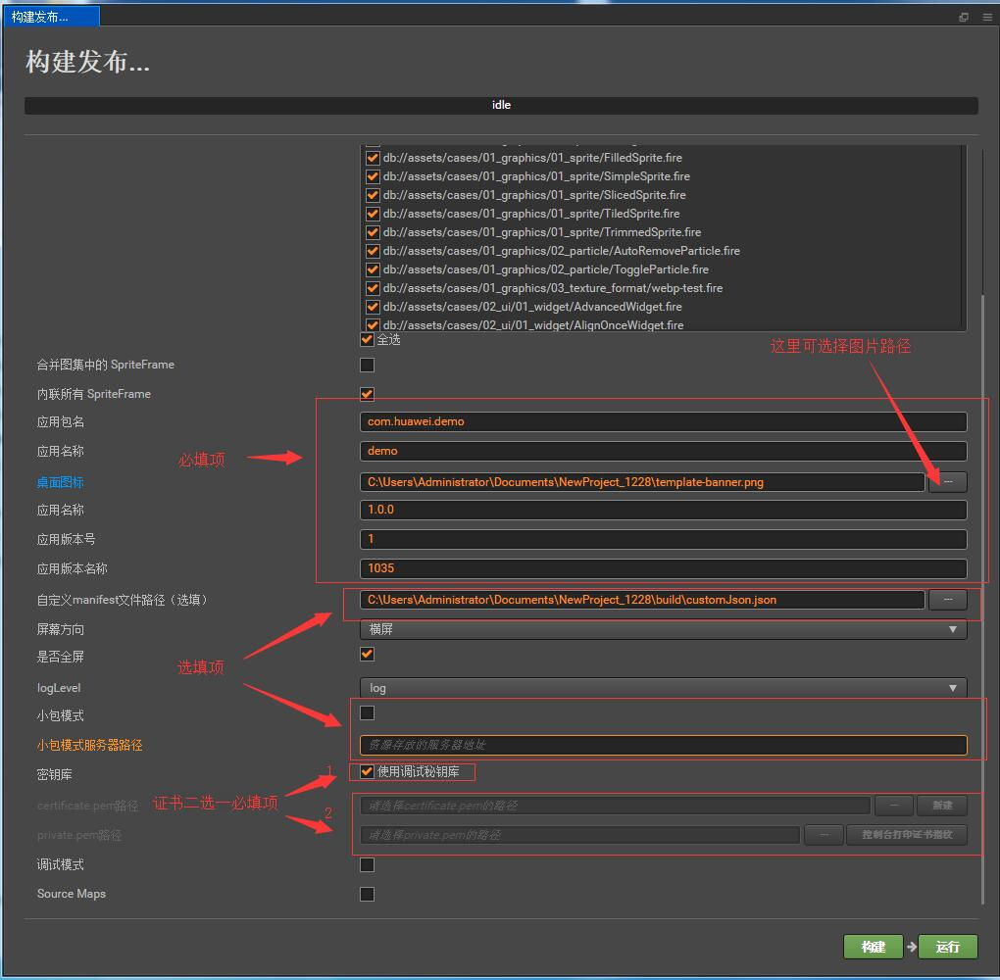

# 发布到 huawei 快游戏平台

从 v2.0.6-huawei.3 版本开始，Cocos Creator 支持将游戏发布到 huawei 快游戏平台。我们来看一下如何使用 Cocos Creator 一键发布到 huawei 快游戏平台。

## 环境配置

- 下载 [快游戏调试器]()，并安装到 Android 设备上（建议 Android Phone 6.0 或以上版本）

- 电脑全局安装 [nodejs-8.1.4](https://nodejs.org/zh-cn/download/) 或以上版本

## 发布流程

一、使用 Cocos Creator 打开需要发布的项目工程，在 **构建发布** 面板的 **发布平台** 中选择 **Huawei Fast Game**。

  


   其中 **应用包名**、**应用名称**、**桌面图标**、**应用版本名称**、**应用版本号**、**支持的最小引擎平台版本号**这些参数为必填项。而 **密钥库**、**小包模式**、**小包模式服务器路径** 为选填项。相关参数配置具体的填写规则如下：
    

- **应用图标**

  **应用图标** 为必填项。构建时，应用图标将会构建到 huawei 快游戏的工程中，请确保填写的应用图标路径下的图片真实存在，点击输入框右边的按钮可选择图片。  

  
- **密钥库**

  **使用调试秘钥库** 是选填项。勾选时，表示用的是 creator 自带默认的证书构建的rpk，仅用于调试时使用。<br>
  如果不勾选 **使用调试秘钥库**，则需要配置 certificate.pem 路径和 private.pem 路径。**注**：rpk提交审核时，此选不勾选。
  关于 certificate.pem 和 private.pem 证书添加，可以点击“certificate.pem”栏目的最右侧按钮**新建**来新建证书。**注**：在windows系统上需要注意事前安装 openssl 软件和配置环境变量。配置好后需要重启cocos creator。mac系统已自带openssl则不用安装。用户也可以用命令行生成证书，如下：

- 命令如何生成 release 签名

   用户需要通过 openssl 命令等工具生成签名文件 private.pem、certificate.pem。
    
    ```bash
    # 命令行指定到刚才添加到小游戏根目录的 release 目录下
    cd E:\workspace\YourProject\build-templates\jsb-link\sign\release
    # 通过 openssl 命令工具生成签名文件
    openssl req -newkey rsa:2048 -nodes -keyout private.pem -x509 -days 3650 -out certificate.pem
    ```

  **注意**：openssl 工具在 linux 或 Mac 环境下可在终端直接打开，而在 Windows 环境下则需要安装 openssl 工具并且配置系统环境变量。

- **小包模式和小包模式服务器路径**

  该项为选填项。小游戏的包内体积包含代码和资源不能超过 4M，资源可以通过网络请求加载。**小包模式** 就是帮助用户将脚本文件保留在小游戏包内，其他资源则上传到远程服务器，根据需要从远程服务器下载。而远程资源的下载、缓存和版本管理，Creator 已经帮用户做好了。用户需要做的是以下两个步骤：

  1、构建时，勾选 **小包模式**，填写 **小包模式服务器路径**。然后点击 **构建**。

  2、构建完成后，点击 **发布路径** 后面的 **打开** 按钮，将发布路径下的 **jsb-link/res** 目录上传到小包模式服务器。例如：默认发布路径是 build，则需要上传 build/jsb-link/res 目录。

  此时，构建出来的 quickgame 目录下将不再包含 res 目录，res 目录里的资源将通过网络请求从填写的 **小包模式服务器地址** 上下载。

二、**构建发布** 

    面板的相关参数设置完成后，点击 **构建**。构建完成后点击 **发布路径** 后面的 **打开** 按钮来打开构建发布包，可以看到在默认发布路径 build 目录下生成了 **quickgame** 目录，该目录就是导出的 huawei 快游戏工程目录和 rpk,rpk 目录在 /build/huawei/dist 目录下。

三、将打包出来的 rpk 运行到手机上，有两种方式。

   方法一： 在构建发布页面，点击右下角的**运行**按钮，会弹出一个**快游戏工具**弹出框，在**手机列表**栏目选择手机（如果连接了多台手机），然后点击**快游戏调试平台**点击**运行**图标。这时rpk会推送到手机快应用调试器上（如有读写等权限弹出请允许）。到此rpk就运行到手机上。
   
   方法二：
   将构建生成的小游戏 rpk 文件（位于小游戏工程 huawei 目录下的 dist 目录中）拷贝到手机 SD 卡目录下。打开**快应用调试器**后，按返回键会弹出一个列表，选择第一个选项“本地安装”，选择路径为放置rpk的路径即可运行到手机上。
        
四、分包 rpk

分包 rpk 不是必项的。分包加载，即把游戏内容按一定规则拆分在几个包里，在首次启动的时候只下载必要的包，这个必要的包称为 主包，开发者可以在主包内触发下载其他子包，这样可以有效降低首次启动的消耗时间。开发者根据需求采用这功能。
在creator设置[配置方法](https://docs.cocos.com/creator/manual/zh/scripting/subpackage.html)后，打包时会自动分包。

构建完成后，生成的分包 rpk在 /build/huawei/dist/[分包名字]目录下。

## 相关参考链接

- [OPPO 快游戏教程](https://cdofs.oppomobile.com/cdo-activity/static/201810/26/quickgame/documentation/games/quickgame.html)

