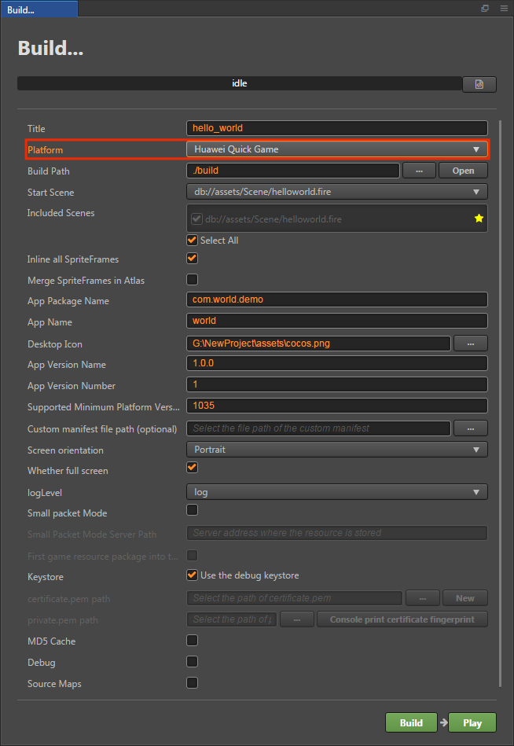

# 发布到华为快游戏

## 环境配置

- 下载 [华为快应用加载器](https://developer.huawei.com/consumer/cn/doc/development/quickApp-Guides/quickapp-installtool#h1-1575365259108)，并安装到 Android 设备上（建议 Android Phone 6.0 或以上版本）

- PC 端全局安装 [nodejs-8.1.4](https://nodejs.org/zh-cn/download/) 或以上版本

## 发布流程

使用 Cocos Creator 打开需要发布的项目工程，从 **菜单栏 -> 项目** 中打开 **构建发布** 面板，**发布平台** 选择 **华为快游戏**。



### 参数项配置

相关参数配置具体的填写规则如下：

- **主包压缩类型**

  设置主包的压缩类型，具体内容可参考文档 [Asset Bundle — 压缩类型](../asset-manager/bundle.md#%E5%8E%8B%E7%BC%A9%E7%B1%BB%E5%9E%8B)。

- **配置主包为远程包**

  该项为可选项，需要与 **资源服务器地址** 选项配合使用。<br>
  勾选后，主包会配置为远程包，并且与其相关依赖资源一起被构建到发布包目录 remote 下的内置 Asset Bundle — [main](../asset-manager/bundle.md#%E5%86%85%E7%BD%AE-asset-bundle) 中。开发者需要将整个 remote 文件夹上传到远程服务器。

- **初始场景分包**

  该项为可选项。<br>
  勾选后，首场景及其相关的依赖资源会被构建到发布包目录 assets 下的内置 Asset Bundle — [start-scene](../asset-manager/bundle.md#%E5%86%85%E7%BD%AE-asset-bundle) 中，提高初始场景的资源加载速度。具体内容可参考文档 [初始场景的资源加载](publish-wechatgame.md#%E5%88%9D%E5%A7%8B%E5%9C%BA%E6%99%AF%E7%9A%84%E5%8A%A0%E8%BD%BD%E9%80%9F%E5%BA%A6)。

- **应用包名**

  该项为必填项，根据用户的需求进行填写。

- **应用名称**

  该项为必填项。是华为快游戏的名称。**构建发布** 面板最上方的 **游戏名称** 则不参与华为快游戏打包流程。

- **桌面图标**

  该项为必填项。构建时 **桌面图标** 将会构建到华为快游戏的工程中。点击输入框右边的 **...** 按钮即可选择图片。桌面图标建议使用 **png** 图片。

- **应用版本名称**

  该项为必填项。**应用版本名称** 是真实的版本，如：1.0.0

- **应用版本号**

  该项为必填项。**应用版本号** 与 **应用版本名称** 不同，**应用版本号** 主要用于区别版本更新。每次提交审核时应用版本号都要比上次提交审核的值至少 +1，一定不能等于或者小于上次提交审核的值，建议每次提交审核时应用版本号递归 +1。**注意**：**应用版本号** 必须为正整数。

- **支持的最小平台版本号**

  该项为必填项。根据华为快游戏的要求目前这个值必须大于或等于 **1035**。

- **自定义 manifest 文件路径**

  该项为选填项。为华为快游戏扩展功能。使用时需要选择 json 文件，文件中的数据类型要求为 json 格式。**注意**：当 json 数据的 key 值为 `package`、`appType`、`name`、`versionName`、`versionCode`、`icon`、`minPlatformVersion`、`config`、`display` 时不可用。否则在构建时会被 **应用包名**、**应用名称**、**应用图标**、**应用版本号**、**应用版本名称** 等数据覆盖。

- **资源服务器地址**

  该项为选填项，用于填写资源存放在远程服务器上的地址。

  - 若 **不填写** 该项，则发布包目录下的 `build/huawei/remote` 文件夹将会被打包到构建出来的 rpk 包中。

  - 若 **填写** 该项，则 remote 文件夹不会被打包到 rpk 包中。开发者需要在构建后手动将 remote 文件夹上传到所填写的资源服务器地址上。

  具体的资源管理细节，请参考文档下方的资源管理部分。

- **密钥库**

  勾选 **密钥库** 时，表示默认使用的是 Creator 自带的证书构建 rpk 包，仅用于 **调试** 时使用。**注意**：若 rpk 包要用于提交审核，则构建时不要勾选该项。<br>
  如果不勾选 **密钥库**，则需要配置签名文件 **certificate.pem 路径** 和 **private.pem 路径**，此时构建出的是可以 **直接发布** 的 rpk 包。用户可通过输入框右边的 **...** 按钮来配置两个签名文件。**注意**：这两个签名文件建议不要放在发布包 **build/huawei** 目录下，否则每次构建时都会清空该目录，导致文件丢失。<br>

  有以下两种方式可以生成签名文件：

  - 通过 **构建发布** 面板 **certificate.pem 路径** 后的 **新建** 按钮生成

  - 通过命令行生成 release 签名

    用户需要通过 openssl 命令等工具生成签名文件 private.pem、certificate.pem。

    ```bash
    # 通过 openssl 命令工具生成签名文件
    openssl req -newkey rsa:2048 -nodes -keyout private.pem -x509 -days 3650 -out certificate.pem
    ```

    > **注意**：openssl 工具在 linux 或 Mac 环境下可在终端直接打开。而在 Windows 环境下则需要安装 openssl 工具并且配置系统环境变量，配置完成后需重启 Creator。

- **自定义 node 路径**

  该项为选填项，从 **v2.0.10** 开始可以自动获取到操作系统全局的 node 路径，无需再手动设置。获取方法为：
  - Windows 系统：从系统获取环境变量中的路径
  - Mac 系统：从 Shell 的配置文件获取环境变量中的路径。

  如果获取不到，请确保 node 已正常安装，并且能够在命令行环境下直接启动。获取到的 node 将用于构建生成可运行的快游戏 rpk 包。

  **V2.0.10** 以下版本的填写规则如下：

  - 若不填写该项时，Creator 会默认在 Windows 系统上读取环境变量中的 node 路径，在 Mac 系统上默认读取 **/usr/bin/local** 目录下的 node 来构建导出可运行的快游戏 rpk 包（rpk 包位于构建生成的发布包 huawei 目录下的 dist 目录）。
  - 如果用户的电脑环境未安装 node 或者读取不到系统中的 node 路径时，则需要填写 **自定义 node 路径** 来构建和导出 rpk 包。填写规则如下：

    - Windows 系统

      ```bash
      # 获取本地 node 路径
      where node
      # 如果输出结果为：
      C:\Program Files\nodejs\node.exe
      # 则自定义 node 路径填写为：
      C:\Program Files\nodejs
      ```

    - Mac 系统

      ```bash
      # 获取本地 node 路径
      which node
      # 如果输出结果为：
      /Users/yourname/.nvm/versions/node/v8.1.4/bin/node
      # 则自定义 node 路径填写为：
      /Users/yourname/.nvm/versions/node/v8.1.4/bin
      ```

### 构建发布

**构建发布** 面板的相关参数设置完成后，点击 **构建**。构建完成后点击 **发布路径** 后面的 **打开** 按钮来打开构建发布包，可以看到在默认发布路径 build 目录下生成了 **huawei** 目录，该目录就是导出的华为快游戏工程目录和 rpk，rpk 包在 `build/huawei/dist` 目录下。


### 将打包出来的 rpk 运行到手机上

有以下两种方式：

1. 在 **构建发布** 面板点击右下角的 **运行** 按钮，会弹出一个 **快游戏工具** 面板。在 **手机列表** 栏目选择手机（如果连接了多台手机），然后在 **快游戏调试平台** 栏目点击 **运行** 按钮。

    这时 rpk 会被推送到之前在手机上安装完成的 **华为快应用加载器** 上（如有读写等权限弹出请允许），即可在手机上打开 rpk。

    

2. 将构建生成的 rpk 包拷贝到手机内部存储目录下。然后在手机上打开 **华为快应用加载器** 后，点击手机的返回键会弹出一个列表，选择第一个选项 **本地安装**，选择路径为放置 rpk 的路径，即可将 rpk 运行到手机上。

## 分包 rpk

分包 rpk 是根据用户的需求选择是否使用。分包加载，即把游戏内容按一定规则拆分在几个包里，在首次启动的时候只下载必要的包，这个必要的包称为 **主包**，开发者可以在主包内触发下载其他子包，这样可以有效降低首次启动的消耗时间。若要使用该功能需要在 Creator 中设置 [小游戏分包](subpackage.md)，设置完成后在构建时就会自动分包。

构建完成后，生成的子包和主包会合并成一个 rpk，生成目录在 `build/huawei/dist` 目录下

## 华为快游戏环境的资源管理

华为快游戏与微信小游戏类似，都存在着包体限制。不过华为的主包包体限制是 **10MB**，超过的部分必须通过网络请求下载。

Cocos Creator 已经帮开发者做好了远程资源的下载、缓存和版本管理。具体的实现逻辑和操作步骤都与微信小游戏类似，请参考 [微信小游戏资源的管理](./publish-wechatgame.md#%E5%BE%AE%E4%BF%A1%E5%B0%8F%E6%B8%B8%E6%88%8F%E7%9A%84%E8%B5%84%E6%BA%90%E7%AE%A1%E7%90%86)。

## 相关参考链接

[华为快游戏开发文档](https://developer.huawei.com/consumer/cn/doc/development/quickApp-Guides/quickgame-develop-runtime-game)
