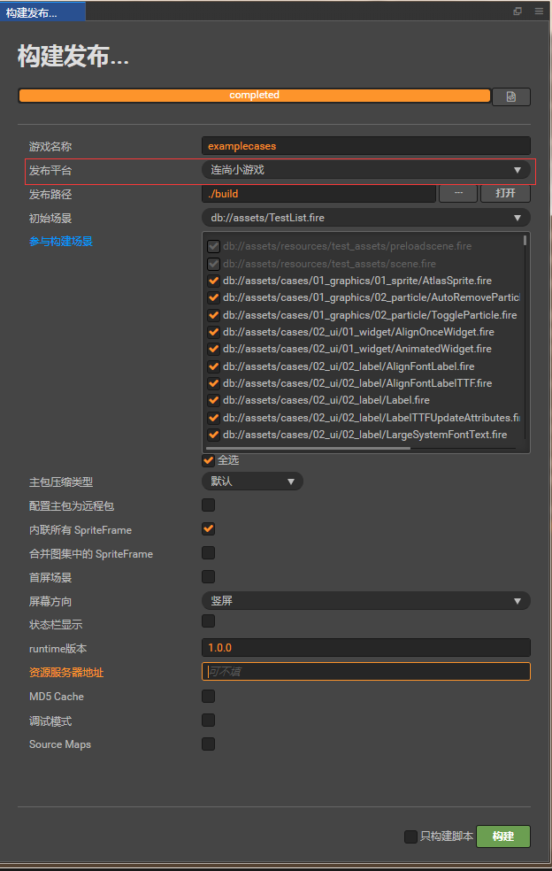
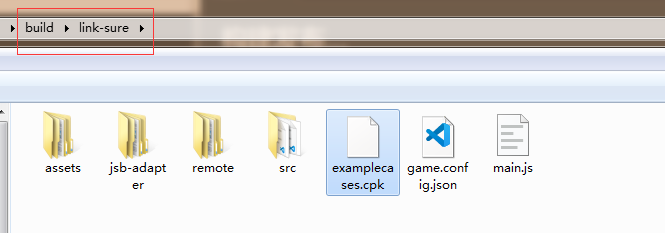

# 发布到连尚小游戏

  从 v2.4.1 开始，Cocos Creator 支持发布到 **连尚小游戏**。**连尚小游戏** 是 wifi 万能钥匙旗下的小游戏应用平台。

## 环境配置

- 下载 [连尚小游戏调试包](https://www.wjminiapp.com/docs/minigame/guide/download_apk.html) 并安装到 Android 设备（建议 Android Phone 6.0 或以上版本）。

## 发布流程

一、使用 Cocos Creator 打开需要发布的项目工程，在 **构建发布** 面板的 **发布平台** 中选择 **连尚小游戏**。

相关参数配置具体的填写规则如下：

- **资源服务器地址**

  该项为选填项，用于填写资源存放在服务器上的地址。

  - 若不填写该项，则发布包目录下的 **build/link-sure/remote** 文件夹将会被打包到 **cpk** 包内。

  - 若填写该项，则构建出来的 **cpk** 包将不包括 **remote** 文件夹，你需要手动将 **remote** 文件夹上传到所填写的资源服务器地址上。

  具体的资源管理细节，请参考 [连尚小游戏环境的资源管理](#%E8%BF%9E%E5%B0%9A%E5%B0%8F%E6%B8%B8%E6%88%8F%E7%8E%AF%E5%A2%83%E7%9A%84%E8%B5%84%E6%BA%90%E7%AE%A1%E7%90%86)。

二、**构建**

**构建发布** 面板的相关参数设置完成后，点击 **构建**。构建完成后点击 **发布路径** 后面的 **打开** 按钮来打开构建发布包，可以看到在默认发布路径 build 目录下生成了 **link-sure** 目录，该目录就是导出的 **link-sure** 工程目录和 cpk。cpk 包在 **/build/link-sure** 目录下。

三、**将打包出来的 cpk 运行到手机上**。

- 开发者需要联系 [连尚小游戏的商务](https://www.wjminiapp.com/docs/minigame/guide/flow.html) 成为小游戏开发者。
- 进入连尚小程序管理平台，创建小游戏，等待审核。
- 审核通过后，在连尚小程序管理平台的 **版本管理** 中上传构建出来的 cpk 包。
- 点击网页上的 **查看二维码**，打开手机上已安装好的连尚小游戏调试器扫码，即可在真机上预览。

## 连尚小游戏环境的资源管理

连尚小游戏与微信小游戏类似，都存在着包体限制，不过连尚小游戏的主包包体限制是 **10MB**，超过的部分必须通过网络请求下载。

我们建议开发者在小游戏包内只保存脚本文件，其他的资源都从远程服务器下载。Cocos Creator 已经帮开发者做好了远程资源的下载、缓存和版本管理。具体的实现逻辑和操作步骤都与微信小游戏类似，请参考 [微信小游戏资源的管理](./publish-wechatgame.html#%E5%B0%8F%E6%B8%B8%E6%88%8F%E7%8E%AF%E5%A2%83%E7%9A%84%E8%B5%84%E6%BA%90%E7%AE%A1%E7%90%86)。

## 相关参考链接
- [连尚小游戏开发流程介绍](https://www.wjminiapp.com/docs/minigame/guide/flow.html)
- [连尚小游戏指南](https://www.wjminiapp.com/docs/minigame/guide/)
- [连尚小游戏调试](https://www.wjminiapp.com/docs/minigame/guide/debug.html)
- [连尚小游戏 API 文档](https://www.wjminiapp.com/docs/minigame/api/)
- [连尚小游戏调试包下载](https://www.wjminiapp.com/docs/minigame/guide/download_apk.html)
