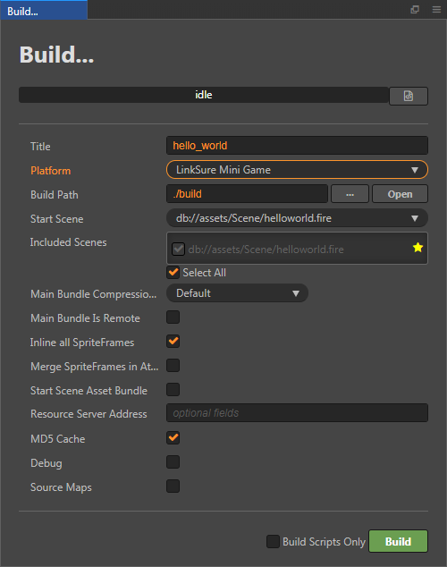
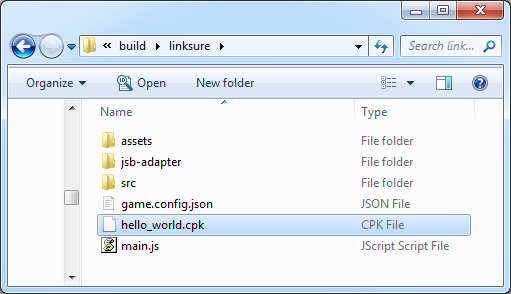
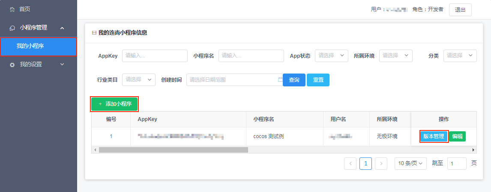
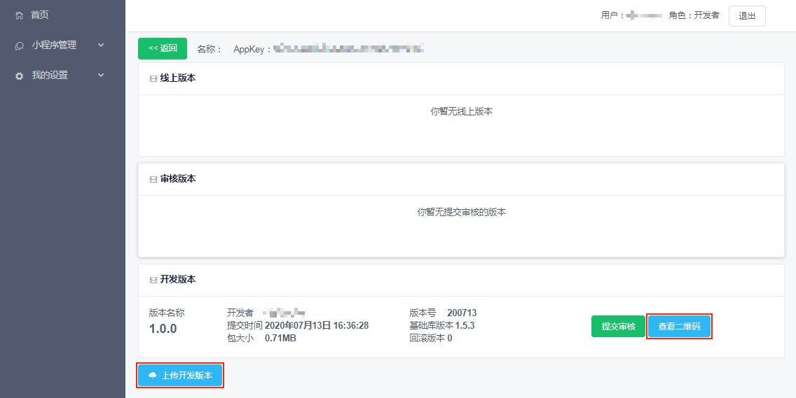

# 发布到连尚小游戏

从 v2.4.1 开始，Cocos Creator 支持发布到 **连尚小游戏**。连尚小游戏是 WiFi 万能钥匙旗下的小游戏应用平台，具有便捷、轻量、免安装的特点。

连尚小游戏以 **.cpk** 格式的游戏包形式运行于小游戏环境中，运行环境与微信小游戏类似。游戏包由云端托管，在 APP 内投放和运行，安全可靠且体验流畅，用户可点开即玩，无需安装。

## 环境配置

- 下载 [连尚小游戏调试器](https://www.wjminiapp.com/docs/minigame/guide/download_apk.html) 并安装到 Android 设备（建议 Android Phone 6.0 或以上版本）。

## 发布流程

使用 Cocos Creator 打开需要发布的项目工程，从 **菜单栏 -> 项目** 中打开 **构建发布** 面板，**发布平台** 选择 **连尚小游戏**。

### 参数项配置

相关参数配置具体的填写规则如下：

- **主包压缩类型**

  设置主包的压缩类型，具体内容可参考文档 [内置 Asset Bundle — `main`](../asset-manager/bundle.md#%E5%86%85%E7%BD%AE-asset-bundle)。

- **配置主包为远程包**

  该项为可选项，需要与 **资源服务器地址** 选项配合使用。 
  勾选后，主包会配置为远程包，并且与其相关依赖资源一起构建到发布包目录 remote 下的内置 Asset Bundle — [main](../asset-manager/bundle.md#%E5%86%85%E7%BD%AE-asset-bundle) 中。开发者需要将整个 remote 文件夹上传到远程服务器，这样主包就不会被打包到 cpk 中。

- **初始场景分包**

  该项为可选项。 
  勾选后，首场景及其相关的依赖资源会被构建到发布包目录 assets 下的内置 Asset Bundle — [start-scene](../asset-manager/bundle.md#%E5%86%85%E7%BD%AE-asset-bundle) 中，提高初始场景的资源加载速度。具体内容可参考文档 [初始场景的资源加载](publish-wechatgame.md#%E5%88%9D%E5%A7%8B%E5%9C%BA%E6%99%AF%E7%9A%84%E5%8A%A0%E8%BD%BD%E9%80%9F%E5%BA%A6)。

- **资源服务器地址**

  该项为选填项，用于填写资源存放在服务器上的地址。

  - 若 **不填写** 该项，则发布包目录下的 `build/linksure/remote` 文件夹将会被打包到构建出来的 cpk 包中。
  - 若 **填写** 该项，则 remote 文件夹不会被打包到 cpk 包中。开发者需要在构建后手动将 remote 文件夹上传到所填写的资源服务器地址上。

  具体的资源管理细节，请参考文档下方的资源管理部分。

### 构建

**构建发布** 面板的相关参数设置完成后，点击 **构建**。 
构建完成后点击 **发布路径** 后面的 **打开** 按钮来打开构建发布包，可以看到在默认发布路径 build 目录下生成了 **linksure** 目录，该目录就是导出的 **linksure** 工程目录，cpk 包在 `build/linksure` 目录下。

### 将打包出来的 cpk 运行到手机上

- 开发者需要联系 [连尚小游戏的商务](https://www.wjminiapp.com/docs/minigame/guide/flow.html) 成为小游戏开发者。
- 进入连尚小程序管理平台，点击 **小程序管理 -> 我的小程序 -> 创建小程序**，填写小程序相关信息，提交后等待审核。
- 审核通过后，点击小程序后面的 **版本管理** 按钮。

  

- 然后点击 **上传开发版本** 来上传构建出来的 cpk 包。开发版本只能保存最新上传的 cpk，后面上传的 cpk 会覆盖之前上传的版本。

  

- 上传完成后点击 **查看二维码**，然后打开手机上已经安装好的连尚小游戏调试器扫码，即可在真机上预览。如果需要调试小游戏可参考官方文档 [连尚小游戏调试](https://www.wjminiapp.com/docs/minigame/guide/debug.html)。

更多内容可参考 [连尚小游戏开发流程介绍](https://www.wjminiapp.com/docs/minigame/guide/flow.html)。

## 连尚小游戏的资源管理

连尚小游戏与微信小游戏类似，都存在着包体限制。连尚小游戏的主包包体限制为 **10MB**，超过的部分必须通过网络请求下载。

Cocos Creator 已经帮开发者做好了远程资源的下载、缓存和版本管理。具体的实现逻辑和操作步骤都与微信小游戏类似，请参考 [微信小游戏的资源管理](./publish-wechatgame.md#%E5%BE%AE%E4%BF%A1%E5%B0%8F%E6%B8%B8%E6%88%8F%E7%9A%84%E8%B5%84%E6%BA%90%E7%AE%A1%E7%90%86)。

## 相关参考链接

- [连尚小游戏指南](https://www.wjminiapp.com/docs/minigame/guide/)
- [连尚小游戏开发流程介绍](https://www.wjminiapp.com/docs/minigame/guide/flow.html)
- [连尚小游戏调试文档](https://www.wjminiapp.com/docs/minigame/guide/debug.html)
- [连尚小游戏 API 文档](https://www.wjminiapp.com/docs/minigame/api/)
- [连尚小游戏调试器下载](https://www.wjminiapp.com/docs/minigame/guide/download_apk.html)
