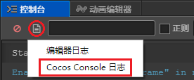
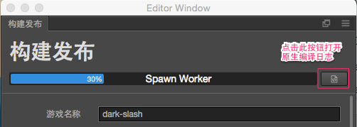
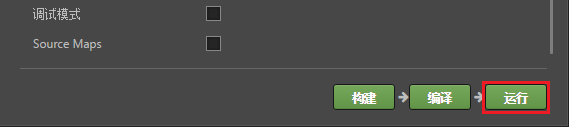
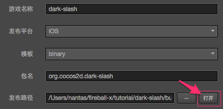

# 打包发布原生平台

点击菜单栏的 **项目 -> 构建发布**，打开构建发布面板。

目前可以选择的原生平台包括 Android、iOS、Mac、Windows 四个，其中发布到 iOS、Mac 和 Windows 的选项只能在相应的操作系统中才会出现。


## 构建选项

### 主包压缩类型

设置主包的压缩类型，具体内容可参考文档 [Asset Bundle — 压缩类型](../asset-manager/bundle.md#%E5%8E%8B%E7%BC%A9%E7%B1%BB%E5%9E%8B)。

### 内联所有 SpriteFrame

自动合并资源时，将所有 SpriteFrame 与被依赖的资源合并到同一个包中。建议网页平台开启，启用后会略微增大总包体，多消耗一点点网络流量，但是能显著减少网络请求数量。建议原生平台关闭，因为会增大热更新时的体积。

### 合并图集中的 SpriteFrame

将图集中的全部 SpriteFrame 合并到同一个包中。默认关闭，启用后能够减少热更新时需要下载的 SpriteFrame 文件数量，但如果图集中的 SpriteFrame 数量很多，则可能会稍微延长原生平台上的启动时间。

如果项目中图集较多，有可能会导致 `project.manifest` 文件过大，建议勾选该项来减小 `project.manifest` 的体积。

**注意**：在热更新时，需要确保新旧项目中该功能的开启/关闭状态保持一致，否则会导致热更新之后出现资源引用错误的情况。

### 设置包名（Package Name）

游戏包名（Package Name 或 Bundle Identity），通常以产品网站 url 倒序排列，如 `com.mycompany.myproduct`。

包名中只能包含数字（0~9）、字母（A~Z、a~z）和下划线（_），此外包名最后一部分必须以字母开头，不能以下划线或数字开头。

> **注意**：iOS 和 macOS 平台的包名（Bundle Identity）则是只能包含数字（0~9）、字母（A~Z、a~z）、中划线（-）和点（.），详情请参考 [包的唯一标识符](https://developer.apple.com/documentation/bundleresources/information_property_list/cfbundleidentifier)。


### Target API Level

设置编译 Android 平台所需的 Target API Level。

### APP ABI

设置 Android 需要支持的 CPU 类型，目前包括 **armeabi-v7a**、**arm64-v8a**、**x86**、**x86_64**（v2.4.3 新增）四种。支持同时选择多个类型进行构建。

**注意**：

- 当你选择一个 ABI 构建完成之后，在不 Clean 的情况下，构建另外一个 ABI，此时两个 ABI 的 so 都会被打包到 apk 中，这个是 Android Studio 默认的行为。若用 Android Studio 导入工程，选择一个 ABI 构建完成之后，先执行一下 **Build  -> Clean Project** 再构建另外一个 ABI，此时只有后面那个 ABI 会被打包到 apk 中。

- 项目工程用 Android Studio 导入后，是一个独立的存在，不依赖于构建面板。如果需要修改 ABI，直接修改 **gradle.properties** 中的 **PROP_APP_ABI** 属性即可。

    

### 密钥库

Android 要求所有 APK 必须先使用证书进行数字签署，然后才能安装。Cocos Creator 提供了默认的密钥库，勾选 **使用调试密钥库** 就是使用默认密钥库，若用户需要自定义密钥库可去掉 **使用调试密钥库** 勾选。具体请参考 [官方文档](https://developer.android.google.cn/studio/publish/app-signing?hl=zh-cn)。

### 生成 App Bundle (Google Play)

如果选择构建 Android 或者 Android Instant 平台，勾选该项即可将游戏打包成 App Bundle 格式用于上传到 Google Play 商店。具体请参考 [官方文档](https://developer.android.google.cn/guide/app-bundle/)。

### 加密脚本

加密发布后的脚本。会在构建后的 `src` 目录下生成 jsc 文件，这个文件是加密过的。而 js 文件会备份在 `js backups` 目录下以便调试，打包时不会进入 APP 中。

**脚本加密密钥**：在 Native 平台上会使用这个值作为加密 js 文件的密钥。项目新建时会随机生成

**Zip 压缩**：勾选上的话可以减小脚本体积


### MD5 Cache

给构建后的所有资源文件名将加上 MD5 信息，解决热更新时的 CDN 资源缓存问题。<br>
启用后，如果出现资源加载不了的情况，说明找不到重命名后的新文件。这通常是因为有些 C++ 中用到的第三方资源没通过 `cc.assetManager` 加载引起的。这时可以在加载前先用以下方法转换 url，转换后的路径就能正确加载。

```cpp
auto cx = ScriptingCore::getInstance()->getGlobalContext();
JS::RootedValue returnParam(cx);
ScriptingCore::getInstance()->evalString("cc.assetManager.utils.getUrlWithUuid(cc.assetManager.utils.getUuidFromURL('url'))", &returnParam);

string url;
jsval_to_string(cx, returnParam, &url);
```

### 只构建脚本

再次构建编译项目时，如果只是修改了脚本，那么勾选该项就只会重新构建脚本，可以大大缩短构建时间。

## 选择源码

在 **模板** 下拉菜单中有两种可用的引擎模板，我们可以从中选择一种：

- Default，使用默认的 Cocos2d-x 源码版引擎构建项目
- Link，与 Default 模板不同的是，link 模板不会拷贝 Cocos2d-x 源码到构建目录下，而是使用共享的 Cocos2d-x 源码。这样可以有效减少构建目录占用空间，以及对 Cocos2d-x 源码的修改可以得到共享。

### 源码引擎

Cocos2d-x 引擎中包括源码引擎。它们适用的范围是：

- 源码引擎初次构建和编译某个工程时需要很长的时间编译 C++ 代码，视电脑配置而定，这个时间可能在 5~20 分钟。对于同一个项目，已经编译过一次之后，下次再编译需要的时间会大大缩短。
- 源码引擎构建出的工程，使用原生开发环境编译和运行（如 Android Studio、Xcode 等 IDE），是可以进行调试和错误捕获的。

目前 Cocos Creator 安装目录下已经包含了自带的 Cocos2d-x 源码引擎。如果您想了解编译的进度，请点击 **控制台** 面板的日志按钮，并选择 **Cocos Console 日志** 来打开相应的日志文件。



## 构建原生工程

选择发布平台，设置了初始场景后，就可以开始构建了，点击右下角的 **构建** 按钮，开始构建流程。



编译脚本和打包资源时会在窗口上方显示进度条，进度条到达 100% 后请继续等待 **控制台** 面板中的工程构建结束，成功的话会显示如下所示的日志：

```bash
Built to "\myProject\example\build\jsb-default" successfully
```

构建结束后，我们得到的是一个标准的 Cocos2d-x 工程，和使用 Cocos Console 新建的工程有同样的结构。接下来我们可以选择通过 Cocos Creator 编辑器的进程进行编译，以及运行桌面预览，或手动在相应平台的 IDE 中打开构建好的原生工程，进行进一步的预览、调试和发布。

## 通过编辑器编译和运行

### 编译

点击下方的 **编译** 按钮，进入编译流程，如果模板选择了 `default` 的源码版引擎，这个编译的过程将会花费比较久的时间。编译成功后会提示

`Compile native project successfully.`

> **注意**：首次编译 Android 平台或者版本升级后，建议通过 Android Studio 打开工程，根据提示下载缺失的工具，再进行编译运行。

### 运行

接下来就可以点击右下角的 **运行** 按钮，通过默认方式预览原生平台的游戏。



点击运行后，视平台不同可能还会继续进行一部分编译工作，请耐心等待或通过日志文件查看进展。

其中 Mac/Windows 平台直接在桌面运行预览，iOS 平台会调用模拟器运行预览，Android 平台必须通过 USB 连接真机，并且在真机上开启 USB 调试后才可以运行预览。

iOS 平台建议通过 Xcode 连接真机进行编译运行。构建完成后使用 Xcode 打开构建目录下的 `frameworks\runtime-src\proj.ios_mac\.xcodeproj` 文件，在 Xcode 面板 `General -> Signing` 中设置签名，在 Xcode 左上方选择连接的设备后点击编译按钮进行编译运行。


## 使用原生工程

点击发布路径旁边的 **打开** 按钮，就会在操作系统的文件管理器中打开构建发布路径。



这个路径中的 `jsb-default` 或 `jsb-link`（根据选择模板不同）里就包含了所有原生构建工程。


图中红框所示的就是不同原生平台的工程，接下来您只要使用原生平台对应的 IDE（如 Xcode、Android Studio、Visual Studio）打开这些工程，就可以进行进一步的编译、预览、发布操作了。关于原生平台 IDE 的使用请搜索相关信息，这里就不再赘述了。

**注意**：

- 在 MIUI 10 系统上运行 debug 模式构建的工程可能会弹出 “Detected problems with API compatibility” 的提示框，这是 MIUI 10 系统自身引入的问题，使用 release 模式构建即可。

- 打包 iOS 平台时，如果开发者在项目中未使用到 WebView 相关功能，请确保在 **项目 -> 项目设置 -> 模块设置** 中剔除 WebView 模块，以提高 iOS 的 App Store 机审成功率。如果开发者确实需要使用 WebView（或者添加的第三方 SDK 自带了 WebView），并因此 iOS 的 App Store 机审不通过，仍可尝试通过邮件进行申诉。

- 从 v2.3.0 开始，Android 与 Android Instant 使用同一个构建模板，构建生成的工程都是在 `build\jsb-default\frameworks\runtime-src\proj.android-studio` 目录中。针对该目录请注意：
  - 如果是 Android 平台单独使用的代码请放入 `app\src` 目录，单独使用的第三方库请放入 `app\libs` 目录（若没有这两个目录可自行创建）。
  - 如果是 Android Instant 单独使用的代码和第三方库请分别放入 `game\src` 和 `game\libs` 目录。
  - 如果是 Android 和 Android Instant 共用的代码和第三方库，请分别放入 `src` 和 `libs` 目录。
  - `proj.android-studio` 目录下的 `jni\CocosAndroid.mk` 和 `jni\CocosApplication.mk` 文件主要用于引擎相关的配置，建议不要修改。开发者如果需要修改配置请参考以下内容：
    - Android 平台请在 `app\jni\Android.mk` 和 `app\jni\Application.mk` 中修改。
    - Android Instant 请在 `game\jni\Android.mk` 和 `game\jni\Application.mk` 中修改。

  通过在 **构建发布** 面板点击 **编译** 按钮来编译 Android 时，会默认执行 `assembleRelease/Debug`，编译 Android Instant 时会默认执行 `instant:assembleRelease/Debug`。
