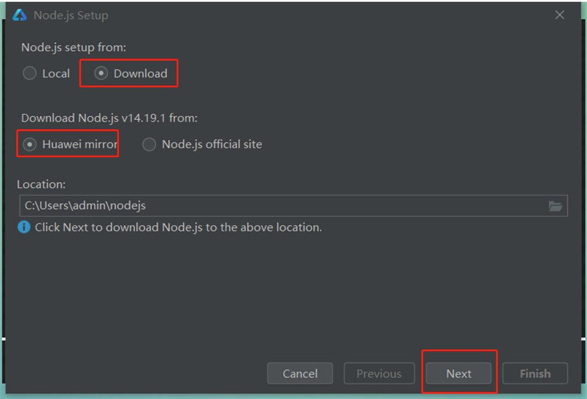
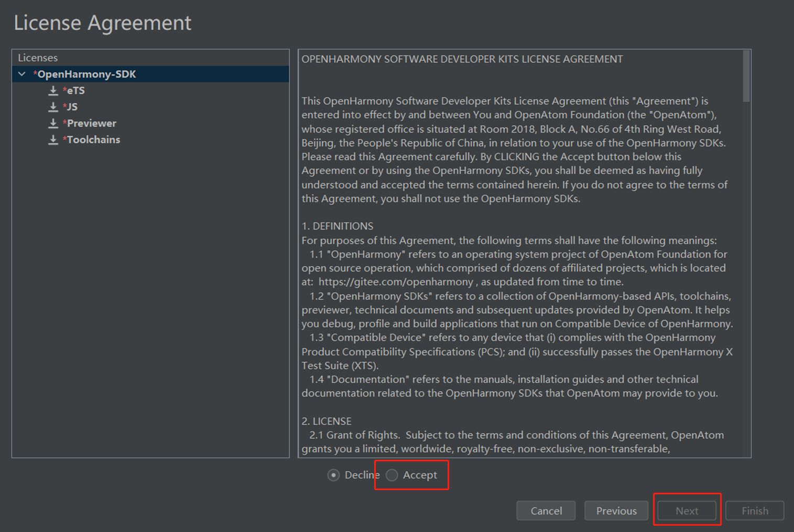
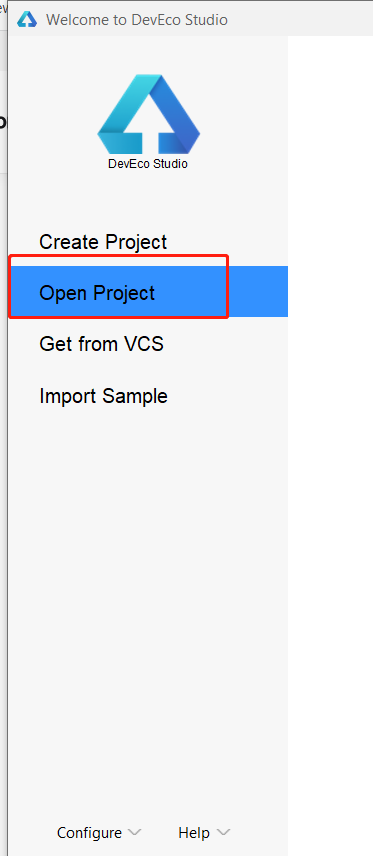

# 发布到 OpenHarmony 应用

自 Cocos Creator v2.4.12 起，支持发布到 **OpenHarmony** 平台。

OpenHarmony 系统与 SDK 下载传送门：[OpenHarmony-3.2-release](https://gitee.com/openharmony/docs/blob/master/zh-cn/release-notes/OpenHarmony-v3.2-release.md#%E4%BB%8E%E9%95%9C%E5%83%8F%E7%AB%99%E7%82%B9%E8%8E%B7%E5%8F%96)

## 安装 DevEco Studio

1. 下载最新的 IDE（版本>=3.1.1）：[DevEco Studio](https://developer.harmonyos.com/cn/develop/deveco-studio#download)

2. 解压目录，双击进行安装，点击 next，如下步骤：

3. 启动DevEco Studio，如下图

4. 首次会提示设置源，默认应该就可以，如下图:

5. 首次安装需要安装 Node.js，如果之前安装有 Node.js，选择本地的 Node.js 即可，但是有版本要求，Node.js 的版本必须大于 v14.19.1 和小于 v15.0.0。npm 的版本要求大于 6.14.16 和小于 7.0.0。如下图

6. 这里选择下载新的 Node.js 为例，如下图:

7. 接下来会提示安装 SDK，点击下一步，注意是 OpenHarmonySDK，如下图

8. 选择 Accept 之后，选择 Next，等待下载完成，之后点击 Finish 即可，如下图：

## 环境配置

- 在编辑器菜单栏的 **原生开发环境** 中设置 **OpenHarmony SDK** 路径。

  > Mac：Cocos Creator -> 偏好设置 -> 原生开发环境 
  > Windows：文件 -> 设置 -> 原生开发环境

  

## 发布流程

1. 在 **构建发布** 面板的 **发布平台** 中选择 **OpenHarmony**，然后点击 **构建**。

2. 使用 DevEcoStudio，打开工程，如下图

3. 配置签名，如下图：

4. 插入设备，点击运行，如下图：

5.执行成功之后，在设备上查看效果。

## 几个注意事项

目前 Cocos Creator 支持在 OpenHarmony 64位 系统运行，暂时不支持 32 位且系统暂不支持 JIT。

另外，因为 OpenHarmony 还在不断完善当中，因此有些已知问题。这些问题都会在后续的版本解决。

目前已知问题是：
   - restart 目前还未有方案；
   - editbox 显示时，会把这个游戏页面往上推
   - RK3568 不支持陀螺仪，线性加速度
   - 部分测试例，背景会显示桌面，驱动问题，非系统和引擎问题
   - 编译失败时，可能是内存不足导致，退出部分应用，重新 build 试试；
   - App Launch 提示错误信息，在 targets 中，添加对应的运行环境： 解决方法，如下图：
   - 更新 IDE，编译报错,如下图： 把 Harmonyos 与 OpenHarmony 的 SDK 更新到最新
