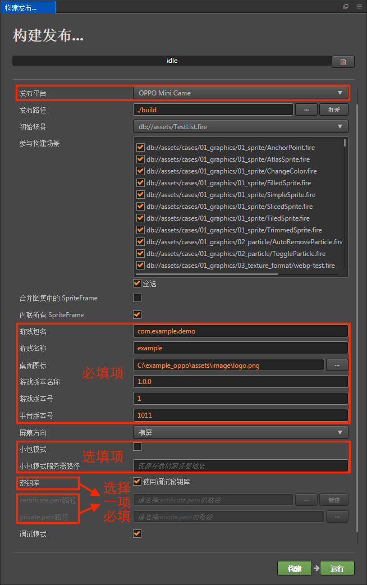
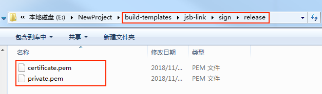
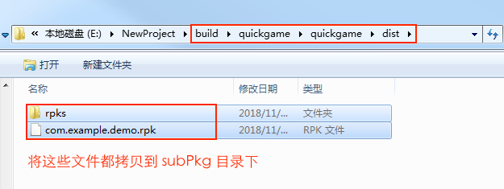

# 发布到 OPPO 小游戏平台

从 v2.0.5 版本开始，Cocos Creator 正式支持将游戏发布到 OPPO 小游戏平台。我们来看一下如何使用 Cocos Creator 一键发布到 OPPO 小游戏平台。

## 环境配置

- 下载 [快游戏调试器](http://cdofs.oppomobile.com/cdo-activity/static/quickgame/tools//bbce19cecbf7c26c396762d61192a11e.zip)，并安装到 Android 设备上（建议 Android Phone 6.0 或以上版本）

- 全局安装 [nodejs-8.1.4](https://nodejs.org/zh-cn/download/) 或以上版本

- 下载 [quickgame-toolkit](http://cdofs.oppomobile.com/cdo-activity/static/quickgame/tools//0974ab43dc361f148189515ee254ff6d.zip)，并解压。

  如果想要减少第一次使用 Cocos Creator 构建 rpk 的等待时间，可以执行以下操作先安装项目依赖：

  ```bash
   # 命令行指定到解压后的 quickgame-toolkit 目录下
   cd quickgame-toolkit
   # 安装项目的依赖
   npm install
  ```

- 根据用户自己的开发需求判断是否需要安装 [调试工具](http://cdofs.oppomobile.com/cdo-activity/static/quickgame/tools//6de9d1c3f06030ae7c52f5105f60383f.zip)。

## 发布流程

一、使用 Cocos Creator 打开需要发布的项目工程，在 **构建发布** 面板的 **发布平台** 中选择 **OPPO Mini Game**。



其中 **游戏包名**、**游戏名称**、**桌面图标**、**游戏版本名称**、**游戏版本号**、**平台版本号**、**本地 npm 安装路径**、**本地 quickgame-toolkit 路径** 这些参数为必填项，根据用户的需求及参数输入框的提示信息进行填写。而 **小包模式**、**小包模式服务器路径**、**构建发布程序包** 为选填项。相关参数配置具体的填写规则如下：

- **应用图标**

  **应用图标** 为必填项。构建时，应用图标将会构建到 OPPO 快游戏的工程中，请确保填写的应用图标路径下的图片真实存在。如：填写的应用图标路径为 /assets/image/logo.png，则在 Creator **资源管理器** 的 **Assets** 目录下需要存在 image 目录和 logo.png。
  
- **本地 npm 安装路径**

  **本地 npm 安装路径** 是必填项。填写 npm 安装路径的目的是提供构建 rpk 的环境。如果不填写该项，则 Creator 只会导出小游戏工程目录，不会生成 rpk 包。

    - Mac 系统

    ```bash
    # 获取本地 npm 安装路径
    which npm
    # 如果输出结果为
    /Users/yourname/.nvm/versions/node/v8.1.4/bin/npm
    # 则本地 npm 安装路径填写为：
    /Users/yourname/.nvm/versions/node/v8.1.4/bin
    ```

    - Windows 系统

    ```bash
    # 获取本地 npm 安装路径
    where npm
    # 如果输出结果为
    C:\Program Files\nodejs\npm
    # 则本地 npm 安装路径填写为
    C:\Program Files\nodejs
    ```

- **本地 quickgame-toolkit 路径**

  **本地 quickgame-toolkit 路径** 为必填项，填写该项的目的是调用 quickgame-toolkit 提供的命令去构建 rpk，将 rpk 生成在 build/quickgame/dist/ 目录下。

  **请注意**：

  1、填写的 **本地 quickgame-toolkit 路径** 为 **解压后** 的 quickgame-toolkit 文件路径。
  
  2、需要将解压后的 **quickgame-toolkit\lib\bin** 目录配置到系统环境变量中，否则可能导致 rpk 包构建失败。然后在命令行中执行 `quickgame-toolkit -V`，若正确输出版本号则表示配置成功，若未正确输出版本号请重启电脑后重试。

- **小包模式和小包模式服务器路径**

  该项为选填项。小游戏的包内体积包含代码和资源不能超过 4M，资源可以通过网络请求加载。**小包模式** 就是帮助用户将脚本文件保留在小游戏包内，其他资源则上传到远程服务器，根据需要从远程服务器下载。而远程资源的下载、缓存和版本管理，Creator 已经帮用户做好了。用户需要做的是以下两个步骤：

  1、构建时，勾选 **小包模式**，填写 **小包模式服务器路径**。然后点击 **构建**。

  2、构建完成后，点击 **发布路径** 后面的 **打开** 按钮，将发布路径下的 **jsb-link/res** 目录上传到小包模式服务器。例如：默认发布路径是 build，则需要上传 build/jsb-link/res 目录。

  此时，构建出来的 quickgame 目录下将不再包含 res 目录，res 目录里的资源将通过网络请求从填写的 **小包模式服务器地址** 上下载。

- **构建发布程序包**

  **构建发布程序包** 是选填项。勾选该项的目的是构建出可以直接发布的 rpk 包。但有三个前提是需要填写 **本地 npm 安装路径**、**本地 quickgame-toolkit 路径** 以及 **添加 release 签名**。<br>
  如果不勾选 **构建发布程序包**，则构建出的是用于测试的 rpk 包。

    - 添加 release 签名：

      在小游戏工程根目录中，添加 **build-templates/jsb-link/sign/release** 目录，然后在release 目录下放置你的私钥文件 **private.pem** 和证书文件 **certificate.pem**。如下图所示：

        

    - 如何生成 release 签名

      用户需要通过 openssl 命令等工具生成签名文件 private.pem、certificate.pem。

    ```bash
    # 命令行指定到刚才添加到小游戏根目录的 release 目录下
    cd E:\workspace\YourProject\build-templates\jsb-link\sign\release
    # 通过 openssl 命令工具生成签名文件
    openssl req -newkey rsa:2048 -nodes -keyout private.pem -x509 -days 3650 -out certificate.pem
    ```

  **注意**：openssl 工具在 linux 或 Mac 环境下可在终端直接打开，而在 Windows 环境下则需要安装 openssl 工具并且配置系统环境变量。

二、**构建发布** 面板的相关参数设置完成后，点击 **构建**。构建完成后点击 **发布路径** 后面的 **打开** 按钮来打开构建发布包，可以看到在默认发布路径 build 目录下生成了 **quickgame** 目录，该目录就是导出的 OPPO 小游戏工程目录和 rpk，rpk 包在 /build/quickgame/dist 目录下。


三、将构建出来的 rpk 运行到手机上。

将构建生成的小游戏 rpk 文件（位于小游戏工程 quickgame 目录下的 dist 目录中）拷贝到手机 SD 卡的/sdcard/games/目录。然后在 Android 设备上打开之前已经安装完成的 **快游戏调试器**，点击 **快游戏** 栏目，然后找到填写游戏名相对应的图标即可，如没有发现，可点击右上角的更多按钮-刷新按钮进行刷新。

四、分包 rpk

分包加载，即把游戏内容按一定规则拆分成几个包，在首次启动的时候只下载必要的包，这个必要的包称为 **主包**，开发者可以在主包内触发下载其他子包，这样可以有效降低首次启动的消耗时间。若要使用该功能需要在 Creator 中设置 [分包配置](../scripting/subpackage.md)，设置完成后构建时就会自动分包。

构建完成后，分包的目录在 /build/quickgame/quickgame/dist 目录下。<br>
这时需要在 Android 设备的 **sdcard** 目录下，新建一个 **subPkg** 目录，然后把 /build/quickgame/quickgame/dist 目录下的 **.rpk** 文件拷贝到 subPkg 目录中。


  
然后切换到 **快应用** 的 **分包加载** 栏目，点击右上方的刷新即可看到分包的游戏名称，点击 **秒开** 即可跟正常打包的 rpk 一样使用。


## 相关参考链接

- [OPPO 快游戏教程](https://cdofs.oppomobile.com/cdo-activity/static/201810/26/quickgame/documentation/games/quickgame.html)
- [OPPO 快游戏 API 文档](https://cdofs.oppomobile.com/cdo-activity/static/201810/26/quickgame/documentation/feature/account.html)
- [OPPO 快游戏工具下载](https://cdofs.oppomobile.com/cdo-activity/static/201810/26/quickgame/documentation/games/use.html)
