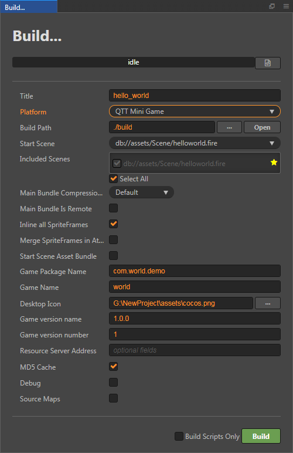
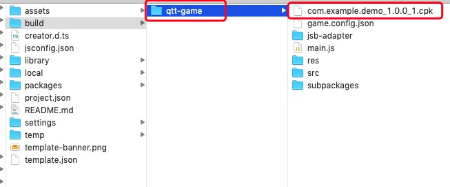
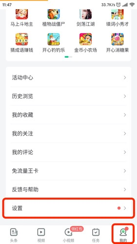
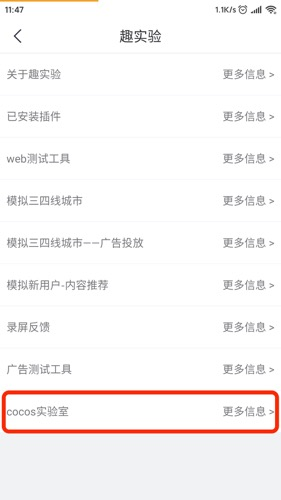
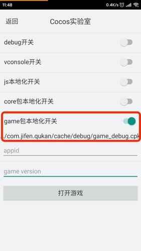

# 发布到趣头条小游戏

Cocos Creator 从 v2.3.0 开始支持将游戏发布到 **趣头条小游戏**。

## 环境配置

- 下载 [趣头条 APP](https://game.qutoutiao.net/doc/index.html#/doc/debug_in_app) 并安装到 Android 设备（建议 Android Phone 6.0 或以上版本）。

## 发布流程

使用 Cocos Creator 打开需要发布的项目工程，从 **菜单栏 -> 项目** 中打开 **构建发布** 面板，**发布平台** 选择 **趣头条小游戏**。

### 参数项配置

相关参数配置具体的填写规则如下：

- **主包压缩类型**

  设置主包的压缩类型，具体内容可参考文档 [Asset Bundle — 压缩类型](../asset-manager/bundle.md#%E5%8E%8B%E7%BC%A9%E7%B1%BB%E5%9E%8B)。

- **配置主包为远程包**

  该项为可选项，需要与 **资源服务器地址** 选项配合使用。 
  勾选后，主包会配置为远程包，并且与其相关依赖资源一起被构建到发布包目录 remote 下的内置 Asset Bundle — [main](../asset-manager/bundle.md#%E5%86%85%E7%BD%AE-asset-bundle) 中。开发者需要将整个 remote 文件夹上传到远程服务器。

- **初始场景分包**

  该项为可选项。 
  勾选后，首场景及其相关的依赖资源会被构建到发布包目录 assets 下的内置 Asset Bundle — [start-scene](../asset-manager/bundle.md#%E5%86%85%E7%BD%AE-asset-bundle) 中，提高初始场景的资源加载速度。具体内容可参考文档 [初始场景的资源加载](publish-wechatgame.md#%E5%88%9D%E5%A7%8B%E5%9C%BA%E6%99%AF%E7%9A%84%E5%8A%A0%E8%BD%BD%E9%80%9F%E5%BA%A6)。

- **游戏包名**

  该项为必填项，根据用户的需求进行填写。

- **游戏名称**

  该项为必填项，是趣头条小游戏的名称。而 **构建发布** 面板最上方的 **游戏名称** 则不参与趣头条小游戏打包流程。

- **桌面图标**

  **桌面图标** 为必填项。点击输入框后面的 **...** 按钮选择所需的图标。构建时，图标将会被构建到趣头条小游戏的 cpk 中。桌面图标建议使用 **png** 图片。

- **游戏版本名称**

  该项为必填项。**游戏版本名称** 是真实的版本，如：1.0.0

- **游戏版本号**

  该项为必填项。**游戏版本号** 与 **游戏版本名称** 不同，**游戏版本号** 主要用于区别版本更新。每次提交审核时游戏版本号都要比上次提交审核的值至少 +1，一定不能等于或者小于上次提交审核的值，建议每次提交审核时游戏版本号递归 +1。**注意**：**游戏版本号** 必须为正整数。

- **资源服务器地址**

  该项为选填项，用于填写资源存放在服务器上的地址。

  - 若 **不填写** 该项，则发布包目录下的 `build/qtt-game/remote` 文件夹将会被打包到构建出来的 cpk 包中。
  - 若 **填写** 该项，则 remote 文件夹不会被打包到 cpk 包中。开发者需要在构建后手动将 remote 文件夹上传到所填写的资源服务器地址上。

  具体的资源管理细节，请参考文档下方的资源管理部分。

### 构建

**构建发布** 面板的相关参数设置完成后，点击 **构建**。构建完成后点击 **发布路径** 后面的 **打开** 按钮来打开构建发布包，可以看到在默认发布路径 build 目录下生成了 **qtt-game** 目录。该目录就是导出的趣头条小游戏工程目录和 cpk，cpk 包在 `build/qtt-game` 目录下。

### 将构建出来的 cpk 运行到手机上

- 在 Android 设备上打开之前已经安装完成的趣头条 APP，点击底部导航栏右侧的 **我的**。然后下拉页面到最底部，点击进入 **设置** 页面。

  

- 在 **设置** 页导航栏的 **右侧空白区域** 连续点击 **6** 次，进入 **趣实验** 页面。

  

- 在 **趣实验** 页面找到 **Cocos 实验室**，点击进入。

  

- 在 **Cocos 实验室** 页面中打开 **game 包本地化开关**，可以看到在其下方显示了一个文件路径。然后将构建生成的 cpk 包重命名为 `game_debug.cpk`，并放置到 Android 设备该文件路径下。**debug 开关** 和 **vconsole 开关** 可根据需要选择是否打开。

  

- 填写申请好的 **appid** 和 **game 版本号**

  **appid** 是申请到的游戏 ID，在调试环境下允许任意填写。 
  **game 版本号** 是游戏包的版本特征值，正常是由平台生成的。这里作为调试使用，通常是由字母和数字组成的任意字符串。**注意**：每更换一次包就要重新输入一个新的值。

- 设置完成后，点击下方的 **打开游戏** 按钮即可。注意：如果要再次 **打开游戏**，则需要重新把 cpk 包放置到上述所述目录下。

## 趣头条小游戏环境的资源管理

趣头条小游戏与微信小游戏类似，都存在着包体限制。不过趣头条的主包包体限制是 **4MB**，超过的部分必须通过网络请求下载。

Cocos Creator 已经帮开发者做好了远程资源的下载、缓存和版本管理。具体的实现逻辑和操作步骤都与微信小游戏类似，请参考 [微信小游戏的资源管理](./publish-wechatgame.md#%E5%BE%AE%E4%BF%A1%E5%B0%8F%E6%B8%B8%E6%88%8F%E7%9A%84%E8%B5%84%E6%BA%90%E7%AE%A1%E7%90%86)。

## 相关参考链接

- [趣头条游戏中心官网](http://game.qutoutiao.net/official/home/prod/index.html)
- [趣头条小游戏官方文档](https://game.qutoutiao.net/doc/index.html#/)
- [趣头条小游戏调试文档](https://game.qutoutiao.net/doc/index.html#/doc/debug_in_app)
- [趣头条小游戏 API 文档](https://game.qutoutiao.net/doc/index.html#/doc/sdk)
