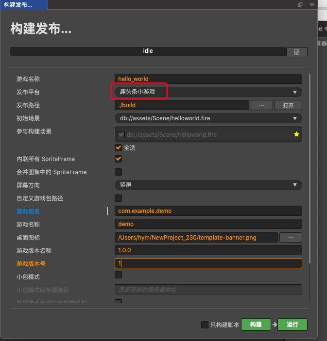
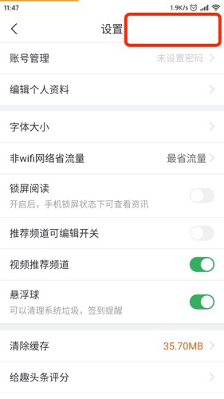

# 发布到 趣头条小游戏

> 从 v2.3.0 开始，Cocos Creator 开始支持 **趣头条小游戏** 平台。

## 环境配置

- 下载 [趣头条 APP](https://static-oss.qutoutiao.net/game/cocos/apk/qutoutiao_game_lab_version.apk) 并安装到 Android 设备（建议 Android Phone 6.0 或以上版本）。

## 发布流程

一、使用 Cocos Creator 打开需要发布的项目工程，在 **构建发布** 面板的 **发布平台** 中选择 **趣头条小游戏**。

相关参数配置具体的填写规则如下：

- **游戏包名**

  该项为必填项，根据用户的需求进行填写。

- **游戏名称**

  该项为必填项。是趣头条小游戏的名称。而 **构建发布** 面板最上方的 **游戏名称** 则不参与 趣头条小游戏打包流程。

- **桌面图标**

  **桌面图标** 为必填项。点击输入框后面的 **...** 按钮选择所需的图标。构建时，图标将会被构建到趣头条小游戏的 cpk 中。桌面图标建议使用 **png** 图片。

- **游戏版本名称**

  该项为必填项。**游戏版本名称** 是真实的版本，如：1.0.0

- **游戏版本号**

  该项为必填项。**游戏版本号** 与 **游戏版本名称** 不同，**游戏版本号** 主要用于区别版本更新。每次提交审核时游戏版本号都要比上次提交审核的值至少 +1，一定不能等于或者小于上次提交审核的值，建议每次提交审核时游戏版本号递归 +1。**注意**：**游戏版本号** 必须为正整数。 

- **小包模式**

  该项为选填项。小游戏的包内体积包含代码和资源不能超过 10M，资源可以通过网络请求加载。**小包模式** 就是帮助用户将脚本文件保留在小游戏包内，其他资源则上传到远程服务器，根据需要从远程服务器下载。而远程资源的下载、缓存和版本管理，Creator 已经帮用户做好了。用户需要做的是以下几个步骤：

  1. 构建之前，勾选 **小包模式**，填写 **小包模式服务器路径**。

  2. **首屏游戏资源打包到游戏包**。
  
      在小包模式下，由于首屏资源过多，下载和加载资源时间比较久，可能会导致首次进入游戏时出现短暂黑屏。如果在构建时勾选了 **首屏游戏资源打包到游戏包**，可以缩短首次进入游戏黑屏的时间。不过需要注意的是：res/import 资源暂不支持分割资源下载，整个 import 目录也会打包到首包。
  
      开发者可以根据自己的需要选择是否勾选该项。然后点击 **构建**。

  3. 构建完成后，点击 **发布路径** 后面的 **打开** 按钮，将发布路径下的 **qtt-game/res** 目录上传到小包模式服务器。例如：默认发布路径是 build，则需要上传 build/qtt-game/res 目录。
  此时，构建出来的 cpk 将不再包含 res 目录，res 目录里的资源将通过网络请求从填写的 **小包模式服务器地址** 上下载。

二、**构建**

**构建发布** 面板的相关参数设置完成后，点击 **构建**。构建完成后点击 **发布路径** 后面的 **打开** 按钮来打开构建发布包，可以看到在默认发布路径 build 目录下生成了 **qtt-game** 目录，该目录就是导出的 qtt-game 工程目录和 cpk。cpk 包在 **/build/qtt-game** 目录下

三、**将打包出来的 cpk 运行到手机上**。

- 打开之前已经安装完成趣头条APP，在底部导航栏点击**我的**，下拉到最底部**设置**,点击进入**设置页面**

- 在设置页标题 **右侧空白区域** 连续点击10次，进入**趣实验**

- 在**趣实验页面**找到 **cocos实验室**点击进入,可以看到cocos实验室的界面

- 在 cocos 实验的界面,打开 game 包本地化开关, cpk 包放置到 /sdcard/Android/data/com.jifen.kan/cache/debug/game_debug.cpk 。根据需要打开 debug 开关和 vconsole 开关。

- 填写申请好的 appid 和 game version
  appid 是申请到的游戏 id, game version 是游戏包的版本特征值，正常是由平台生成的，此处作为调试用，任意一串字母数字组成的字符串即可，但是要保证每更换一次包要重新输入一个新的值。

- 准备完成后,点击**打开游戏**即可.注：每次打开游戏后，再次点击**打开游戏**按钮，需要重新把 cpk 放置到上述所述目录下。

## 相关参考链接

-  [趣头条小游戏调试](https://game.qutoutiao.net/doc/index.html#/doc/debug_in_app)
-  [趣头条小游戏文档](https://game.qutoutiao.net/doc/index.html#/)
-  [API文档](https://newidea4-gamecenter-frontend.1sapp.com/sdk/docs/#/sdk/README)
