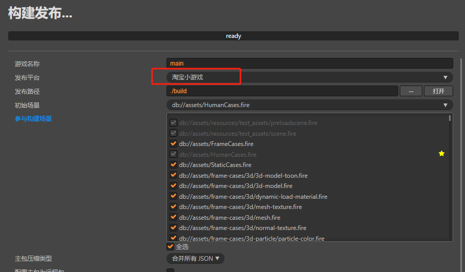
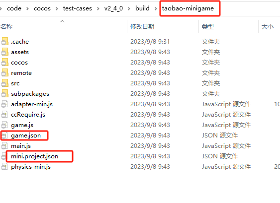
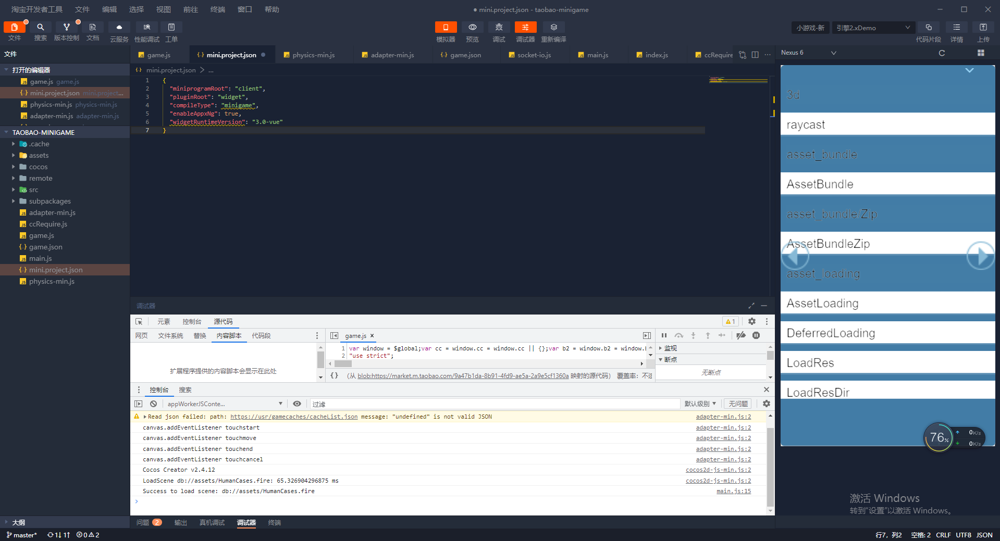

# 发布到淘宝小游戏

Cocos Creator 从 v2.4.12 开始支持将游戏发布到 **淘宝小游戏**。

## 准备工作

- 参考 [淘宝小游戏接入指南](https://open.taobao.com/v2/doc#/abilityToOpen?docType=1&docId=121007&treeId=804)，在淘宝开放平台完成开发者入驻流程和应用创建。

- 桌面端下载 [淘宝开发者工具](https://developer.taobao.com/?spm=a219a.15212435.0.0.11ef669aIQNlnI) 并安装。

- 下载 [淘宝](https://market.m.taobao.com/app/fdilab/download-page/main/index.html)，并安装到手机设备上。

- 淘宝客户端在 Android 上支持的最低版本为 10.22.30，在 iOS 为 10.22.30。

## 发布流程

使用 Cocos Creator 打开需要发布的项目工程，从 **菜单栏 -> 项目** 中打开 **构建发布** 面板，**发布平台** 选择 **淘宝小游戏**，然后点击 **构建**。

### 参数项配置

相关参数配置具体的填写规则如下：

- **主包压缩类型**

  设置主包的压缩类型，具体内容可参考文档 [Asset Bundle — 压缩类型](../asset-manager/bundle.md#%E5%8E%8B%E7%BC%A9%E7%B1%BB%E5%9E%8B)。

- **配置主包为远程包**

  该项为可选项，需要与 **资源服务器地址** 选项配合使用。 
  勾选后，主包会配置为远程包，并且与其相关依赖资源一起被构建到发布包目录 remote 下的内置 Asset Bundle — [main](../asset-manager/bundle.md#%E5%86%85%E7%BD%AE-asset-bundle) 中。开发者需要将整个 remote 文件夹上传到远程服务器。

- **初始场景分包**

  该项为可选项。 
  勾选后，首场景及其相关的依赖资源会被构建到发布包目录 assets 下的内置 Asset Bundle — [start-scene](../asset-manager/bundle.md#%E5%86%85%E7%BD%AE-asset-bundle) 中，提高初始场景的资源加载速度。具体内容可参考文档 [初始场景的资源加载](publish-wechatgame.md#%E5%88%9D%E5%A7%8B%E5%9C%BA%E6%99%AF%E7%9A%84%E5%8A%A0%E8%BD%BD%E9%80%9F%E5%BA%A6)。

- **资源服务器地址**

  该项为选填项，用于填写资源存放在远程服务器上的地址。开发者需要在构建后手动将发布包目录下的 remote 文件夹上传到所填写的资源服务器地址上。

### 运行预览

- 构建完成后点击 **发布路径** 后面的 **打开** 按钮，可以看到在发布包 build 目录下生成了淘宝小游戏工程文件夹 **taobao-minigame**，其中已经包含了淘宝小游戏环境的配置文件：`game.json` 和 `mini.project.json`。

  

- 使用 **淘宝开发者工具** 打开构建生成的 **taobao-minigame** 文件夹，即可打开淘宝小游戏项目及预览调试游戏内容。开发者工具的具体使用方式请参考 [淘宝开发者工具介绍](https://miniapp.open.taobao.com/doc.htm?docId=119188&docType=1&tag=dev)。

  

## 淘宝小游戏的资源管理

淘宝小游戏与微信小游戏类似，都存在着包体限制，超过 2MB 的额外资源，必须通过网络请求下载。在包体优化方面，建议剔除掉没使用到的引擎模块。

Cocos Creator 已经帮开发者做好了远程资源的下载、缓存和版本管理。具体的实现逻辑和操作步骤都与微信小游戏类似，请参考 [微信小游戏资源管理](./publish-wechatgame.md#%E5%BE%AE%E4%BF%A1%E5%B0%8F%E6%B8%B8%E6%88%8F%E7%9A%84%E8%B5%84%E6%BA%90%E7%AE%A1%E7%90%86)。

## 淘宝小游戏的限制

淘宝小游戏暂时不支持以下功能模块：

- VideoPlayer
- WebView
- 自定义字体

## 淘宝与其他小游戏平台的差异

- 全局变量的访问，需要挂载到 global 变量上 
- 'global-variables.js' 说明: window 变量是 global 的引用，需要先确保 global上变量已经存在，定义的临时变量才会有值。若使用自定义脚本或使用第三方插件，发现全局变量不存在，通常是加载时机问题导致脚本还没被加载，就使用到了脚本内的全局变量。
- 淘宝的 js 引擎是自研的，不是基于 v8 开发；draw call 的次数可能会影响到帧率，开发过程应该尽量减少 draw call 的次数。
- 淘宝 IDE, 模拟器和真机的 JS 环境是不一致的；若是真机无问题，直接把问题反馈给淘宝平台
- 真机调试和预览方式帧率会有比较大的差异；真机可以断点帧率比较低，在测试的时候应该以预览的方式验证帧率

## 参考链接

- [淘宝开放平台开发指南](https://miniapp.open.taobao.com/docV3.htm?docId=119114&docType=1&tag=dev)
- [淘宝开发者入驻文档](https://miniapp.open.taobao.com/doc.htm?spm=a219a.15212435.0.0.4f44669ay8X5vm&docId=119111&docType=1&)
- [淘宝小游戏介绍](https://open.taobao.com/v2/doc#/abilityToOpen?docType=1&docId=121009&treeId=804)
- [淘宝小游戏 API 文档](https://open.taobao.com/v2/doc#/abilityToOpen?docType=1&docId=121112&treeId=805)
- [淘宝开发者工具下载](https://developer.taobao.com/?spm=a219a.15212435.0.0.7892669alqxNjY)
- [淘宝开发者工具介绍](https://miniapp.open.taobao.com/doc.htm?docId=119189&docType=1&tag=dev)
- [淘宝开发者工具真机调试](https://miniapp.open.taobao.com/doc.htm?docId=119194&docType=1&tag=dev)
