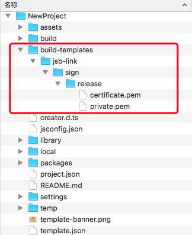
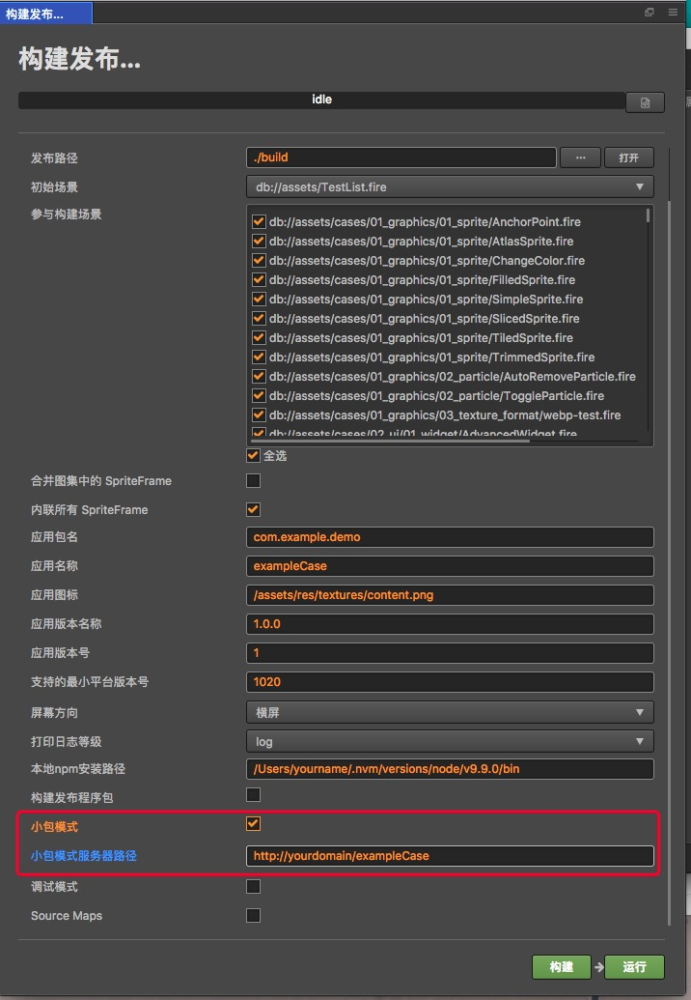
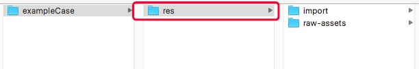

# 发布到vivo快游戏平台
## 使用 Cocos Creator 发布包
我们从 Cocos Creator v2.0.5 开始，支持 Cocos Creator 游戏一键发布为vivo游戏，下面是详细的发布步骤：
1.在[vivo快游戏教程下载与更新](https://jerrymoon.github.io/kuai-you-xi-jiao-cheng/xia-zai-yu-geng-xin.html)，下载快游戏调试器和快游戏引擎，并安装到android手机上（系统尽可能6.0以上）；根据开发需求安装chrome调试快游戏引擎版本。
2.vivo快游戏环境需要在电脑全局安装qgame-toolkit，本地需要提前实现安装[nodejs-8.1.4或以上版本](https://nodejs.org/zh-cn/download/)
安装nodejs后，这里需要注意npm源地址为：

```
https://registry.npmjs.org/
```
查看当前npm源地址为：

```
npm config get registry
```
如不是，请设置npm源地址为：

```
npm config set registry https://registry.npmjs.org/
```

确定npm源地址后，安装qgame-toolkit命令为：

```
npm install -g qgame-toolkit
```

3.打开cocos creator的构建面板

发布平台选择vivo 快游戏，填写应用包名、应用名称、应用图标、应用版本名称、应用版本号、支持的最小引擎平台版本号（根据[vivo文档](https://jerrymoon.github.io/kuai-you-xi-jiao-cheng/idejie-ru-shuo-ming/cocos-creatorjie-ru-shuo-ming.html)修改，当前是填写1020），这些信息为必填项。 构建完成后，点击发布路径后的"打开"按钮，发布路径下的qgame目录就是导出快游戏工程目录，如：默认发布路径是build，快游戏工程目录则为build/qgame。
如下图是新建的examplecollection(范例集合)可选项和必填项
  

* 应用图标
  构建时，应用图标将会导出到快游戏的工程里，请确保填写的应用图标路径下的图片真实存在。如：填写的应用图标路径为/assets/image/logo.png，则在creator的资源管理器assets目录下需要存在image目录和logo.png图片。
  
* 本地npm安装路径
  本地npm安装路径是非必填项。填写的npm安装路径的目的是在creator构建导出可运行的快游戏rpk包，rpk包位于快游戏工程qgame下的dist目录里。如果不填写，则creator只会导出快游戏工程目录。

 * 获取本地的npm的安装路径的命令：

   ```
    which npm
   ```
    在mac系统下，如果输出结果：
    
   ```
    /Users/yourname/.nvm/versions/node/v8.1.4/bin/npm
    ```
    则本地npm安装路径需要填写为：
    
   ```
    /Users/yourname/.nvm/versions/node/v8.1.4/bin
    ```
    在windows系统下，如果输出结果：
    
    ```
    c:\Program Files\nodejs\npm
    ```
    则本地npm安装路径需要填写为
    
    ```
    c:\Program Files\nodejs
    ```  
* 构建发布程序包
   勾选构建发布程序包表示在creator导出可以直接发布的rpk包，但前提是需要填写本地npm安装路径和在  creator中添加release签名。如果不勾选，则构建出用于测试的rpk包。
    * 添加release签名方式：
    在快游戏工程根目录中，添加build-templates/jsb-link目录，并在该目录中放置sign目录，在sign目录中放置release目录，在release目录中放置你的私钥文件private.pem和证书文件certificate.pem。 最终的目录结构如：build-templates/jsb-link/sign/release/certificate.pem，如下图：
    
     
     
    * 如何生成release签名
      开发者需要自己添加证书，其中debug下面的证书只供调试使用，开发者需要通过openssl命令等工具生成签名文件private.pem、certificate.pem。注意：openssl工具在linux或MAC下终端直接打开，windows下需要安装openssl工具并且配置系统环境变量。
      例如：
      
     ```
     openssl req -newkey rsa:2048 -nodes -keyout private.pem -x509 -days 3650 -out certificate.pem
      ```
     
* 小包模式
   快游戏的包内体积不能超过 4M，包含代码和资源，资源可以通过网络请求加载。 这里的小包模式就是帮助开发者将脚本文件保留在快游戏包内，其他资源都从远程服务器按需下载。开发者需要做下面2个步骤：
   * 构建时，勾选小包模式功能，填写小包模式服务器路径。示例如下图：

   * 构建完成后，点击发布路径后的"打开"按钮，将发布路径下的 jsb-link/res 目录上传到小包模式服务器路径。 例如：默认发布路径是 build，则需要上传 build/jsb-link/res 目录。
    
   上传到服务器的目录如下图： 
   
   
   此时，构建生产的 qgame 将不再包含 res 目录，res 目录里的资源将通过网络请求从填写的小包模式服务器地址上下载。
   
4.将打包出来的rpk运行到手机上，有两种方式：

   方法一：
     1. 在手机上打开在上述安装好的快游戏调试器
     2. 点击“扫码安装按钮”
       
     3. 利用vivo快游戏打包工具命令
        先把命令行切换/build/qgame目录下，如 快游戏工程在E:\workspace\NewProject
       
    ```
     cd E:\workspace\NewProject\build\qgame\
    ```
    
  然后执行
 
``` 
npm run server
```  
  执行完成后，生成网址和二维码，拷贝生成的网址到浏览器，扫描网页的二维码即可打开rpk。
    
  方法二：
       1.将编译好的快游戏rpk文件拷入手机SD卡中
       2.点击桌面“快应用调试器”
       3.点击“本地安装”
       
       4.从手机SD中找到rpk文件，选择打开即可
       
   
## 参考链接

- [vivo快游戏教程](https://jerrymoon.github.io/kuai-you-xi-api-wen-dang/quan-ju-shi-jian/sheng-ming-zhou-qi.html)
- [vivo快游戏 API 文档](https://jerrymoon.github.io/kuai-you-xi-api-wen-dang/quan-ju-shi-jian/sheng-ming-zhou-qi.html)
- [vivo快游戏工具下载](https://jerrymoon.github.io/kuai-you-xi-jiao-cheng/xia-zai-yu-geng-xin.html)

