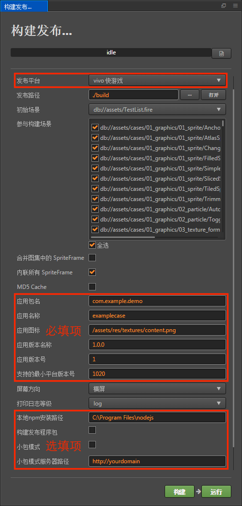
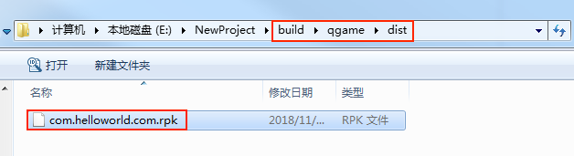
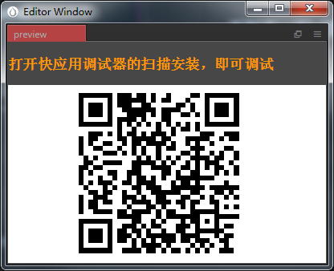
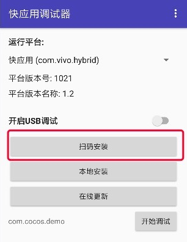
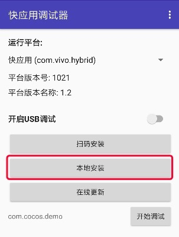

# 发布到 vivo 小游戏

## 环境配置

- 下载 [快应用 & vivo 小游戏调试器](https://minigame.vivo.com.cn/documents/#/lesson/base/environment?id=%E5%AE%89%E8%A3%85vivo%E5%B0%8F%E6%B8%B8%E6%88%8F%E8%B0%83%E8%AF%95%E5%99%A8) 和 [vivo 小游戏引擎](https://minigame.vivo.com.cn/documents/#/lesson/base/environment?id=%E5%AE%89%E8%A3%85vivo%E5%B0%8F%E6%B8%B8%E6%88%8F%E5%BC%95%E6%93%8E)，并安装到 Android 设备上（建议 Android Phone 6.0 或以上版本）

- 全局安装 [nodejs-8.9.0](https://nodejs.org/zh-cn/download/) 或以上版本

    **注意**：安装 nodejs 后，需要注意 npm 源地址是否为 <https://registry.npmjs.org/>

    ```bash
    # 查看当前 npm 源地址
    npm config get registry
    # 若不是，重新设置 npm 源地址
    npm config set registry https://registry.npmjs.org/
    ```

- 全局安装 qgame-toolkit。确定 npm 源地址后，安装 `qgame-toolkit`：

    ```bash
    npm install -g qgame-toolkit
    ```

    **注意**：从 **v2.1.3** 开始，无需安装 `qgame-toolkit`，但是需要安装 `vivo-minigame/cli`：

    ```
    npm install -g @vivo-minigame/cli
    ```

    若 `vivo-minigame/cli` 安装失败，可能是因为 nodejs 版本过低导致的，请检查 node 版本并升级。

## 发布流程

使用 Cocos Creator 打开需要发布的项目工程，从 **菜单栏 -> 项目** 中打开 **构建发布** 面板，**发布平台** 选择 **vivo 小游戏**。



### 参数项配置

相关参数配置具体的填写规则如下：

- **主包压缩类型**

  设置主包的压缩类型，具体内容可参考文档 [Asset Bundle — 压缩类型](../asset-manager/bundle.md#%E5%8E%8B%E7%BC%A9%E7%B1%BB%E5%9E%8B)。

- **配置主包为远程包**

  该项为可选项，需要与 **资源服务器地址** 选项配合使用。<br>
  勾选后，主包会配置为远程包，并且与其相关依赖资源一起被构建到发布包目录 remote 下的内置 Asset Bundle — [main](../asset-manager/bundle.md#%E5%86%85%E7%BD%AE-asset-bundle) 中。开发者需要将整个 remote 文件夹上传到远程服务器。

- **初始场景分包**

  该项为可选项。<br>
  勾选后，首场景及其相关的依赖资源会被构建到发布包目录 assets 下的内置 Asset Bundle — [start-scene](../asset-manager/bundle.md#%E5%86%85%E7%BD%AE-asset-bundle) 中，提高初始场景的资源加载速度。具体内容可参考文档 [初始场景的资源加载](publish-wechatgame.md#%E5%88%9D%E5%A7%8B%E5%9C%BA%E6%99%AF%E7%9A%84%E5%8A%A0%E8%BD%BD%E9%80%9F%E5%BA%A6)。

- **应用包名**

  该项为必填项，根据用户的需求进行填写。

- **应用名称**

  该项为必填项。是 vivo 小游戏的名称。而 **构建发布** 面板最上方的 **游戏名称** 则不参与 vivo 小游戏打包流程。

- **桌面图标**

  **桌面图标** 为必填项。点击输入框后面的 **...** 按钮选择所需的图标。构建时，图标将会被构建到 vivo 小游戏的工程中。**桌面图标** 建议使用 **.png** 图片。

- **应用版本名称**

  该项为必填项。**应用版本名称** 是真实的版本，如：1.0.0

- **应用版本号**

  该项为必填项。**应用版本号** 与 **应用版本名称** 不同，**应用版本号** 主要用于区别版本更新。每次提交审核时应用版本号都要比上次提交审核的值至少 +1，一定不能等于或者小于上次提交审核的值，建议每次提交审核时应用版本号递归 +1。**注意**：**应用版本号** 必须为正整数。

- **支持的最小平台版本号**

  该项为必填项。具体填写的值可通过点击 [更新记录](https://minigame.vivo.com.cn/documents/#/download/engine?id=%E6%9B%B4%E6%96%B0%E8%AE%B0%E5%BD%95%EF%BC%9A) 来查看最新的 vivo 引擎版本号。

- **资源服务器地址**

  该项为选填项，用于填写资源存放在服务器上的地址。

  - 若 **不填写** 该项，则发布包目录下的 `build/qgame/remote` 文件夹将会被打包到构建出来的 rpk 包中。

  - 若 **填写** 该项，则 remote 文件夹不会被打包到 rpk 包中。开发者需要在构建后手动将 remote 文件夹上传到所填写的资源服务器地址上。

  具体的资源管理细节，请参考文档下方的资源管理部分。

- **密钥库**

  勾选 **密钥库** 时，表示默认用的是 Creator 自带的证书构建 rpk 包，仅用于 **测试和调试** 时使用。<br>
  如果不勾选 **密钥库**，则需要配置签名文件 **certificate.pem 路径** 和 **private.pem 路径**，此时构建出的是可以 **直接发布** 的 rpk 包。用户可通过输入框右边的 **...** 按钮来配置两个签名文件。**注意**：这两个签名文件建议不要放在发布包 **build/qgame** 目录下，否则每次构建时都会清空该目录，导致文件丢失。

  有以下两种方式可以生成签名文件：

  - 通过 **构建发布** 面板 **certificate.pem 路径** 后的 **新建** 按钮生成。

  - 通过命令行生成 release 签名

    用户需要通过 openssl 命令等工具生成签名文件 `private.pem`、`certificate.pem`。其中在 `build/qgame/sign/debug` 目录下的证书仅供调试使用。

    ```bash
    # 通过 openssl 命令工具生成签名文件
    openssl req -newkey rsa:2048 -nodes -keyout private.pem -x509 -days 3650 -out certificate.pem
    ```

    **注意**：openssl 工具在 linux 或 Mac 环境下可在终端直接打开，而在 Windows 环境下则需要安装 openssl 工具并且配置系统环境变量。

- **允许分离引擎**（v2.3.4 新增）

  该项为选填项。vivo 从平台版本号 **1063** 开始新增了 **游戏引擎插件** 功能。此插件内置了 Cocos Creator 引擎的官方版本，若玩家首次体验的游戏中启用了此插件，则所有同样启用此插件的游戏，都无需再次下载 Cocos Creator 引擎，只需直接使用公共插件库中的相同版本引擎，或者增量更新引擎即可。

  使用时勾选 **允许分离引擎**，然后正常构建发布即可，无需其它人工操作。具体可参考 [微信小游戏引擎插件使用说明](./wechat-engine-plugin.md)。

- **自定义 npm 文件夹路径**

  该项为选填项，从 **v2.0.10** 开始可以自动获取到操作系统全局的 npm 路径，无需再手动设置。获取方法为：

  - Windows 系统：从系统获取环境变量中的路径
  - Mac 系统：从 Shell 的配置文件获取环境变量中的路径。

  如果获取不到，请确保 npm 已正常安装，并且能够在命令行环境下直接启动。获取到的 npm 将用于构建生成可运行的小游戏 rpk 包（rpk 包位于构建生成的小游戏工程 qgame 目录下的 dist 目录）。如果构建时找不到 npm 文件夹路径，则 Creator 只会导出小游戏工程目录，不会生成 rpk 包。

  **v2.0.10** 以下版本的填写规则如下：

  - 若不填写该项时，Creator 会默认在 Windows 系统上读取环境变量中的 npm 路径，在 Mac 系统上默认读取 **/usr/bin/local** 目录下的 npm 来构建导出可运行的小游戏 rpk 包。
  - 如果用户的电脑环境未安装 npm 或者读取不到系统中的 npm 路径时，则需要填写 **自定义 npm 文件夹路径** 来构建导出 rpk 包。填写规则如下：

    - Windows 系统

      ```bash
      # 获取本地 npm 安装路径
      where npm
      # 如果输出结果为：
      C:\Program Files\nodejs\npm
      # 则自定义 npm 文件夹路径填写为：
      C:\Program Files\nodejs
      ```

    - Mac 系统

      ```bash
      # 获取本地 npm 安装路径
      which npm
      # 如果输出结果为：
      /Users/yourname/.nvm/versions/node/v8.1.4/bin/npm
      # 则自定义 npm 文件夹路径填写为：
      /Users/yourname/.nvm/versions/node/v8.1.4/bin
      ```

### 构建

**构建发布** 面板的相关参数设置完成后，点击 **构建**。构建完成后点击 **发布路径** 后面的 **打开** 按钮来打开构建发布包，可以看到在默认发布路径 build 目录下生成了 **qgame** 目录，该目录就是导出的 vivo 小游戏工程目录，rpk 包则在 `qgame/dist` 目录下。



### 将打包出来的 rpk 运行到手机上

有以下三种方式可将 rpk 运行到手机上：

- **方法一**

    在 **构建发布** 面板点击 **运行** 按钮，等待二维码界面生成

    

    然后在 Android 设备上打开之前已经安装完成的 **快应用 & vivo 小游戏调试器**，点击 **扫码安装** 按钮直接扫描二维码即可打开 rpk。

    

- **方法二**

    将构建生成的小游戏 rpk 文件（位于小游戏工程 qgame 目录下的 dist 目录中）拷贝到手机内部存储目录下。

    在 Android 设备上打开之前已经安装完成的 **快应用 & vivo 小游戏调试器**，点击 **本地安装**，然后从手机内部存储目录中找到 rpk 文件，选择打开即可。

    

- **方法三**

    利用 vivo 小游戏打包工具命令生成网址和二维码

    ```bash
    # 先把命令行指定到 qgame 目录下
    cd E:\workspace\YourProject\build\qgame
    # 生成网址和二维码
    npm run server
    ```

    然后在 Android 设备上打开之前已经安装完成的 **快应用 & vivo 小游戏调试器**

    最后点击 **扫码安装** 按钮，将第一步中生成的网址拷贝到浏览器，然后直接扫描网页上的二维码即可打开 rpk。

## 分包加载

vivo 小游戏从 **v2.1.3** 开始支持分包加载，用法与微信小游戏类似。详情请参考 [小游戏分包](subpackage.md#vivo-%E5%B0%8F%E6%B8%B8%E6%88%8F)。

## vivo 小游戏环境的资源管理

vivo 小游戏与微信小游戏类似，都存在着包体限制，不过 vivo 的主包包体限制是 **4MB**，超过的部分必须通过网络请求下载。

Cocos Creator 已经帮开发者做好了远程资源的下载、缓存和版本管理。具体的实现逻辑和操作步骤都与微信小游戏类似，请参考 [微信小游戏资源的管理](./publish-wechatgame.md#%E5%BE%AE%E4%BF%A1%E5%B0%8F%E6%B8%B8%E6%88%8F%E7%9A%84%E8%B5%84%E6%BA%90%E7%AE%A1%E7%90%86)。

## 参考链接

- [vivo 小游戏开发文档](https://minigame.vivo.com.cn/documents/#/lesson/base/start)
- [vivo 小游戏 API 文档](https://minigame.vivo.com.cn/documents/#/api/system/life-cycle)
- [快应用 & vivo 小游戏调试器下载](https://minigame.vivo.com.cn/documents/#/download/debugger)
