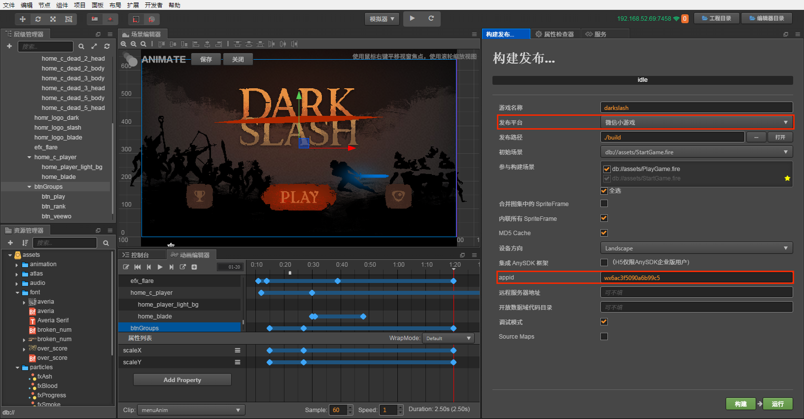
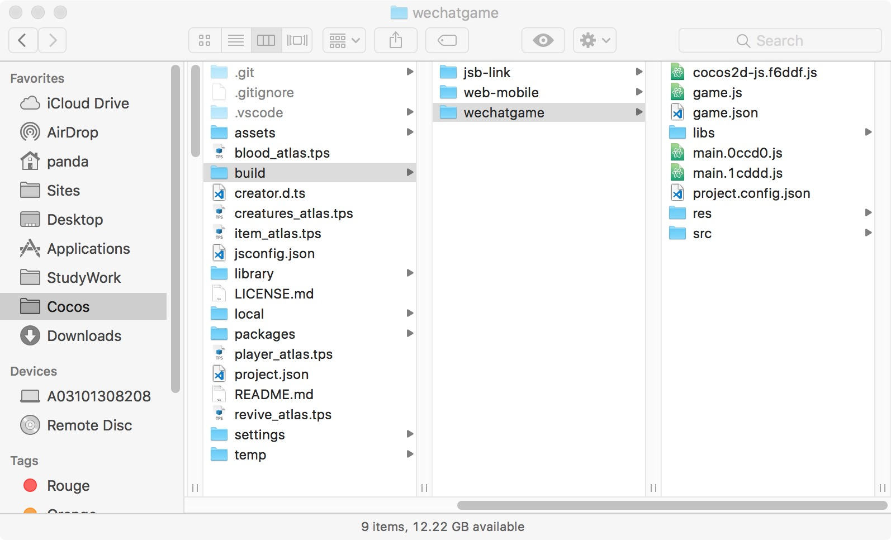

# 发布到微信小游戏平台

早在微信官方正式发布小游戏平台之前，Cocos Creator 团队就和微信开发团队合作完成了 Cocos Creator 对微信小游戏平台的支持。在小游戏正式公布之后，我们也在第一时间发布了完美支持小游戏的 Cocos Creator v1.8。这篇文档的初衷也是希望帮助开发者们在第一时间以最顺畅的方式提交游戏到小游戏平台。

这篇文档将会覆盖：

- 小游戏的运行环境介绍
- 如何使用 Cocos Creator 发布微信小游戏
- 小游戏资源管理

与这篇文档搭配的还有一段教学视频，可以结合视频中的操作来理解，更加直观。


<iframe frameborder="0" width="100%" height="440" src="https://v.qq.com/iframe/player.html?vid=c05255stri7&tiny=0&auto=0" allowfullscreen></iframe>


## 微信小游戏平台

微信小游戏是微信小程序下的游戏产品平台，它不仅提供了强大的游戏能力，还和小程序一样，提供了大量的原生接口，比如支付，社交，文件系统，照片，NFC 等。相当于同时结合了 WEB 易于传播以及 Native 功能丰富的优势。

小游戏的运行环境是小程序环境的扩展，基本思路也是封装必要的 WEB 接口提供给用户，尽可能追求和 WEB 同样的开发体验。小游戏在小程序环境的基础上提供了 WebGL 接口的封装，使得渲染能力和性能有了大幅度提升。不过由于这些接口都是微信团队通过自研的原生实现封装的，所以并不可以等同为浏览器环境。

作为引擎方，为了尽可能简化开发者的工作量，我们为用户完成的主要工作包括：

- 引擎框架适配微信小游戏 API，纯游戏逻辑层面，用户不需要任何额外的修改
- Cocos Creator 编辑器提供了快捷的打包流程，直接发布为微信小游戏，并自动唤起小游戏的开发者工具
- 自动加载远程资源，缓存资源以及缓存资源版本控制

除此之外，小游戏平台的游戏提交，审核和发布流程和小程序是没有区别的，都需要遵守微信团队的要求和标准流程，具体信息可以参考文末的链接。

## 使用 Cocos Creator 发布微信小游戏

我们从 Cocos Creator v1.8 开始，支持 Cocos Creator 游戏一键发布为微信小游戏，下面是详细的发布步骤：

1. 在[微信公众平台](https://mp.weixin.qq.com/debug/wxagame/dev/devtools/download.html)下载微信开发者工具
2. 在 "Creator 设置" > "原生开发环境" 中设置微信开发者工具路径

    
3. 登陆微信公众平台，找到 appid

    
4. 在构建面板中设置项目名和 appid

    
5. 构建发布
6. 点击 play 打开微信开发者工具

    
7. 预览部署

按照这样的流程，项目的 build 目录下就会生成一个微信小游戏的发布包，其中已经包含了微信小游戏环境的配置文件：game.json 和 project.config.json

## 小游戏环境的资源管理

在小游戏环境中，资源管理是最特殊的部分，它和浏览器的不同在于下面四点：

1. 小游戏的包内体积不能够超过 4mb，包含所有代码和资源，额外的资源必须通过网络请求下载。
2. 对于从远程服务器下载的文件，小游戏环境没有浏览器的缓存以及过期更新机制。
3. 对于小游戏包内资源，小游戏环境内并不是按需加载的，而是一次性加载所有包内资源，然后再启动页面。
4. 不可以从远程服务器下载脚本文件。

这里引出了两个关键的问题，首页面加载速度和远程资源缓存及版本管理。对于首页面加载速度，我们建议用户只保存脚本文件在小游戏包内，其他资源都从远程服务器下载。而远程资源的下载、缓存和版本管理，其实在 Cocos Creator 中，已经帮用户做好了。下面我就来解释一下这部分的逻辑。

在小游戏环境中，我们提供了一个 wxDownloader 对象，给它设置了 `REMOTE_SERVER_ROOT` 属性后，引擎下载资源的逻辑就变成：

1. 检查资源是否在小游戏包内
2. 不存在则查询本地缓存资源
3. 如果没有缓存就从远程服务器下载
4. 下载后保存到小游戏应用缓存内供再次访问时使用

同时，当开启引擎的 md5Cache 功能后，文件的 url 会随着文件内容的改变而改变，这样当游戏发布新版本后，旧版本的资源在缓存中就自然失效了，只能从服务器请求新的资源，也就达到了版本控制的效果。

具体来说，开发者需要做的是：

1. 构建时，勾选 md5Cache 功能。
2. 将小游戏发布包中的 res 文件夹完整的上传到服务器。
3. 删除发布包内的 res 文件夹。
4. 在构建发布面板中设置 `远程服务地址`。
5. 对于测试阶段来说，可能你无法部署到正式服务器上，需要用本地服务器来测试，那么请在微信开发者工具中打开详情页面，勾选项目设置中的 `不检验安全域名、TLS 版本以及 HTTPS 证书` 选项。

    

**注意**：如果缓存资源超过微信环境限制，用户需要手动清除资源，可以在微信小游戏平台下使用 `wx.downloader.cleanAllAssets()` 接口来清除缓存。目前只支持一次清除所有缓存。

## 微信小游戏分包加载

微信小游戏如何实现分包加载请参考 [代码分包加载](../scripting/subpackage.md)。

## 平台 SDK 接入

除了纯游戏内容以外，其实微信小游戏环境还提供了非常强大的原生 SDK 接口，其中最重要的就是用户、社交、支付等，这些接口都是仅存在于微信小游戏环境中的，等同于其他平台的第三方 SDK 接口。这类 SDK 接口的移植工作在现阶段还是需要开发者自己处理。下面列举一些微信小游戏所提供的强大 SDK 能力：

1. 用户接口：登陆，授权，用户信息等
2. 微信支付
3. 转发以及获得转发信息
4. 文件上传下载
5. 媒体：图片、录音、相机等
6. 其他：位置、设备信息、扫码、NFC、等等

## 接入微信小游戏的开放数据域

微信小游戏为了保护其社交关系链数据，增加了 **开放数据域** 的概念，这是一个单独的游戏执行环境。开放数据域中的资源、引擎、程序，都和主游戏完全隔离，开发者只有在开放数据域中才能访问微信提供的 wx.getFriendCloudStorage() 和 wx.getGroupCloudStorage() 两个 API，用于实现一些例如排行榜的功能。

Cocos Creator 从 v1.9.1 版本开始支持打包到开放数据域，详情请参考 [接入微信小游戏的开放数据域](../publish/publish-wechatgame-sub-domain.md)。

## 微信小游戏已知问题：

我们对微信小游戏的适配工作还未完全结束，目前仍不支持以下组件：

- VideoPlayer
- WebView

用户如果有需要，目前可以先自己直接调用微信的 API 来使用。

## 参考链接

- [微信小游戏开发文档](https://mp.weixin.qq.com/debug/wxagame/dev/index.html)
- [微信公众平台](https://mp.weixin.qq.com/)
- [小游戏 API 文档](https://developers.weixin.qq.com/minigame/dev/document/render/canvas/wx.createCanvas.html)
- [微信开发者工具下载](https://mp.weixin.qq.com/debug/wxagame/dev/devtools/download.html)
- [微信开发者工具文档](https://developers.weixin.qq.com/minigame/dev/devtools/devtools.html)

## 常见问题

小游戏开发过程中的常见问题，我们将在这个帖子中解答和汇总： http://forum.cocos.com/t/faq/54828
