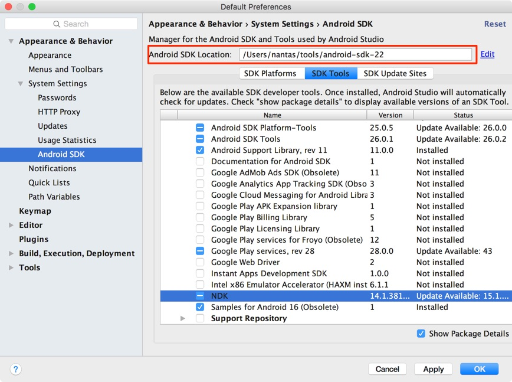
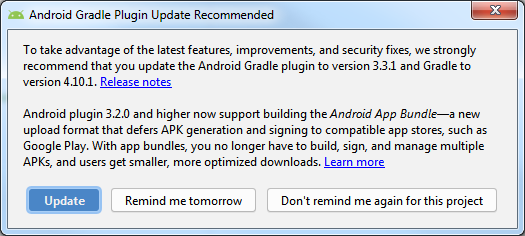
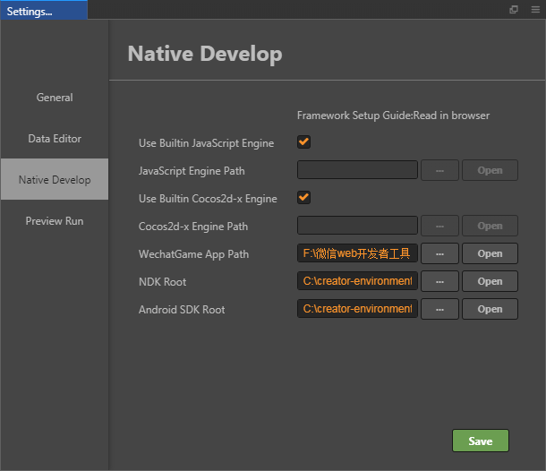

# 安装配置原生开发环境

除了内置的 Web 版游戏发布功能外，Cocos Creator 使用基于 cocos2d-x 引擎的 JSB 技术实现跨平台发布原生应用。在使用 Cocos Creator 打包发布到原生平台之前，我们需要先配置好 cocos2d-x 相关的开发环境。

## Android 平台相关依赖

要发布到 Android 平台，需要安装以下全部开发环境依赖。

如果您没有发布到 Android 平台的计划，或您的操作系统上已经有完整的 Android 开发环境，可以跳过这个部分。

### 下载 Java SDK（JDK）

编译 Android 工程需要本地电脑上有完整的 Java SDK 工具，请到以下地址下载：

[Java SE Development Kit 8 Downloads](http://www.oracle.com/technetwork/java/javase/downloads/jdk8-downloads-2133151.html)

下载时注意选择和本机匹配的操作系统和架构，下载完成后运行安装程序即可。

安装后请检查 JAVA 环境，在 Mac 终端或者 Windows 命令行工具中输入下面代码来查看：

```
java -version
```

显示为 JAVA SE 则没有问题，如果系统中使用的是 JRE，则需要安装 [JAVA SE 运行环境](http://www.oracle.com/technetwork/java/javase/downloads/index.html)。

如果是 Windows 系统，请确认你的环境变量中包含 JAVA_HOME。可以通过右键点击我的电脑，选择属性，打开高级选项卡中来查看和修改环境变量。修改完成后 Windows 平台可能需要重启电脑才会生效。参考 [如何设置或更改 JAVA 系统环境变量](https://www.java.com/zh_CN/download/help/path.xml)

### 下载安装 Android Studio

从 v1.10 开始，我们不再支持 Eclipse 的 ANT 构建，需要使用 Android Studio 作为安卓平台的构建工具，并在 Android Studio 里下载所需的 SDK 和 NDK 包。首先请 [安装 Android Studio](http://www.android-studio.org/)。

### 下载发布 Android 平台所需的 SDK 和 NDK

安装 Android Studio 完成后，参考官方文档，打开 SDK Manager：[SDK Manager 使用说明](https://developer.android.google.cn/studio/intro/update.html#sdk-manager)。

1. 在 SDK Platforms 分页栏，勾选你希望安装的 API Level，也就是支持安卓系统的版本，推荐选择主流 API Level 23（6.0）、API Level 26（8.0）和 API Level 28（9.0）等。
2. 在 SDK Tools 分页栏，首先勾选右下角的 **Show Package Details**，显示分版本的工具选择。
3. 在 **Android SDK Build-Tools** 里，选择最新的 build tools 版本。
4. 勾选 **Android SDK Platform-Tools** 和 **Android SDK Tools**，如需安装 Android 支持库，请参考 [官方文档](https://developer.android.google.cn/topic/libraries/support-library/setup)。
5. 勾选 **NDK**，建议使用的版本为 **r17 - r19**。
6. 记住窗口上方所示的 Android SDK Location 指示的目录，稍后我们需要在 Cocos Creator 里填写这个 SDK 所在位置。
7. 点击 **OK**，根据提示完成安装。



**注意**：目前 Creator 支持的 Android Gradle 版本为 **4.10.x**，对应的 Gradle Tool 版本为 **3.x**（推荐使用 v3.2.0）。在使用 Android Studio 编译时，若出现 Android Gradle 插件的升级提示，建议不要升级。



- 查看 Android Gradle 版本的文件路径：`YourProject\build\jsb-link\frameworks\runtime-src\proj.android-studio\build.gradle`
- 查看 Gradle Tool 版本的文件路径：`YourProject\build\jsb-link\frameworks\runtime-src\proj.android-studio\gradle\wrapper\gradle-wrapper.properties`

## 安装 C++ 编译环境

请安装以下运行环境：

- Python 2.7.5+，[下载页](https://www.python.org/downloads/)，注意不要下载 Python 3.x 版本。

- 打包 Windows 版本需要安装 [Visual Studio 2017 社区版](https://www.visualstudio.com/downloads/download-visual-studio-vs)。在安装 Visual Studio 时，请勾选 **使用 C++ 的桌面开发** 和 **使用 C++ 的游戏开发** 两个模块。

  > **注意**：在 **使用 C++ 的游戏开发** 模块中有一个 **Cocos** 选项，请勿勾选安装。

- 打包 Mac 版本和 iOS 版本时，Mac 下需要安装 [Xcode](https://developer.apple.com/xcode/download/) 和命令行工具。

## 配置原生发布环境路径

下载安装好开发环境依赖后，让我们回到 Cocos Creator 中配置构建发布原生平台的环境路径。在主菜单中选择 `CocosCreator -> 设置`，打开设置窗口：



我们在这里需要配置以下两个路径：

- **NDK 路径**，选择刚才在 Android Studio 中的 `Android SDK Location` 路径下的 `ndk-bundle` 文件夹（NDK 是其根目录），不需要编译 Android 平台的话这里可以跳过。

  > **注意**：新版本 Android Studio 的 NDK 可下载多版本，之前的 `ndk-bundle` 文件名更改为 `ndk`，可在 `ndk` 目录下根据需要选择具体版本的 NDK。

- **Android SDK 路径**，选择刚才在 Android Studio 的 SDK Manager 中记下的 `Android SDK Location` 路径（Android SDK 的目录下应该包含 build-tools、platforms 等文件夹），不需要编译 Android 平台的话这里可以跳过。

配置完成后点击 **保存** 按钮，保存并关闭窗口。

> **注意**：这里的配置会在编译 **原生工程** 的时候生效。如果没有生效（一些 Mac 机器有可能出现这个情况），可能需要您尝试到 **系统环境变量** 设置这些值：`COCOS_CONSOLE_ROOT`、`NDK_ROOT`、`ANDROID_SDK_ROOT`。

## 注意事项

由于在公测版中收到了很多原生打包的问题反馈，这里补充一些可能的问题原因。

1. 包名问题

    检查构建发布面板中的包名，包含空格，`-` 等都是非法的包名。

2. Android 编译成功，但运行时提示 `dlopen failed: cannot locate symbol "xxxx" referenced by "libcocos2djs.so"...`

    请检查 NDK 和 Android SDK 的架构和版本是否和测试用的 Android 系统相对应，另外可以尝试使用本文所用的 NDK 和 Android SDK 版本来测试。

最后，如果依然打包失败，请附上详细的复现步骤及报错信息通过 [论坛](https://forum.cocos.org/c/27) 反馈给我们。
