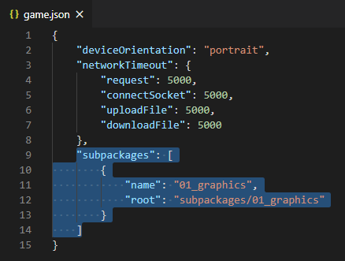

# 小游戏分包

部分小游戏平台支持分包功能以便对资源、脚本和场景进行划分。Creator 从 v2.4 开始支持 [Asset Bundle](../asset-manager/bundle.md)，开发者可以将需要分包的内容划分成多个 Asset Bundle，这些 Asset Bundle 会被构建成小游戏的分包。在启动游戏时只会下载必要的主包，不会加载这些分包，而是由开发者在游戏过程中手动加载，从而有效降低游戏启动的时间。

## 配置方法

Asset Bundle 是以 **文件夹** 为单位进行配置的。当我们在 **资源管理器** 中选中一个文件夹时，**属性检查器** 中就会出现一个 **配置为 Bundle** 的选项，勾选后会出现如下图的配置项：

除了通用的 [Asset Bundle 配置](../scripting/asset-bundle.md#%E9%85%8D%E7%BD%AE%E6%96%B9%E6%B3%95) 之外，小游戏分包主要要关注的设置有：
- 将 **目标平台** 设置成需要分包的小游戏平台，**压缩类型** 设置为 **小游戏分包**。
- 小游戏分包只能放在本地，不能配置为远程包，所以 **配置为远程包** 项不可勾选。

配置完成后点击右上方的 **应用** 按钮，这个文件夹就被配置成 Asset Bundle 了。

## 构建

项目构建完成后，这个 Asset Bundle 文件夹会被打包到小游戏平台发布包目录下的 **subpackages** 文件夹中。该文件夹中包含的每个文件夹都是一个 Asset Bundle。

例如：将 example 工程中的 `cases/01_graphics` 文件夹在微信小游戏平台配置为 Asset Bundle，那么项目构建后将会在微信小游戏发布包目录下的 **subpackages** 生成 **01_graphics** 文件夹。**01_graphics** 文件夹就是一个 Asset Bundle。

## 微信小游戏

在微信小游戏的构建中，Asset Bundle 的配置也会按照规则自动生成到微信小游戏发布包目录下的 **game.json** 配置文件中。

**注意**：微信小游戏需要特定的版本才能支持分包功能。微信 6.6.7 客户端，2.1.0 及以上基础库开始支持，请更新至最新客户端版本，开发者工具请使用 1.02.1806120 及以上版本。更新了开发者工具后不要忘记修改开发者工具中的 **详情 -> 本地设置 -> 调试基础库** 为 2.1.0 及以上：

### 分包加载包大小的限制

目前微信小游戏分包大小有以下限制：

- 整个微信小游戏所有分包大小不超过 **20M**
- 单个分包不限制大小
- 主包大小不能超过 **4M**

具体请参考 [微信小游戏分包加载官方文档](https://developers.weixin.qq.com/minigame/dev/guide/base-ability/sub-packages.html)。

## vivo 小游戏

在 vivo 小游戏的构建中，Asset Bundle 的配置也会按照规则自动生成到 vivo 小游戏发布包 `qgame/src` 目录下的 **manifest.json** 配置文件中。

**注意**：

1. **快应用 & vivo 小游戏调试器** 从 **1051** 版本开始支持 vivo 小游戏分包加载。低于 1051 的版本虽然不支持分包加载，但是也做了兼容处理，如果使用了分包也不会影响游戏正常运行。具体可参考 [vivo 分包加载-运行时兼容](https://minigame.vivo.com.cn/documents/#/lesson/base/subpackage?id=%e8%bf%90%e8%a1%8c%e6%97%b6%e5%85%bc%e5%ae%b9)。
2. 与其他小游戏平台不同的是，项目构建后 vivo 小游戏的 Asset Bundle 文件夹是生成在发布包 **qgame** 目录下的 **src** 目录。

    

### 分包加载包的限制

目前 vivo 小游戏分包大小限制为 20M（主包限制 4M 及分包大小限制 16M）。

具体请参考 [vivo 小游戏分包加载官方文档](https://minigame.vivo.com.cn/documents/#/lesson/base/subpackage)。
