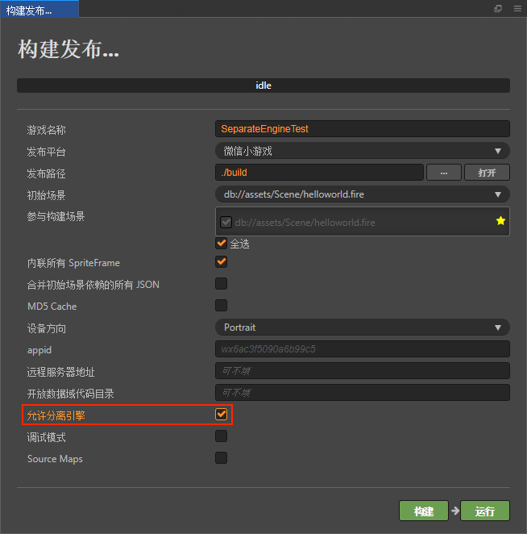

# 微信小游戏引擎插件使用说明

游戏引擎插件是微信 7.0.7 版本新增的一项功能。此插件内置了 Cocos Creator 引擎的官方版本，若玩家首次体验的游戏中启用了此插件，则所有同样启用此插件的游戏，都无需再次下载 Cocos Creator 引擎，只需直接使用公共插件库中的相同版本引擎，或者增量更新引擎即可。

例如，当一个玩家玩过了由 Cocos Creator v2.2.0 开发的 A 游戏，里面已启用了此插件。然后他又玩了同样是 v2.2.0 开发的 B 游戏，如果 B 游戏也启用了此插件，那么就无需重新下载 Cocos Creator 引擎。即使 B 使用的是 v2.2.1 的 Cocos Creator，微信也只需要增量更新引擎两个版本的差异部分。这样就可以大幅减少小游戏的下载量，提升小游戏启动速度 0.5 ~ 2s，获得更好的用户体验。

## 使用说明

Cocos Creator 提供了强大的集成式游戏开发环境，使用引擎插件非常简单。

### Cocos Creator 2.2.1 及以上版本

在 Cocos Creator 新版本中已集成此插件。只需在 **构建发布** 面板中，勾选 **允许分离引擎**，然后正常构建发布即可，**无需其它人工操作**。（此功能仅在非调试模式生效）

### Cocos Creator 2.0.5 ~ 2.2.0 版本

一、下载 Cocos Creator 构建插件

地址：https://github.com/cocos-creator/plugin-wechat-engine-separation/archive/master.zip

二、安装插件

- 如需应用于全局（所有项目）下：将解压后的插件文件夹拷贝到 `C:\Users\用户\.CocosCreator\packages`（Windows）或者 `用户/.CocosCreator/packages`（Mac）下即可。
- 如需应用于单个项目：将解压后的插件文件夹拷贝到项目工程中与 assets 文件夹同级的 packages 文件夹下（如果没有可以自行创建一个）。

三、构建

安装插件以后，重启 Cocos Creator，在 **构建发布** 面板中执行正常构建即可，**无需其它人工操作**。（此功能仅在非调试模式生效）
之后如需禁用引擎插件功能，直接删除此插件即可。

### Cocos Creator 2.0.4 以下版本

根据调查，目前 Cocos Creator v2.0.4 以下的开发者占比已经非常少。我们不建议这部分开发者使用引擎插件，因为收效并不明显，反而增大了维护成本。 
如确实需要，建议先升级到 Cocos Creator 2.0.10 或更高版本，高版本对微信小游戏的支持会更好。

## FAQ

问：微信小游戏开放数据域支持该功能吗？ 
答：根据微信的规则，目前还不支持。

问：引擎插件功能是否支持自定义引擎？ 
答：不支持，构建时如果版本不匹配或者启用了自定义引擎，编辑器将会弹出提示。

问：启用引擎插件后，是否仍然会把引擎代码算入首包包体中？ 
答：根据微信的规则，目前仍然会计算在内。

问：Cocos Creator v2.2.0 在 iOS 9 上启用引擎插件后无法进入游戏？ 
答：非常抱歉，这是已知的兼容性问题，在 v2.2.1 中已进行修复。

问：启用引擎插件后，在微信开发工具中提示 “代码包解包失败”，但真机预览正常？  
答：构建面板中默认的 appid 为通用测试 id。根据微信的规则，如需测试引擎分离功能，需要开发者在构建面板中填入自己开通的 appid。

## 参考链接

- [微信小游戏引擎插件官方文档](https://developers.weixin.qq.com/minigame/dev/guide/base-ability/game-engine-plugin.html)
