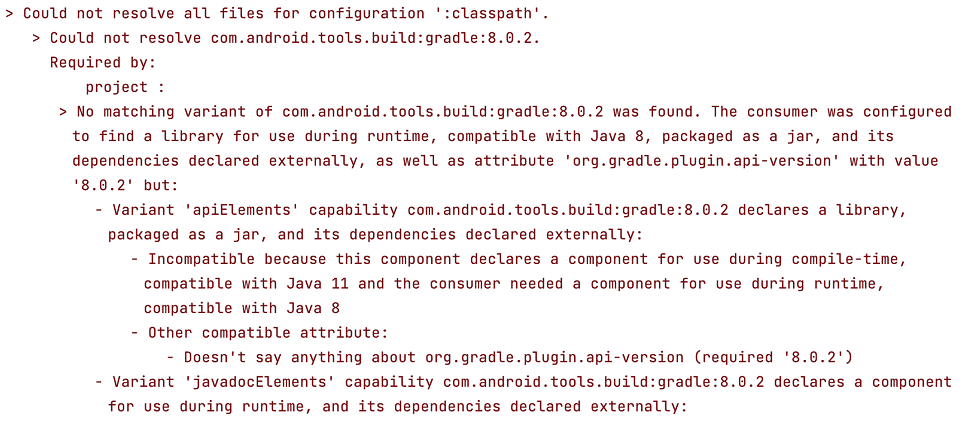
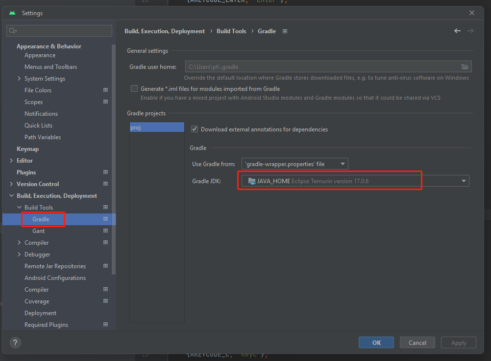

# Android 工程升级

从 v3.8 开始，构建产出的 Android 工程默认支持新版本的 Android Studio（Flamingo | 2022.2.1）。由于 Android Gradle 插件的 [要求](https://developer.android.com/studio/releases?hl=zh-cn#jdk-17)，开发者需要将 JDK 升级到 17，同时升级 Android Studio 到 Flamingo 版本。

> 如果没有对构建生成的 Android 工程进行配置，可以直接删除 native/engine/android 目录和 build/android 目录，然后重新构建。这样不需要对工程进行一步步的修改升级。但是请注意，这一步操作是有风险的，如对接 SDK 的代码可能会被删除，请谨慎操作。

对于现有的原生 Android 工程，开发者可以参考以下步骤对工程进行升级：

## 第一步：备份当前工程

在升级之前，我们应该先备份当前的 native 目录，以防万一。比如可以用 Git 保存当前修改.

## 第二步：升级Gradle插件版本

Gradle 插件版本是 Gradle 与 Android 构建系统之间的接口。因此，在升级 Gradle 之前，我们需要先升级 Gradle 插件版本。在项目的 native/engine/android/build.gradle 文件中，将 classpath 中的 Gradle 插件版本改为 8.0.2。

```diff
         // jcenter() // keeped as anchor, will be removed soon
     }
     dependencies {
-        classpath 'com.android.tools.build:gradle:4.1.0'
+        classpath 'com.android.tools.build:gradle:8.0.2'

         // NOTE: Do not place your application dependencies here; they belong
         // in the individual module build.gradle files
```

## 第三步：移除 package 字段

移除 native/engine/android/app/AndroidManifest.xml 文件中的 package 属性。

```diff
<?xml version="1.0" encoding="utf-8"?>
 <manifest xmlns:android="http://schemas.android.com/apk/res/android"
-    package="com.cocos.test"
     android:installLocation="auto">

     <uses-permission android:name="android.permission.INTERNET"/>
```

在 `native/engine/android/app/build.gradle` 中的修改 applicationId 为 namespace
```diff
     compileSdkVersion PROP_COMPILE_SDK_VERSION.toInteger()
     buildToolsVersion PROP_BUILD_TOOLS_VERSION
     ndkPath PROP_NDK_PATH
+    namespace APPLICATION_ID

     compileOptions {
         sourceCompatibility JavaVersion.VERSION_1_8
@@ -17,7 +18,6 @@ android {
     }

     defaultConfig {
-        applicationId APPLICATION_ID
         minSdkVersion PROP_MIN_SDK_VERSION
         targetSdkVersion PROP_TARGET_SDK_VERSION
         versionCode 1
```

### 第四步：升级 Gradle 版本

接下来，我们需要升级 Gradle wrapper 版本。在项目的 `build/android/proj/gradle/wrapper/gradle-wrapper.properties` 文件中，将 distributionUrl 改为 8.0.2，如下所示：

```properties
distributionUrl=https\://services.gradle.org/distributions/gradle-8.0.2-bin.zip

```

## 第五步: 更新 Proguard Rules

添加下面的内容到文件 `native/engine/android/app/proguard-rules.pro`

```
# This is generated automatically by the Android Gradle plugin.
-dontwarn android.hardware.BatteryState
-dontwarn android.hardware.lights.Light
-dontwarn android.hardware.lights.LightState$Builder
-dontwarn android.hardware.lights.LightState
-dontwarn android.hardware.lights.LightsManager$LightsSession
-dontwarn android.hardware.lights.LightsManager
-dontwarn android.hardware.lights.LightsRequest$Builder
-dontwarn android.hardware.lights.LightsRequest
-dontwarn android.net.ssl.SSLSockets
-dontwarn android.os.VibratorManager
```

## 第六步：安装 JDK 17

在 [官网](https://www.oracle.com/java/technologies/downloads/) 上下载并安装 JDK 17。安装过程中需要注意配置环境变量。

安装完成后，可以通过在命令行输入 `java -version` 来检查是否安装成功。

> 从 3.8.1 开始, 您可以在 [偏好设置中配置](../../zh/editor/preferences/index.md#外部程序) Java Home 为 JDK 17 的路径, 不需要修改环境变量. 

## 第七步：升级 Android Studio

在升级 Gradle 之后，我们还需要升级 Android Studio。如果您当前使用的是较老版本的 Android Studio，请先下载最新版本的 Android Studio（Flamingo | 2022.2.1）。下载地址为: [https://developer.android.com/studio](https://developer.android.com/studio)。


下载完成后，打开 Android Studio 并导入您的项目。Android Studio 会自动检测您的项目所需的 Gradle 版本，并提示您进行升级。按照提示进行操作，即可完成 Android Studio 的升级。

如果在 Android Studio 编译时遇到下面的错误报告：



您可以参考以下截图，在设置中修改 Gradle 使用的 JDK 17：



完成上述步骤后，您也可以在构建面板中重新执行构建。
