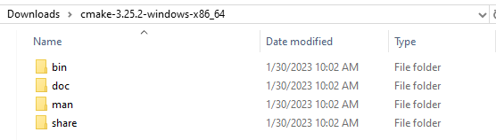
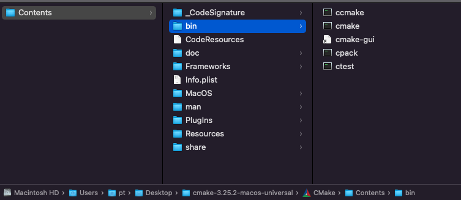

# 升级 CMake

在 v3.6 之前的版本不支持指定 cmake 路径, 可以使用覆盖编辑器内建的 cmake 目录的方式实现升级.

### Windows 平台
1. 到 https://cmake.org/download/  下载需要的 cmake 版本, 并解压

2. 打开编辑内部目录 `resources/tools/cmake/`

3. 用下载的 cmake 内容覆盖 编辑器内建的 cmake, 目录结构保持不变.
4. 重启编辑器后生效.

### Mac 平台

1. 到 https://cmake.org/download/  下载需要的 cmake 版本, 并解压
   

2. 打开编辑内部目录 `Contents/Resources/tools/cmake/arm64`(或 `x86_64`)

3. 拷贝所下载的 `CMake/Contents` 中的内容到 编辑器对应目录. 
4. 重启编辑器后生效.