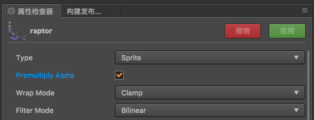
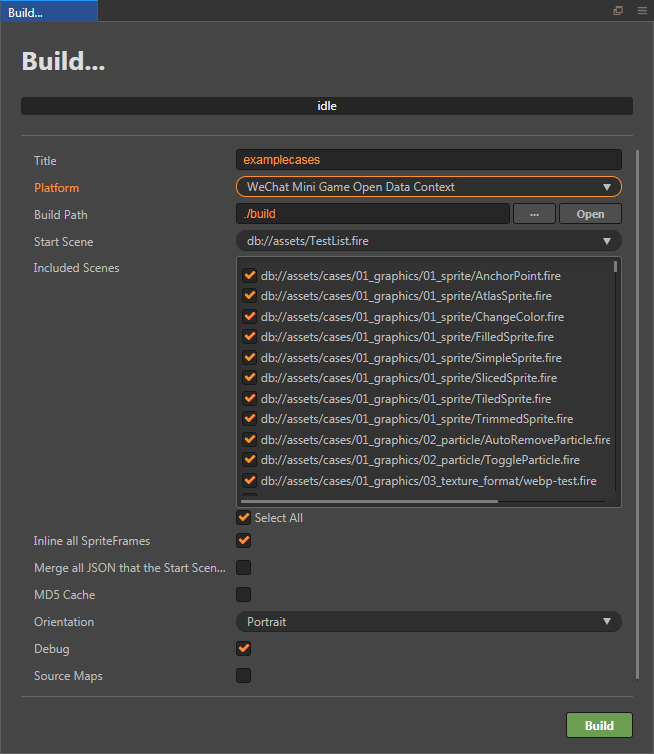
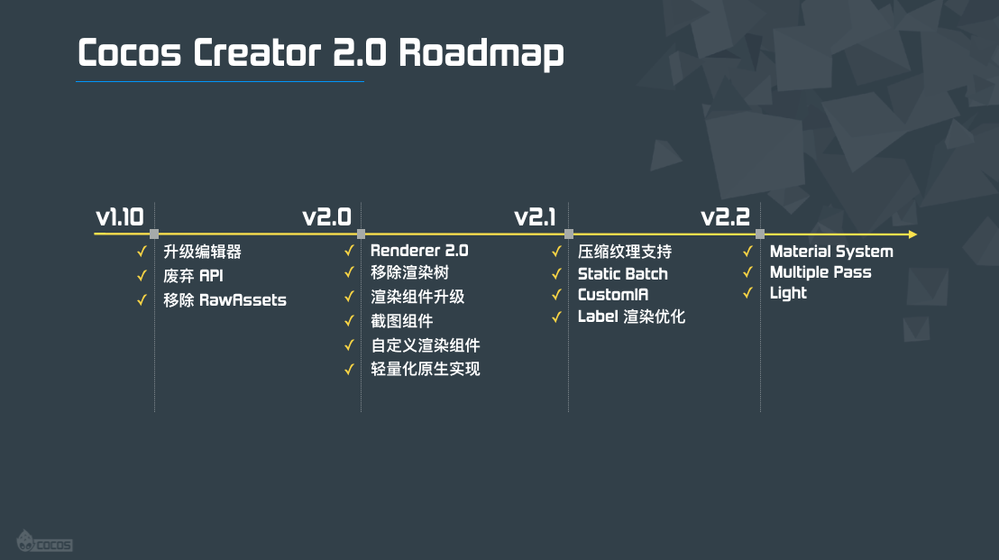

# Cocos Creator v2.0 升级文档

## 1. 概述

经历了大规模的底层重构和为期两个月的稳定性迭代，Cocos Creator v2.0 终于和大家见面了。这篇文章希望能给 v1.x 的用户完整的升级指引，帮助开发者顺利迁移到全新版本上。

总体上来说，Cocos Creator v2.0 设计的核心目标有两点：

1. 大幅提升引擎基础性能
2. 提供更高级的渲染能力和更丰富的渲染定制空间

为了完成这个目标，我们彻底重写了底层渲染器，从结构上保障了 Web 和小游戏性能的提升和渲染能力的升级。同时，为了保障用户项目可以更平滑得升级，我们几乎没有改动组件层的 API。当然，这些改动并不是对用户完全透明的，比如引擎加载流程、事件系统、引擎整体 API 的精简和重组，这些都会带来对用户层 API 的影响，我们希望通过升级指南、文档和 deprecation 信息等方式帮助大家升级。

当然，升级成功只是开始，Cocos Creator 在 v2.0 中准备了更深入的更新和可能性等待大家挖掘。

### 2.0.0 已知问题列表

由于不少用户反馈了从 1.x 升级上来的项目遇到的诸多问题，我们也需要在此强调一下目前升级的风险所在，存在的问题，和我们的修复计划。

问题列表：

1. 2.x 原生平台中 Spine & DragonBones 的性能不如 1.x。且 ETC 压缩纹理不支持（1.x 可以 hack 实现）。
2. 1.x 升级过程中如果内置 base64 贴图的 Particle 资源可能会失效。我们会在 2.0.1 回滚对 Particle 资源的升级，回到 1.x 的状态，避免错误。如果遇到类似问题可以通过使用外部贴图文件来绕过。
3. 1.x RichText 升级后可能导致场景持续报错：can not read property `_worldMatrix` of null。在 2.0.1 中会修复。暂时可以在旧版本删除 RichText，再在 2.0 重新添加来绕过。
4. 微信开放数据域中加载远程头像无法显示，无法设置 Camera 背景色透明。在 2.0.1 中修复。
5. 玩一玩发布版本可能会黑屏，原因是 libs 下的脚本文件名大小写在发布过程中被覆盖了。在 2.0.1 中修复。遇到问题请使用 1.x 版本发布玩一玩。
6. 部分 Spine 动画升级后渲染错误。在 2.0.1 中修复。
7. Tilemap 在 Camera 缩放的情况下，会出现地图被过多剪裁的问题。在 2.0.1 中修复。
8. RichText 暂不支持通过节点颜色修改颜色。
9. Native 平台暂不支持 VideoPlayer 和 WebView 组件
10. 不支持 IE 11。在 2.0.1 中修复。
11. 目前 2.0 版本存在着原生平台上引擎渲染性能可能下降的情况，对特定的游戏可能会有较明显的影响，建议开发中的原生平台项目谨慎升级。我们后续会进行优化。

## 2. 编辑器升级

首先我们先来了解一下编辑器层面的改动，由于 2.0 的重点更新集中在引擎层面，这方面其实改动不算很多，主要是贴图资源，平台发布，以及部分组件的使用方式。在 2.x 的后续更新中，我们会陆续给大家带来更多编辑器层面的重要升级。

### 2.1 Texture 资源配置

也许有开发者在 Creator 1.x 注意过贴图资源的配置，比如 Wrap Mode 和 Filter Mode，但是其实在 1.x 中不论怎么设置，都是不会影响到运行时的贴图资源的。那么在 2.0 中，我们让这些配置在运行时真正生效，还增加了一个是否预乘贴图的选项：

- Wrap Mode：循环模式，它决定了当 uv 超过 1 时如何对贴图采样
  - Clamp：uv 的取值会自动限定在 0, 1 之间，超出直接取 0 或 1
  - Repeat：超过时会对 uv 的值取模，使得贴图可以循环呈现
- Filter Mode：过滤模式，它决定了对贴图像素进行浮点采样时，是否和周围像素进行混合，以达到贴图缩放时的平滑过度效果。结果上来说，Trilinear 平滑程度高于 Bilinear，高于 Point，但是 Point 很适合像素风格的游戏，在缩放贴图时，像素边界不会变得模糊，保持原始的像素画风格。
  - Point（最近点采样）：直接使用 uv 数值上最接近的像素点
  - Bilinear（二次线性过滤）：取 uv 对应的像素点以及周围的四个像素点的平均值
  - Trilinear（三次线性过滤）：会在二次线性过滤的基础上，取相邻两层 mipmap 的二次线性过滤结果，进行均值计算
- Premultiply Alpha：这是在 2.0 新增的参数，勾选时，引擎会在上传 GPU 贴图的过程中，开启 GL 预乘选项。这对于一些需要预乘的贴图非常有帮助，时常会有一些用户对于贴图周围或者文字周围莫名其妙的白边无法理解，这是贴图周围的半透明像素造成的：

这在 1.x 都需要使用代码的方式才能够消除，而在 2.0 中你只需要开启贴图的预乘选项。还需要注意的是，如果你发现这样做使得贴图变暗，那么就要将对应的渲染组件的混合模式改为 ONE，ONE_MINUS_SRC_ALPHA 即可。

### 2.2 Camera 组件使用

摄像机可能是 1.x 到 2.0 改动最大的一个组件，为了开发者可以顺畅更新，我们尽量保持了组件层 API 的一致性，然而 Camera 的使用方式和 API 却无法做到简单迁移。因为在 2.0 中，Camera 从一个配角变成了主角：

1. Canvas 组件会添加一个默认 Main Camera 节点，并挂载 Camera 组件，它将默认对准 Canvas 节点的中心，显示场景中渲染元素
2. 节点 Group 对应 Camera 的 culling mask，只有 Camera culling mask 包含的 Group 才会被渲染
3. 可以通过多 Camera 来渲染不同 Group，并且让它们拥有全局层级关系，场景渲染是以 Camera 列表为入口，依次渲染（多 Camera 也可以用不同视角渲染同一个物体）

在这个架构下，1.x 那样的使用方式就不再可行了，无法直接指定 Camera 对应的 target，而是通过设置节点 Group 和 Camera 的 culling mask 来设置节点和 Camera 匹配关系。

具体的改动，开发者们可以参考 [2.0 Camera 使用文档](../render/camera.md)。

### 2.3 构建面板更新

构建面板方面，最大的改动是微信小游戏开放数据域的发布。在 1.x 中，开发者要选择发布平台为 WeChat Mini Game，并且勾选开放数据域项目，在 2.0 中，我们将微信开放数据域独立为一个平台：WeChat Mini Game Open Data Context。

可以看到，构建选项比其他平台要简单许多，这是因为开放数据域的环境特殊，去除了不必要的选项。同时，由于开放数据域不支持 WebGL 渲染，所以在引擎模块裁剪上，不论用户怎么设置，WebGL 渲染器都会被剔除，同时依赖于 WebGL 渲染的所有模块都会被剔除。其他模块，仍然需要用户自己选择来尽量争取在打到开放数据域中的最小包体。

同理，在构建其他平台时，请不要勾选 Canvas Renderer，因为 Canvas 渲染器支持的渲染组件不多，意义已经不大了。

从 v2.0.1 开始，我们更新了开放数据域解决方案，具体请参考 [接入小游戏开放数据域](../publish/publish-wechatgame-sub-domain.md)。

### 2.4 模块设置

除了微信开放数据域中的模块设置比较特殊以外，在其他平台项目的模块设置中还有几点需要注意：

1. 目前我们已经在非微信开放数据域的其他平台中废弃了 Canvas 渲染模式，所以 Canvas Renderer 模块都可以剔除，但 WebGL Renderer 模块必须保留。
2. 原生平台目前不可剔除 Native Network 模块（未来会调整）。

### 2.5 自定义引擎 Quick Compile

在 2.0 中，我们为需要定制引擎的开发者提供了一种更便捷的开发方式。1.x 在修改定制引擎之后，还需要进行 gulp build 构建才能生效，而且构建时间很长。这个问题的根本原因是，任何小的改动都需要将所有引擎文件进行重新打包，混淆，这个过程的耗时很长。所以 2.0 中我们改为引用自定义引擎中的分散文件，当用户改动发生时，只会更新被修改的文件，开发者也可以手动触发更新。

当使用自定义 JS 引擎时，加载或刷新编辑器时编辑器会扫描引擎并自动重新编译修改的引擎代码。

在编译完成后，预览就会直接使用新的引擎代码，构建项目时，也会使用新的引擎代码进行编译构建，当然，这会带来两个副作用：需要编译引擎时构建时间增长；预览时加载引擎脚本很多，所以预览加载时间也会增长。

## 3. 引擎模块升级

下面将介绍的是 Cocos Creator v2.0 的最重要的引擎部分更新，我们在 2.0 中对引擎框架进行了彻底的升级：

1. 彻底模块化
2. 移除底层 cocos2d-html5 渲染引擎，改为和 3D 引擎共享底层渲染器
3. 摒弃渲染树，直接使用节点和渲染组件数据来组装渲染数据
4. 逻辑层和渲染层隔离，通过有限的数据类型交互
5. 渲染流程零垃圾

下面介绍具体的更新内容。

### 3.1 底层渲染器升级

一般来说用户都是通过渲染组件层级来控制渲染，对于这样的使用方式来说，2.0 和 1.x 几乎没有区别，用户升级后组件层的代码都仍然是能正常运转的。不过如果用户由于优化等需求，项目代码中触碰到 sgNode 的层级，那么就需要注意了，在 1.x 中作为底层渲染器的 _ccsg 模块已经被彻底移除，组件层不再能访问任何 sgNode。下面是 2.0 和 1.x 在节点树层级的差异：

另外很关键的一点是，2.0 除了在微信开放数据域中保留了有限的 Canvas 渲染能力以外，其他平台都移除了 Canvas 渲染，仅支持 WebGL 渲染。

由于篇幅限制，这里不深入探讨引擎底层框架的更新，详细内容请关注我们后续推出的 v2.0 渲染框架文档。

### 3.2 启动流程升级

在 1.x 中，引擎和用户脚本的加载顺序是：

- 加载引擎
- 加载 main.js
- 初始化引擎
- 初始化渲染器
- 加载项目插件脚本
- 加载项目主脚本
- 调用 cc.game.onStart

而在 2.0 中，用户脚本将可以干预到初始化逻辑，比如设置 cc.macro.ENABLE_TRANSPARENT_CANVAS（Canvas 背景是否透明）、cc.macro.ENABLE_WEBGL_ANTIALIAS（是否开启 WebGL 抗锯齿），或者对引擎应用一些前置的定制代码。以前这些工作都必须定制 main.js，在 cc.game.onStart 回调中添加，跟引擎默认初始化逻辑混在一起，用户经常有困惑，而且对于版本升级也不友好。所以在 2.0 中我们前置了用户脚本的加载：

- 加载引擎
- 加载 main.js
- 加载项目插件脚本
- 加载项目主脚本
- 初始化引擎（Animation Manager, Collision Manager, Physics Manager, Widget Manager）
- 初始化渲染器
- 调用 cc.game.onStart

### 3.3 平台代码分离和定制

在 1.x 中，main.js 承载了所有平台的初始化逻辑，但由于平台越来越多，差异也越来越大，所以我们决定将这些平台的启动逻辑尽量分离。

1. Web & Facebook Instant Game
    1. 入口文件：index.html
    2. 适配文件：无
2. 微信小游戏
    1. 入口文件：game.js
    2. 适配文件：libs/
3. 原生平台
    1. 入口文件：main.js
    2. 适配文件：jsb-adapter/
4. QQ 轻游戏
    1. 入口文件：main.js
    2. 适配文件：libs/

开发者如果需要添加自己的定制代码，可以参考 [定制项目文档](http://docs.cocos.com/creator/manual/zh/publish/custom-project-build-template.html) 在项目中用自己的版本覆盖原始版本，另外，尽量不要覆盖 main.js。

### 3.4 事件系统升级

事件系统在引擎和用户代码中都被广泛使用，但是为了兼容派发触摸事件的需求（捕获和冒泡），1.x 中它的设计过于复杂，对于普通的简单事件反而性能有些低下。在 2.0 中为了解决这个问题，我们将树形结构中包含捕获和冒泡阶段的事件模型仅实现在了 cc.Node 中，彻底简化了 EventTarget 的设计。下面是关键的 API 对比：

Node：

- on (type, callback, target, useCapture)：注册事件监听器，可以选择注册冒泡阶段或者捕获阶段
- off (type, callback, target, useCapture)：取消注册监听器
- emit (type, arg1, arg2, arg3, arg4, arg5)：派发简单事件
- dispatchEvent (event)：以捕获和冒泡事件模型在节点树上派发事件（捕获阶段触发顺序从根节点到目标节点，冒泡阶段再从目标节点上传到根节点）

EventTarget：

- on (type, callback, target)：注册事件监听器
- off (type, callback, target)：取消注册监听器
- emit (type, arg1, arg2, arg3, arg4, arg5)：派发简单事件
- dispatchEvent (event)：兼容 API，派发一个简单的事件对象

可以看到只有 Node 的 `on`/`off` 支持父节点链上的事件捕获和事件冒泡，默认仅有系统事件支持这样的派发模式，用户可以通过 `node.dispatchEvent` 在节点树上以同样的流程派发事件。这点跟 1.x 是一致的。
但是，Node 上使用 emit 派发的事件和 EventTarget 上的所有事件派发都是简单的事件派发方式，这种方式派发的事件，在事件回调的参数上和 1.x 有区别：

    // **v1.x**
    eventTarget.on(type, function (event) {
        // 通过 event.detail 获取 emit 时传递的参数
    });
    eventTarget.emit(type, message); // message 会被保存在回调函数的 event 参数的 detail 属性上
    // **v2.0**
    eventTarget.on(type, function (message, target) {
        // 直接通过回调参数来获取 emit 时传递的事件参数
    });
    eventTarget.emit(type, message, eventTarget); // emit 时可以传递至多五个额外参数，都会被扁平的直接传递给回调函数

另外值得一提的是，热更新管理器的事件监听机制也升级了，AssetsManager 在旧版本中需要通过 cc.eventManager 来监听回调，在 2.0 中我们提供了更简单的方式：

    // 设置事件回调
    assetsManager.setEventCallback(this.updateCallback.bind(this));
    // 取消事件回调
    assetsManager.setEventCallback(null);

### 3.5 适配模式升级

Cocos Creator 支持多种适配模式，开发者可以通过 Canvas 组件中的设置来管理，其中一种适配模式在 2.0 中有一定的调整，就是同时勾选 Fit Width 和 Fit Height 的模式。

在这种适配模式下，开发者的设计分辨率比例将会忠实地被保留，并缩放场景到所有内容都可见，此时场景长宽比和设备屏幕长宽比一般都存在差距，就会在左右或者上下留下黑边。在 1.x 中，我们将 DOM Canvas 的尺寸直接设置为场景的尺寸，所以超出场景范围的内容都会被剪裁掉，而背景就是 Web 页面。但是这种方式在微信小游戏上遇到了问题，微信会强制将主 Canvas 的尺寸拉伸到全屏范围，导致 1.x 使用这种适配模式在小游戏上往往都会造成严重的失真。2.0 改变了适配策略的实现，保持 DOM Canvas 全屏，通过设置 GL Viewport 来让场景内容居中，并处于正确位置。这样做带来的变化是，微信小游戏中比例完全正确，但是场景范围外的内容仍然是可见的。

### 3.6 RenderTexture 截图功能

在 1.x 中，开发者一般通过 cc.RenderTexture 来完成截图功能，但是这是属于旧版本渲染树中的一个功能，在我们去除渲染树后，截图功能的使用方式也完全不同了。简单来说，2.0 中 cc.RenderTexture 变成了一个资源类型，继承自贴图（cc.Texture）资源。开发者通过将某个摄像机内容渲染到 cc.RenderTexture 资源上完成截图，具体的使用方式参考 [Camera 文档截图章节](../render/camera.md#%E6%88%AA%E5%9B%BE)。

### 3.7 TiledMap 功能简化

瓦片地图在 2.0 中经过了重新设计，为了提升渲染性能，我们简化了 TiledLayer 的能力，下面是修改或去除的 TiledLayer 功能：

- ~~getTiles~~
- ~~setTiles~~
- getTileAt: getTiledTileAt
- ~~removeTileAt~~
- setTileGID: setTileGIDAt
- ~~setMapTileSize~~
- ~~setLayerSize~~
- ~~setLayerOrientation~~
- ~~setContentSize~~
- ~~setTileOpacity~~
- ~~releaseMap~~

我们去除了 Tiles 获取和设置的能力，设置 map 或者 layer 尺寸和朝向的能力，这是因为我们希望这些信息从 tmx 文件中获取之后是稳定的，开发者可以通过 tmx 去调整地图，而不是这些接口。在 1.x 中，getTileAt 和 setTileAt 是通过将一个地图块实例化为一个 Sprite 实现的，这个 Sprite 的渲染在地图的渲染流程中会制造大量的特殊处理逻辑，也会使得瓦片地图渲染性能受到比较大的影响。所以在 2.0 中，我们提供了 getTiledTileAt 接口让开发者可以获取一个挂载 TiledTile 组件的节点，通过这个节点，开发者可以修改 Tile 的位置、旋转、缩放、透明度、颜色等信息，还可以通过 TiledTile 组件来控制地图位置和瓦片 ID，这取代了原本的 setTileOpacity 等独立接口。

当然，我们不是为了简化而简化，一方面这带来了 web 和小游戏性能上的提升，另一方面这个简单的框架也为未来瓦片地图的升级打下了很好的基础，我们计划会支持 multiple tilesets、节点遮挡控制等能力。

### 3.8 物理引擎升级

物理引擎方面，我们将旧的 box2d 库升级为 [box2d.ts](https://github.com/flyover/box2d.ts)，主要是为了在性能上有所提升，保障物理游戏的稳定性。不过 box2d.ts 内部的接口和以往的接口会有一定的差异，开发者需要留意这些接口的使用。

### 3.9 其他重要更新

除了上面那些完整模块的更新，在引擎的其他方面还有一些比较重要的更新：

1. Node
    1. 移除了 tag 相关的 API
    2. 将 transform 获取 API 都更新为 matrix 相关 API，并且获取时需要开发者传递存储结果的对象
    3. 保留属性风格 API，移除与属性重复的 getter setter API
    4. 由于遍历流程的改变，节点的渲染顺序也和之前不同，2.0 中所有子节点都会在父节点之后渲染，包含 zIndex 小于 0 的节点
2. Director
    1. 移除了与视图和渲染相关的 API，比如 getWinSize、getVisibleSize、setDepthTest、setClearColor、setProjection 等
    2. 废弃 EVENT_BEFORE_VISIT 和 EVENT_AFTER_VISIT 事件类型
3. Scheduler：除了组件对象以外，需要使用 Scheduler 调度的目标对象，都需要先执行 `scheduler.enableForTarget(target)`
4. value types
    1. 以前在 cc 命名空间下的 AffineTransform 计算 API 都移到 AffineTransform 下，比如 `cc.affineTransformConcat` 改为 `cc.AffineTransform.concat`
    2. Rect 和 Point 相关的计算 API 都改为了对象 API，比如 `cc.pAdd(p1, p2)` 改为 `p1.add(p2)`
    3. 移除了 `cc.rand`、`cc.randomMinus1To1` 等 JS 直接提供的 API
5. debug：新增 cc.debug 模块，暂时包含 setDisplayStats、isDisplayStats 方法
6. 移除的部分重要 API
    1. 所有 _ccsg 命名空间下的 API
    2. cc.textureCache
    3. cc.pool
    4. Spine：Skeleton.setAnimationListener

除了上面这些升级，对于引擎核心模块来说，我们将所有的 API 变更都记录在了 [deprecated.js](https://github.com/cocos/cocos-engine/blob/2.0.0/cocos2d/deprecated.js) 中，在预览或者调试模式中，开发者都会看到相关的 API 更新提示，只要按照提示进行升级，再结合这篇文档，相信就可以解决大部分问题。

## 4. 后续版本计划

2.0 虽然已经完成了底层渲染器的更新，但是我们尚未正式开放高级渲染能力给开发者，在 2.x 后续版本中，我们会逐步用产品化的方式推出这些高渲染能力，让开发者们可以在用 Cocos Creator 制作 2D 游戏时，感受到前所未有的想象空间，释放无限的创作激情。

大致的路线图规划如下：

