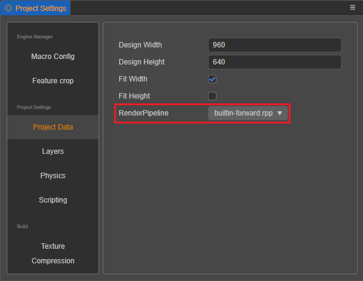

# 内置渲染管线

自 3.1 版本开始，内置渲染管线包括 builtin-forward (前向渲染管线) 和 builtin-deferred (延迟渲染管线)。渲染管线可通过 **项目->项目设置->项目数据->渲染管线** 进行设置切换，切换之后重启编辑器即可生效。

</img>

## 前向渲染管线

引擎默认使用前向渲染管线，前向渲染管线的执行流程如下图所示：

</img>

前向渲染主要包括 ShadowFlow 和 ForwardFlow 两个阶段，ShadowFlow 中包含一个 ShadowStage 会预先对场景中需要投射阴影的物体进行阴影贴图的绘制，ForwardFlow 包含一个 ForwardStage 对场景中所有物体按照 **非透明-光照-透明-UI** 的顺序进行依次绘制，在计算光照时，会为每个物体进行所有光照的裁剪计算，通过裁剪的光照将会执行绘制并对该物体进行光照计算，目前场景中只会有一个平行光生效，可接受的最大光照数量为 16。

## 延迟渲染管线

目前引擎提供了试验版本的内置延迟渲染管线，对于光照数量比较多的项目可以切换延迟渲染管线来缓解光照计算的压力，延迟管线的执行流程如下图所示：

</img>

内置的延迟管线主要包括 ShadowFlow，GBufferFlow 和 LightingFlow 三个阶段，ShadowFlow 与前向渲染一致，预先进行阴影贴图的绘制，GBufferFlow 包含一个 GBufferStage 会对场景中的非透明物体进行绘制，LightingFlow 包含一个 LightingStage 和一个 PostProcessStage，其中 LightingStage 会先对输出到 GBuffer 中的非透明物体信息进行基于屏幕空间的光照计算，然后再绘制半透明物体，之后 PostProcessStage 将把 LightingStage 得到的全屏图像绘制到主屏幕中，最后再进行 UI 的绘制。

由于延迟管线需要使用 GPU 的 Multiple Render Targets 特性来进行 GBuffer 的绘制，目前大部分移动平台应该都支持，对于 WebGL1.0 环境下如果没有支持 WEBGL_draw_buffers 扩展的平台将无法正常渲染。另外延迟管线对于无光照的材质将无法正常绘制，比如引擎内置的 builtin-unlit 材质，对于自定义的 Standard 材质，需要参照引擎内置的 builtin-standard.effect 为延迟管线增加对应的 deferred pass 声明，对于需要通过动态设置材质 Uniform 来实现材质效果变化的需求，在延迟管线下需要指定对应的 Pass 索引进行更新才能够生效，而不是默认更新索引 0 的 Pass，比如内置的 builtin-standard 材质，对应的 PassIndex 为 1。

引擎内置的渲染管线后续也会不断优化并进行功能特性的增加，比如后处理阶段，HDR，反射等等，为开发者提供更加多元和丰富的渲染特性。