# 自定义渲染管线（实验性质）

Cocos Creator 3.6中添加了新的 **自定义渲染管线**。

目前为实验性的前瞻版本，接口、命名尚未稳定，不推荐在正式项目中使用。目前仅支持 Web 端。

**自定义渲染管线** 的接口位于 `cocos/core/pipeline/custom/pipeline.ts`

## 概述

通过 **自定义渲染管线**（CustomPipeline），用户可以定制 **渲染通道**（RenderPass），设置输入/输出的 **渲染视图**（RenderView）、以及每个 **渲染通道** 需要绘制的 **渲染内容**（RenderContent）。

**渲染内容** 可以是 **场景**、屏幕 **矩形**，也可以是计算任务的 **分发**（Dispatch），取决于 **渲染通道** 的类型。

**渲染内容** 的绘制顺序，可以通过 **渲染队列**（RenderQueue）进行调整。

**自定义渲染管线** 的【**渲染通道**、**渲染队列**、**渲染内容**】构成一个森林：

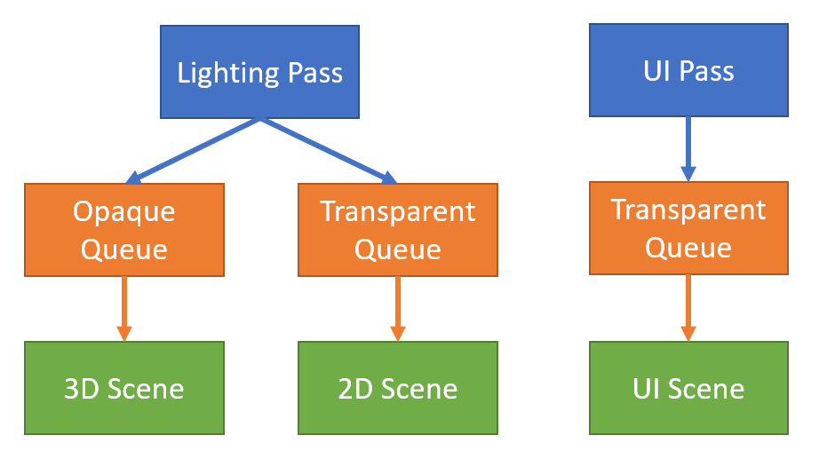</img>

**自定义渲染管线**的【**渲染通道**、**渲染视图**】构成一个有向无圈图（DAG）：

</img>

我们可以层叠（Stack）以上两张图，得到 **渲染流程图**（RenderGraph）。**渲染流程图** 描述了 **自定义渲染管线** 的全部流程，引擎会按照用户定制的流程图进行资源分配、流程优化、渲染执行。

## 渲染通道（RenderPass）

**渲染通道** 有三种类型：光栅（Raster）、计算（Compute）、资源（Resource）。

每种类型会有各自不同的 **渲染通道**。

### 光栅类型（Raster）

光栅类型使用了GPU的光栅化能力（在GraphicsEngine执行）。

#### 1. **光栅化通道**（RasterPass）

</img>

- width、height为输出渲染目标的分辨率。

- layoutName为Effect的Stage名字。

- name为调试（debug）时显示的名字。为空时，系统会赋予默认名字。

#### 2. **光栅化子通道**（RasterSubpass）

功能尚未开放。需要GPU分块渲染能力（Tile-based rendering）。

#### 3. **光栅化展示通道**（PresentPass）

将画面渲染至屏幕上。

### 计算类型（Compute）

计算类型使用了GPU的通用计算能力、以及光线追踪能力（可在GraphicsEngine、ComputeEngine执行）。

#### 1. **计算通道**（ComputePass）

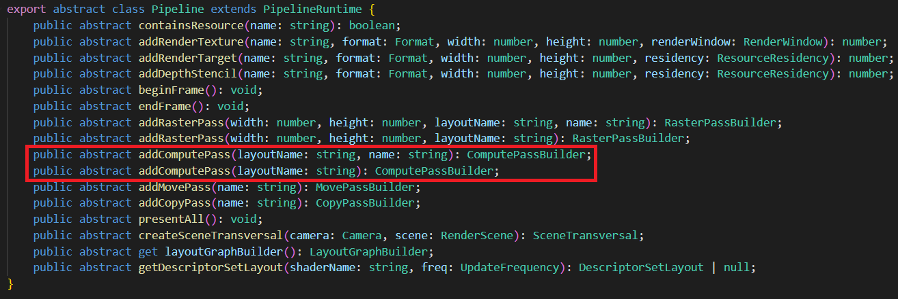</img>

- layoutName为Effect的Pass名字。

- name为调试（debug）时显示的名字。为空时，系统会赋予默认名字。

#### 2. **光线追踪通道**（RaytracePass）

功能尚未开放。需要GPU光线追踪能力。

### 资源类型（Resource）

资源类型使用了 GPU 的资源处理能力（可在GraphicsEngine、ComputeEngine、CopyEngine执行）。

#### 1. **拷贝通道**（CopyPass）

负责将资源来源（source）拷贝至目标（target），需要资源格式兼容。

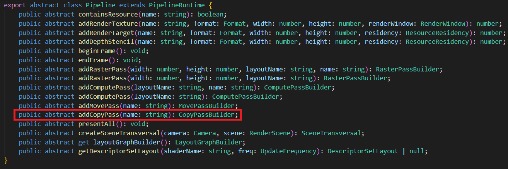</img>

- name 为调试（debug）时显示的名字。为空时，系统会赋予默认名字。

#### 2. **移动通道**（MovePass）

负责将资源来源（source）移动至目标（target），需要资源格式全同。

这里的移动是语义上的概念（move semantics）：将来源的变量移动至目标变量，作废来源变量。如果资源因某些原因无法移动（比如资源来源正在被读取），则以拷贝方式实现。

移动语义用于管线优化，达到减小带宽的目的。如果不清楚如何正确使用**移动通道**，可以用**拷贝通道**替代，不会影响画面表现，调试时较为容易。

## 渲染视图（RenderView）

RenderView 有两种类型：**光栅化视图**（RasterView），**计算视图**（ComputeView）。

### 光栅化视图（RasterView）

**光栅化视图** 会被光栅化。有两种子类型：渲染目标（RenderTarget），深度模板（DepthStencil）。

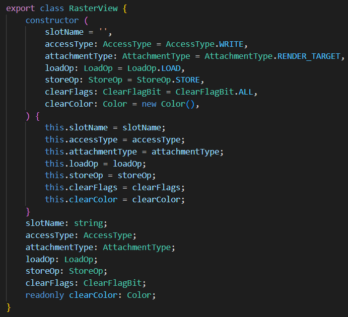</img>

- slotName 为 shader pixel 分量的名字。（比如color、normal等）

- accessType 为绑定类型，可以是 Read、ReadWrite、Write。作为输入（Input）时，为Read；作为输出（Output）时为Write；同时作为输入与输出（Inout），为ReadWrite。【注意】深度模板（DepthStencil）在做深度测试（DepthTest）时，虽然结果不写入视图，但此时作为输出，绑定类型依然为Write。部分平台开启ARM_shader_framebuffer_fetch_depth_stencil扩展时，DepthStencil绑定类型为ReadWrite。DepthStencil的绑定类型不能为Read。

- attachmentType为类型，可以是RenderTarget或者DepthStencil。

- loadOp 是光栅化读取选项，可以是读取（Load）、清除（Clear）、舍弃（Discard）。

- storeOp 是光栅化存储选项，可以是写入（Store）、舍弃（Discard）。

- clearFlags 是清除标志位，如果类型是 RenderTarget，标志位必须是Color。如果类型是 DepthStencil，为 Depth、Stencil、Depth | Stencil三者其一。

- clearColor 为清除颜色，如果类型是 RenderTarget，为 RGBA（Float4）。如果类型为 DepthStencil，为 RG，此时 R 通道存储 Depth（Float）。G 通道存储 Stencil（Uint8）。

### 计算视图（ComputeView）

**计算视图**不会被光栅化。常用于采样（Sample）、乱序读写（Unordered Access）。

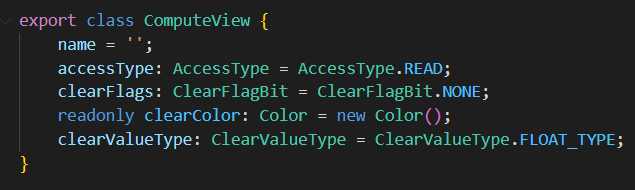</img>

- name 为 Shader 描述符（Descriptor）的名字。

- accessType 为读写类型。可以是 Read、ReadWrite、Write。

- clearFlags 为资源的清除类型，一般为 None 或者 Color。

- clearColor 为资源的清除颜色，为 Float4 或者 Int4。取决于 clearValueType。

- clearValueType 为资源清除颜色的类型，为 Float 或者 Int。

如果资源标注了清除颜色，那么在执行 **计算通道**（ComputePass）前，会以 clearColor 清除资源内容。光栅类型的通道（Raster）不清除 **计算视图** 内容。

## 渲染视图设置

**光栅化通道**：

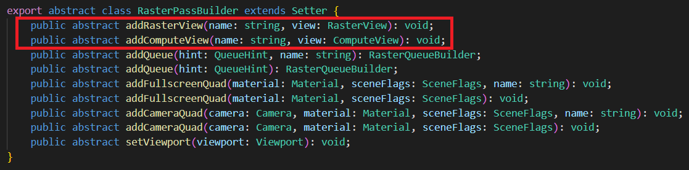</img>

**计算通道**：

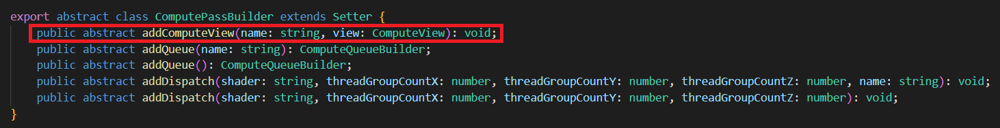</img>

## 渲染队列（RenderQueue）

**渲染队列** 是 **渲染通道**（Render Pass）的子节点，有严格的（渲染）先后顺序。只有一个 **渲染队列** 的内容完全绘制后，才会绘制下一个 **渲染队列** 的内容。

**渲染队列** 有两种类型：**光栅化队列**、**计算队列**。分别在 **光栅化通道**、**计算通道** 添加。

### 光栅化队列（RasterQueue）

**光栅化队列** 执行光栅化任务，一般为绘制 **场景**、绘制全屏四边形等。**光栅化队列** 内部为乱序绘制。

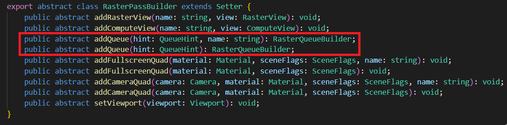</img>

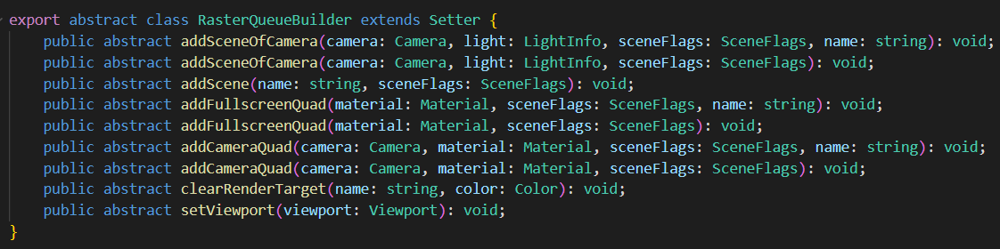</img>

- hint 为队列提示，有 None、Opaque、Cutout、Transparent 四种选项。hint 不会影响执行，只用于性能检测。比如在移动平台上，我们往往希望先绘制 Opaque 队列（关闭 AlphaTest），再绘制 Cutout 队列（开启AlphaTest）。如果在 Opaque 队列的绘制内容中，不小心混入了开启 AlphaTest 的物件，会降低图形性能。因此我们会通过队列提示，检查用户的提交是否符合预期。

- name 为调试（debug）时显示的名字。为空时，系统会赋予默认名字。

### 计算队列（ComputeQueue）

**计算队列** 只包含 **分发**（Dispatch），顺序执行。

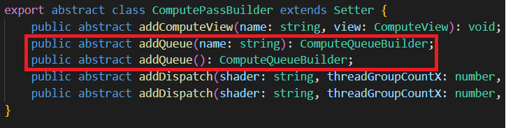</img>

</img>

**计算通道** 没有队列提示。

## 渲染内容（RenderContent）

**渲染内容** 通过 **渲染队列** 排序、由多种元素组成。

### 场景（Scene）

需要绘制的2D、3D**场景**。适用于**光栅化队列**。

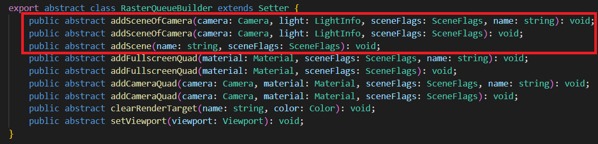</img>

可通过 camera 添加，也可以直接添加。可以附加一定的光照信息。

- sceneFlags一定程度控制 **场景** 的渲染。比如渲染哪些对象（Opaque、Cutout、Transparent）、是否只渲染阴影投射对象（ShadowCaster）、是否只渲染 UI、光照方式（None、Default、Volumetirc、Clustered、PlanarShadow）、是否渲染 GeometryRenderer、是否渲染 Profiler 等。

### 矩形（Quad）

全屏/局部的**矩形**。常用于后期特效渲染。适用于**光栅化队列**。

</img>

### 分发（Dispatch）

用于**计算队列**。

</img>

### 动态设置

我们可以动态设置Queue、Pass的一些属性。

比如viewport、clearRenderTarget等。

## 渲染数据设置

在编写渲染算法时，我们往往需要设置一些数据供Shader使用。

**渲染流程图**（RenderGraph）在 **渲染通道**（RenderPass）、**渲染队列**（RenderQueue）提供了设置数据的接口。

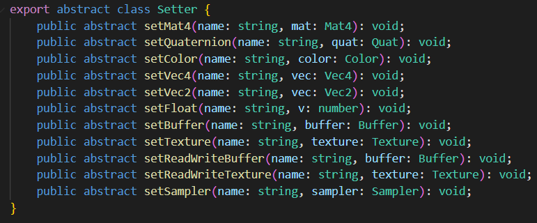</img>

用户可以设置常量（Constant）、缓冲（Buffer）、贴图（Texture）等数据。

这些数据可以是只读的、或者始终处于可读写状态。

对于有读/写状态变化的资源，我们建议用 **渲染视图**（RenderView）进行跟踪。

每个 **渲染通道**、**渲染队列** 有各自独立的存储。

每个节点有不同的数据更新/上传频率。用户填写的常量、Shader描述符（Descriptor）的更新频率需要与节点的更新频率一致。

- **渲染通道**：每 **渲染通道** 上传一次（PerPass）。

- **渲染队列**：每 **渲染阶段** 上传一次（PerPhase）。

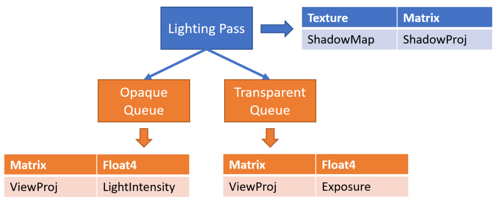</img>

## 功能开启

勾选 **自定义渲染管线**。

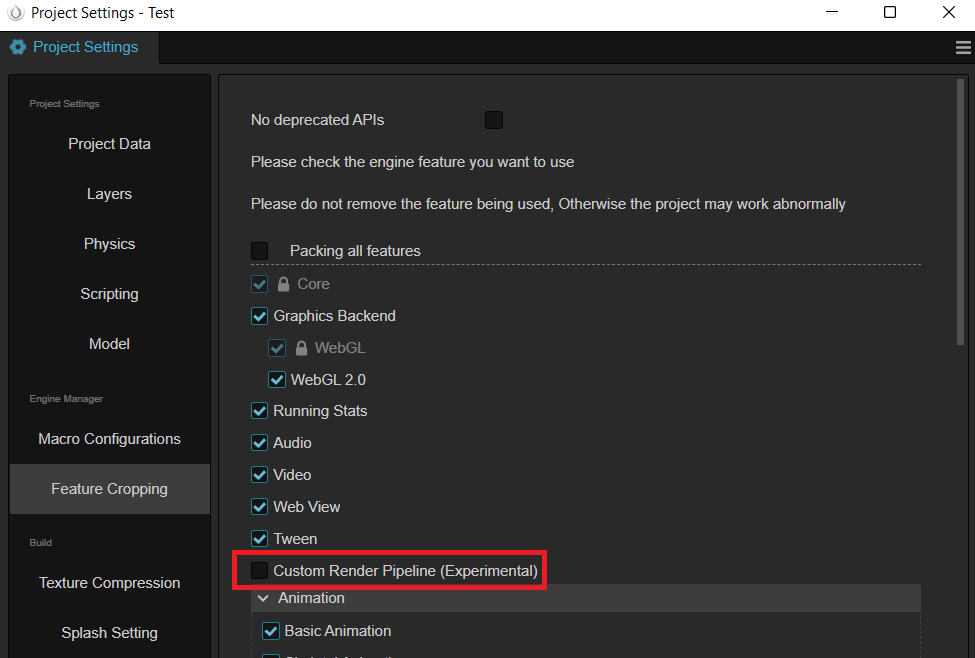</img>

通过填写 **自定义管线** 的名字，选择注册好的 **自定义渲染管线**。
- 目前支持 **前向渲染管线**（名字为 Custom 或 Forward）和 **后向渲染管线**（名字为 Deferred）两种。

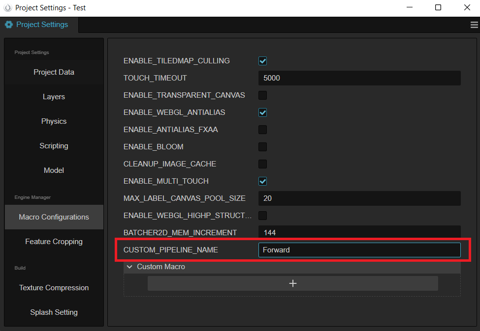</img>

## 编写自定义渲染管线

新建 TypeScript 文件，定义名为 `TestCustomPipeline` 类，让该类实现 `rendering.PipelineBuilder` 接口，通过 `rendering.setCustomPipeline` 方法把该 pipeline 注册到系统中，如下代码所示。

``` typescript
import { _decorator, rendering, renderer, game, Game } from 'cc';
import { AntiAliasing, buildForwardPass, buildBloomPasses,
    buildFxaaPass, buildPostprocessPass, buildUIPass, isUICamera, decideProfilerCamera } from './PassUtils';

export class TestCustomPipeline implements rendering.PipelineBuilder {
    setup(cameras: renderer.scene.Camera[], pipeline: rendering.Pipeline): void {
        decideProfilerCamera(cameras);
        for (let i = 0; i < cameras.length; i++) {
            const camera = cameras[i];
            if (camera.scene === null) {
                continue;
            }
            const isGameView = camera.cameraUsage === renderer.scene.CameraUsage.GAME
                || camera.cameraUsage === renderer.scene.CameraUsage.GAME_VIEW;
            if (!isGameView) {
                // forward pass
                buildForwardPass(camera, pipeline, isGameView);
                continue;
            }
            // TODO: The actual project is not so simple to determine whether the ui camera, here is just as a demo demonstration.
            if (!isUICamera(camera)) {
                // forward pass
                const forwardInfo = buildForwardPass(camera, pipeline, isGameView);
                // fxaa pass
                const fxaaInfo = buildFxaaPass(camera, pipeline, forwardInfo.rtName);
                // bloom passes
                const bloomInfo = buildBloomPasses(camera, pipeline, fxaaInfo.rtName);
                // Present Pass
                buildPostprocessPass(camera, pipeline, bloomInfo.rtName, AntiAliasing.NONE);
                continue;
            }
            // render ui
            buildUIPass(camera, pipeline);
    }
}
}

game.on(Game.EVENT_RENDERER_INITED, () => {
    rendering.setCustomPipeline('Test', new TestCustomPipeline);
});

```

可以看到上述代码引用了 PassUtils 脚本文件,该文件通过简单封装常用 `RenderPass` 的相关逻辑，方便用户直接使用（PassUtils可以在这 [下载](./code/PassUtils.ts)）。

PassUtils有不少函数，我们抽取 `buildPostprocessPass` 的部分逻辑来介绍：

```typescript
function buildPostprocessPass (camera,
    ppl,
    inputTex: string,
    antiAliasing: AntiAliasing = AntiAliasing.NONE) {
    // ...
    const postprocessPassRTName = `postprocessPassRTName${cameraID}`;
    const postprocessPassDS = `postprocessPassDS${cameraID}`;
    if (!ppl.containsResource(postprocessPassRTName)) {
        // 注册 color texture 资源，因为当前 pass 是要上屏，所以传递 camera.window 作为上屏信息。如果是离屏的则需要调用 ppl.addRenderTarget 函数即可
        ppl.addRenderTexture(postprocessPassRTName, Format.BGRA8, width, height, camera.window);
        // 注册 depthStencil texture 资源
        ppl.addDepthStencil(postprocessPassDS, Format.DEPTH_STENCIL, width, height, ResourceResidency.MANAGED);
    }
    // 下面两行会更新 color texture 与 depthStencil texture 的注册信息(主要为尺寸大小)，同样如果离屏的则调用 'ppl.updateRenderTarget' 函数
    ppl.updateRenderWindow(postprocessPassRTName, camera.window);
    ppl.updateDepthStencil(postprocessPassDS, width, height);
    // 注册一个 RasterPass，它的 layoutName 为 post-process
    const postprocessPass = ppl.addRasterPass(width, height, 'post-process');
    postprocessPass.name = `CameraPostprocessPass${cameraID}`;
    // 设置当前 rasterPass 的 viewport
    postprocessPass.setViewport(new Viewport(area.x, area.y, area.width, area.height));
    // 判断系统中是否有输入纹理的同名信息，并把该输入纹理注入到 outputResultMap的sampler 中
    if (ppl.containsResource(inputTex)) {
        const computeView = new ComputeView();
        computeView.name = 'outputResultMap';
        postprocessPass.addComputeView(inputTex, computeView);
    }
    // 设置 postprocessPass 的 clear color 信息
    const postClearColor = new Color(0, 0, 0, camera.clearColor.w);
    if (camera.clearFlag & ClearFlagBit.COLOR) {
        postClearColor.x = camera.clearColor.x;
        postClearColor.y = camera.clearColor.y;
        postClearColor.z = camera.clearColor.z;
    }
    // 注册 color texture 相关的 pass view
    const postprocessPassView = new RasterView('_',
        AccessType.WRITE, AttachmentType.RENDER_TARGET,
        getLoadOpOfClearFlag(camera.clearFlag, AttachmentType.RENDER_TARGET),
        StoreOp.STORE,
        camera.clearFlag,
        postClearColor);
    // 注册 depth stencil texture 相关的 pass view
    const postprocessPassDSView = new RasterView('_',
        AccessType.WRITE, AttachmentType.DEPTH_STENCIL,
        getLoadOpOfClearFlag(camera.clearFlag, AttachmentType.DEPTH_STENCIL),
        StoreOp.STORE,
        camera.clearFlag,
        new Color(camera.clearDepth, camera.clearStencil, 0, 0));
    // 把 color texture 资源与相关的pass view产生关联(即 renderpass 的 color texture 输出口)
    postprocessPass.addRasterView(postprocessPassRTName, postprocessPassView);
    // 把 depth stencil texture 资源与相关的 pass view 产生关联
    postprocessPass.addRasterView(postprocessPassDS, postprocessPassDSView);
    // 添加具体的渲染队列，拿到 postprocess material 去画一个与屏幕等尺寸的四边形
    postprocessPass.addQueue(QueueHint.NONE).addFullscreenQuad(
        postInfo.postMaterial, 0, SceneFlags.NONE,
    );
    // ...
    if (profilerCamera === camera) {
        // 开启 profiler 渲染
        postprocessPass.showStatistics = true;
    }
    // 把 color texture 与 depth stencil texture 的资源返回，可以用于后续其它 render pass 的数据源
    return { rtName: postprocessPassRTName, dsName: postprocessPassDS };
}
```

首先我们需要知道 `RasterPass` 如何配置 `layoutName` （即上述代码中的 post-process 字符串）。打开 `post-process.effect` 文件后，可以看到内部定义的 `pass` 名称就是 `post-process` ，所以 effect 文件中的 pass name 就是作为 RasterPass 的 `layoutName`。如果 effect 没有定义 pass name，那么 `RasterPass` 的 `layoutName` 就得赋值为 `default` （forward/gbuffer 相关的 RasterPass 都是通过 default 配置）。所以要配置自己的后处理方案，就需要为自己编写的 effect 文件正确配置 pass name。

</img>

另外我们还需要把上一个 pass 的输出纹理作为当前 pass 的输入信息，上面说到需要通过 `ComputeView` 实现，而这里 `ComputeView` 的 name 设置为了 `outputResultMap`，那么该怎么正确配置这个名称？继续对 `post-process.effect` 文件分析，可以看到下面的代码，`ComputeView` 的 name 与 `post-process-fs` 的片元着色器的纹理输入名称一致。

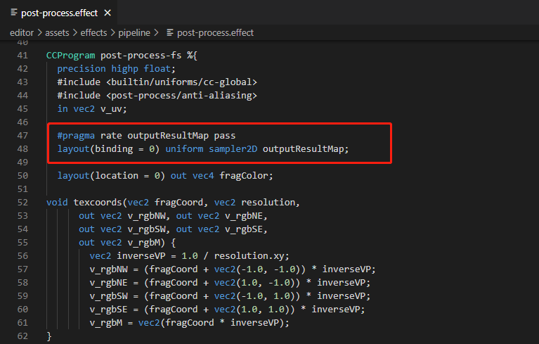</img>

同时我们需要通过下述代码行对 `outputResultMap` 名称进行声明，表明该输入纹理的使用频率为 Pass level。

```glsl
#pragma rate outputResultMap pass
```

定义完 `TestCustomPipeline` 后需要通过其它逻辑代码（如：组件等）引入该文件，以便激活 `Game.EVENT_RENDERER_INITED` 事件监听，之后改变 **项目设置** -> **宏配置** -> **CUSTOM_PIPELINE_NAME** 为 `Test`:

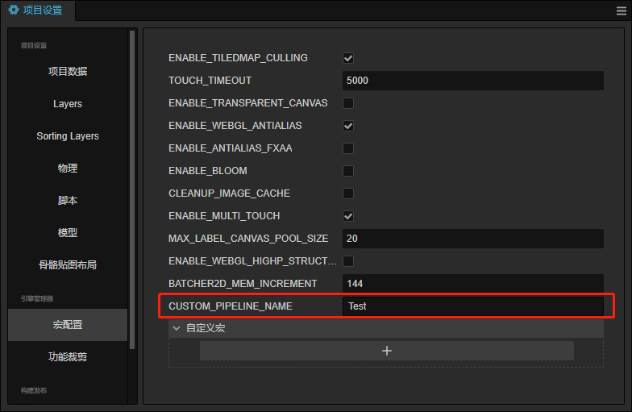</img>

运行后的效果如下所示,它包含了 fxaa 与 bloom 的后效：

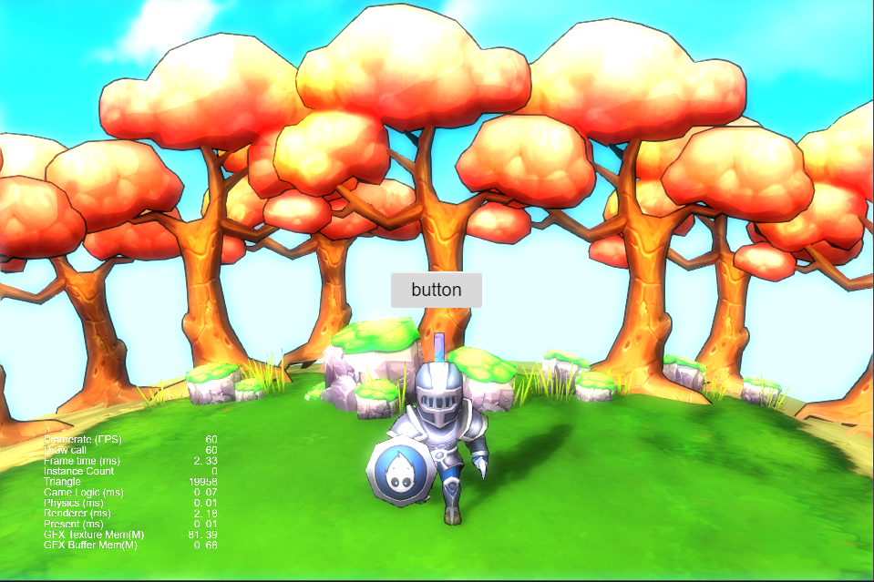</img>

这就是定义一个 `RenderPass` 的流程，PassUtils 还定义了其它 Pass 可以提供用户参考，包括 `BloomPasses`，`FxaaPass` 等。这些 `RenderPass` 提供了调节参数可对输出效果进行调整（如Bloom的曝光强度，迭代次数等），用户可查看相关的代码进行尝试。
