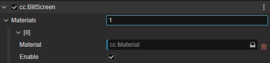

# BlitScreen 组件

BlitScreen 组件允许用户定义不同的材质来管理 [自定义后效](./custom.md)。

## 属性

| 属性 | 说明 |
| :-- | :-- |
| **Materials** | 后效材质的数组 |

分配 **Materials** 属性的数组长度，可以添加不同的后效材质。添加后属性如下：

| 属性 | 说明 |
| :-- | :-- |
| **Material** | 后效材质，从 **资源管理器** 中拖拽自定义好的材质到该属性。 |
| **Enable** | 该后效材质是否被启用 |

后效材质会根据添加到数组内的顺序执行。
