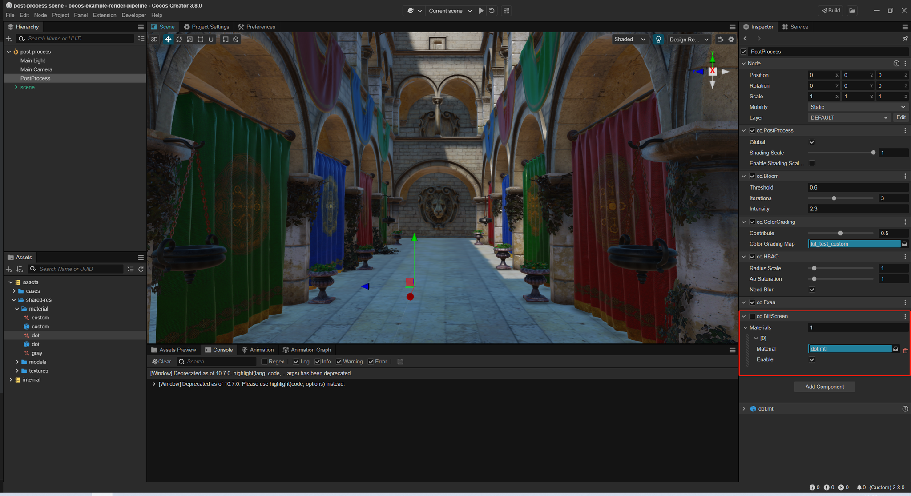
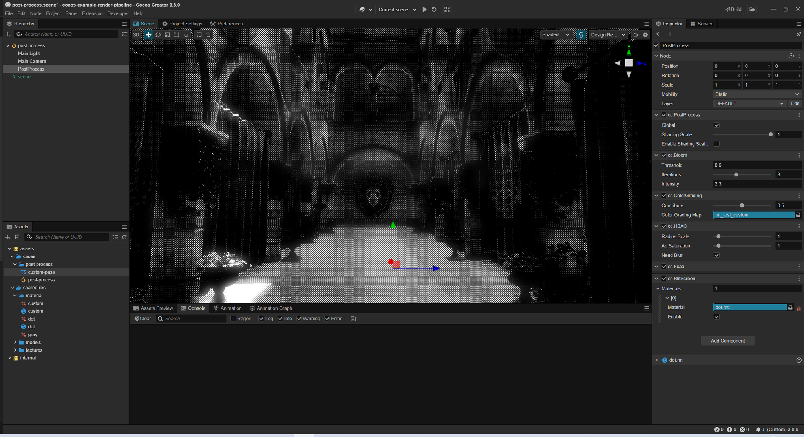
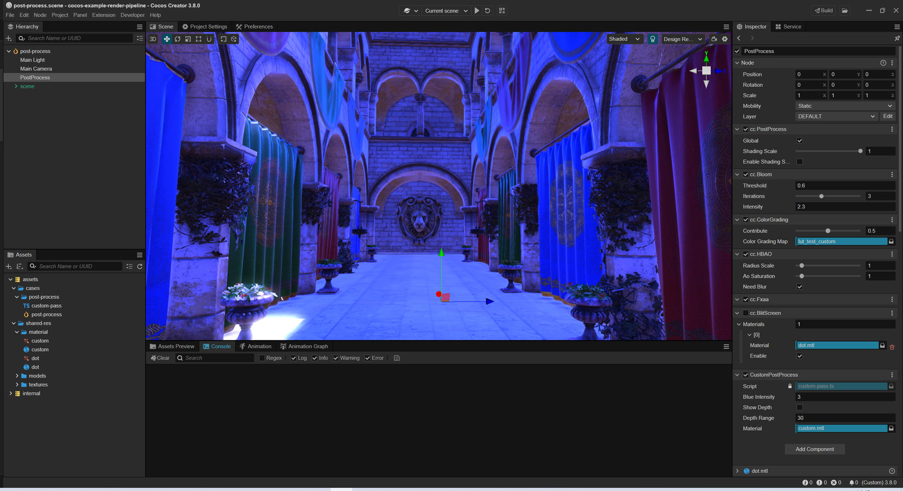
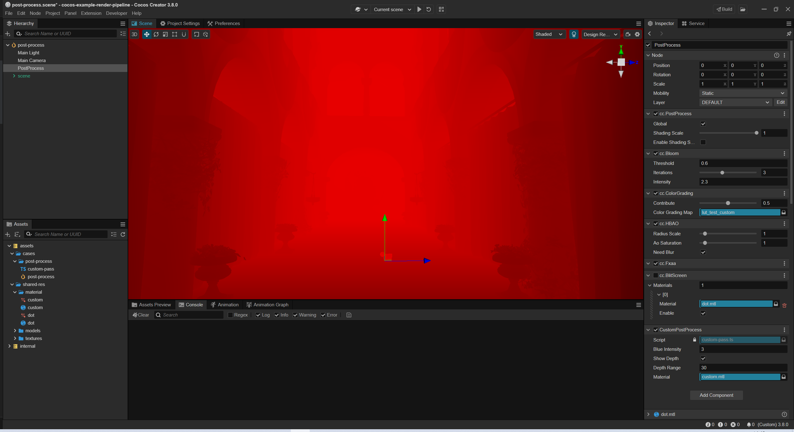

# 自定义后效

自定义后效有两种方式，简单的后效可以直接将后效材质添加到 *blit-screen* 后效组件上，复杂的后效需要自定义一个后效 pass 。

## Blit-Screen 后效组件

参考 [设置后效流程](index.md) 添加 Blit-Screen 后效组件，
将自定义后效材质拖入 Materials 属性中，Blit-Screen 会按照 Materials 数组顺序依次渲染后效材质。

Materials 属性中每个自定义后效材质都支持单独开关，方便开发者管理。





具体可以参考 [cocos-example-render-pipeline](https://github.com/cocos/cocos-example-render-pipeline/blob/main/assets/cases/post-process/post-process.scene)

## 自定义后效 Pass

如果需要自定义更加复杂的后效流程，你可以创建自定义后效 Pass 。




1. 定义 PostProcessSetting 组件，传递参数到 CustomPass 中

```js
@ccclass('CustomPostProcess')
@menu('PostProcess/CustomPostProcess')
export class CustomPostProcess extends PostProcessSetting {
    @property
    blueIntensity = 1

    @property
    showDepth = false

    @property
    depthRange = 30

    @property(Material)
    _material: Material | undefined

    @property(Material)
    get material () {
        return this._material;
    }
    set material (v) {
        this._material = v;
    }
}
```

2. 定义 CustomPass

```js
export class CustomPass extends SettingPass {
    // custom pass name
    name = 'CustomPass'

    // out out slot name
    outputNames: string[] = ['CustomPassColor']

    // reference to post process setting
    get setting () { return this.getSetting(CustomPostProcess); }

    // Whether the pass should rendered
    checkEnable(camera: renderer.scene.Camera): boolean {
        let setting = this.setting;
        return setting.material && super.checkEnable(camera);
    }

    params = new Vec4

    render (camera: renderer.scene.Camera, ppl: rendering.Pipeline) {
        const cameraID = this.getCameraUniqueID(camera);

        // clear background to black color 
        let context = this.context;
        context.clearBlack()

        // input name from last pass's output slot 0
        let input0 = this.lastPass.slotName(camera, 0);
        // output slot 0 name 
        let output = this.slotName(camera, 0);

        // get depth slot name
        let depth = context.depthSlotName;

        // also can get depth slot name from forward pass.
        // let forwardPass = builder.getPass(ForwardPass);
        // depth = forwardPass.slotName(camera, 1);

        // set setting value to material
        let setting = this.setting;
        this.params.x = setting.blueIntensity
        this.params.y = setting.showDepth ? 1 : 0;
        this.params.z = setting.depthRange;
        setting.material.setProperty('params', this.params);

        context.material = setting.material;
        context
            // update view port
            .updatePassViewPort()
            // add a render pass
            .addRenderPass('post-process', `${this.name}${cameraID}`)
            // set inputs
            .setPassInput(input0, 'inputTexture')
            .setPassInput(depth, 'depthTexture')
            // set outputs
            .addRasterView(output, gfx.Format.RGBA8)
            // final render
            .blitScreen(0)
            // calculate a version
            .version();
    }
}
```

3. 注册 custom pass

```js
let builder = rendering.getCustomPipeline('Custom') as postProcess.PostProcessBuilder;
if (builder) {
    // insert CustomPass after a BlitScreenPass
    builder.insertPass(new CustomPass, BlitScreenPass);
} 
```

具体可以参考 [custom-pass](https://github.com/cocos/cocos-example-render-pipeline/blob/main/assets/cases/post-process/custom-pass.ts)
